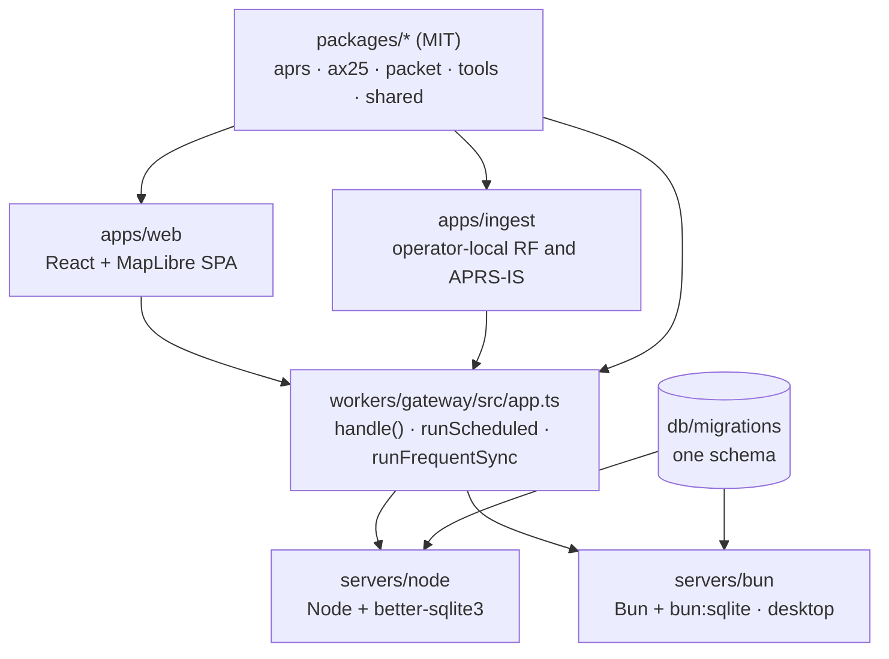

# Architecture and runtimes

This page explains how the APRScaching code base fits together: one gateway that runs on two runtimes, a
web app, an ingest that runs on the operator's own equipment, and the libraries underneath. It is for
contributors deciding where a change belongs.

## The pieces



| Piece | What it is |
|-------|------------|
| **Gateway** (`workers/gateway`) | The API and data plane. `app.ts` exports a runtime-neutral `handle()`, plus `runScheduled` and `runFrequentSync`. Routing is the `p === "/…"` table and the regex segment routes in that file; each feature is one module beside it (`verify.ts`, `webauthn.ts`, `ingest.ts`, …). |
| **Runtime shims** (`servers/node`, `servers/bun`) | They import the same app and supply its runtime interfaces (`runtime.ts`): a database shim over better-sqlite3 or `bun:sqlite` (`d1.ts`), a socket adapter over the shared `rooms-core.ts` for the live region rooms, filesystem media, and the shared migration runner. Bun reuses the Node host modules; the desktop launcher (`deploy/desktop/`) wraps `servers/bun/server.ts`'s `createServer()`. |
| **Web app** (`apps/web`) | A React and MapLibre single-page app: the map, the Shack and the operator surface. |
| **Ingest** (`apps/ingest`) | The operator-local RF and APRS-IS bridge, a process on a Pi or PC. The browser bridges a USB or Bluetooth radio the same way. |
| **Libraries** (`packages/*`) | Pure, reusable codecs (`@aprscaching/aprs`, `@aprscaching/ax25`, `@aprscaching/packet`, `@aprscaching/tools`) and typed contracts (`@aprscaching/shared`). They run in Node, Bun and the browser, and stay MIT-licensed with no AGPL-only dependency. |

Fix behaviour in `workers/gateway`, never in one runtime's shim.

## The two gateway runtimes

| Runtime | Package | Storage | Shape |
|---------|---------|---------|-------|
| **Node + SQLite** | `servers/node` | `better-sqlite3`, filesystem media | Self-host, Oracle Cloud, bare metal, Pocket |
| **Bun + bun:sqlite** | `servers/bun` | `bun:sqlite`, filesystem media | Desktop |

Both support the full feature set and the complete configuration: the Node and Bun servers forward every
gateway configuration key from the process environment, and run the scheduled jobs on in-process intervals.
The differences are the SQLite driver and the HTTP and socket server. CI proves parity by running the same
`tools/smoke/*` suites against both ([Testing & verification](testing.md)).

## The ingest stays local

The RF ingest always runs on the operator's own equipment: `apps/ingest` on a Pi, PC or mini-PC, or the
browser bridging a radio over Web Serial or Web Bluetooth. It is never cloud-only, and its `INGEST_URL` can
point at `localhost`, a LAN gateway or a remote one. Off-grid operation, with the ingest and the gateway on
one box and no internet, is a first-class mode. A cloud machine may run an APRS-IS-only feed, never the only
way RF gets in.

## One schema

The schema lives once, in `db/migrations/*.sql`. The Node and Bun servers apply it at boot with the shared
runner (`migrate.ts`), which records each applied file by name. Until 1.0 the schema is one file,
`0001_baseline.sql`, and a schema change edits it directly. Once 1.0 is released the baseline is frozen: each
schema change is a new file with the next number, and a file that has been applied is never edited.

## Images

`deploy/Dockerfile` builds the full image from the repository root: it installs the workspace with the pinned
pnpm, builds every package (the web app into `apps/web/dist` inside the image) and starts the gateway by
default. The same image runs the ingest through a compose `command:` override. Its services run as the
unprivileged user `aprscaching` (UID and GID 10001, in `dialout` for serial devices), which owns `/data` and
`/srv/web`; the code under `/app` stays root-owned.

```bash
docker build -f deploy/Dockerfile -t aprscaching:local .
```

Two single-service Dockerfiles exist for mix-and-match setups: `servers/node/Dockerfile` (the gateway only) and
`apps/ingest/Dockerfile` (the ingest only). Both build from the repository root.

## Every public instance shows its source

Every public instance exposes a visible **Source** link and `/.well-known/source`, as the AGPL's network-use
clause requires.

## Next

- [Testing & verification](testing.md): every check and how to run it.
- [The trust model](../reference/trust-model.md): the rules the gateway enforces.
