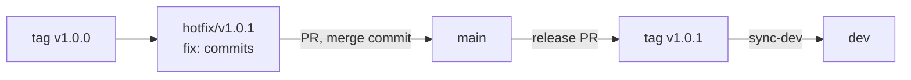

# Testing & verification tooling

This page lists every check that verifies the repository, from unit tests to interop with real packet
software, and how to run each one. It is for contributors; all commands run from the repository root after
`pnpm install`.

## The three wrappers (day-to-day)

| Command | What it runs | Duration |
|---|---|---|
| `pnpm run check` | `pnpm -r build` (typecheck every package) + `pnpm -r test` (all unit suites) + the web typecheck & production build. No servers. | ~1–3 min |
| `pnpm run smoke` | Boots a throwaway Node/SQLite gateway (random port, temp DB, generated secret), runs the `smoke` + `geofence` conformance suites against it, tears down. | ~30–60 s |
| `pnpm run verify` | `check` then `smoke` — the full pre-commit gate. | ~2–4 min |

Also part of the gate: `pnpm lint` (fast ESLint), `pnpm lint:types` (type-aware rules over
`workers/` + `packages/`, its own CI job), `pnpm format:check` (Prettier).

## Unit tests (vitest)

More than 200 test files across `packages/aprs` (parser), `packages/ax25`, `packages/packet` (the largest
logic surface: NET/ROM, INP3, FBB incl. LZHUF), `packages/shared` (CBOR/fedwire),
`packages/tools` (DSP decoders, registry), `workers/gateway` (federation, auth, trust),
`servers/node`, and `apps/ingest` (transports, reconnect).

```bash
pnpm -r test                                    # everything
pnpm --filter @aprscaching/packet test              # one workspace
pnpm --filter @aprscaching/packet exec vitest run test/lzhuf.test.ts   # one file
```

`servers/bun` intentionally has no vitest: the Bun **conformance** job (below) covers it. `apps/web`
runs a vitest suite over its pure logic modules (`apps/web/test/*.test.ts`, no DOM except the Mermaid parse
check under jsdom: data loading, polling, navigation history) beside its typecheck + build and three guards:
`no-emoji.mjs`, `tour-anchors.mjs` (every tour anchor resolves) and `vendor-maplibre.mjs` (the vendored
MapLibre).

## Conformance suites (runtime-agnostic)

`tools/smoke/*.mjs` are standalone scripts that hit a **running gateway** at `BASE` and assert the
full product behavior. The same suites run against both runtimes, which is what keeps Node and Bun in
step:

| Suite | Asserts |
|---|---|
| `tools/smoke/smoke.mjs` | The end-to-end gateway flow: ingest auth, caches, finds, trust tiers, BBS, federation signing (with `fedwire-mini.mjs`, an independent minimal CBOR codec used as a cross-implementation check) |
| `tools/smoke/geofence.mjs` | Real-time geofencing over WebSocket: a position near a cache produces a `near_cache` prompt for the right callsign only |
| `tools/smoke/federation.mjs` | Two instances: publisher seeds, subscriber pull-syncs, signature-verified mirroring (needs `PUB`, `SUB`, `RELAY_SECRET`) |

### Running them against each runtime

**Node + SQLite** — wrapped as `pnpm run smoke`. Manually:

```bash
KEY=$(node tools/fedkey/genkey.mjs --raw)
export INGEST_SECRET=devsecret OPERATOR_SECRET=devoperator SESSION_SECRET=devsession
DB_PATH=/tmp/acs.db PORT=8787 ALLOW_DEV_TOKENS=1 \
  FIRST_PARTY_SITES=OE8XXX FED_PRIVATE_KEY="$KEY" \
  pnpm --filter @aprscaching/node-gateway start &
BASE=http://127.0.0.1:8787 node tools/smoke/smoke.mjs      # sends x-ingest-secret and x-operator-secret
BASE=http://127.0.0.1:8787 node tools/smoke/geofence.mjs
```

**Bun + bun:sqlite** — same env recipe as Node, started with `bun run servers/bun/server.ts`.

**Two-instance federation** — `tools/dev/smoke.sh federation` runs it locally. It boots two throwaway
Node/SQLite gateways on free ports with the environment of the CI job `conformance-federation`
(`.github/workflows/ci.yml`): signing keys and a key history from `tools/fedkey/genkey.mjs`, a signed
registry from `tools/fedkey/signregistry.mjs`, a publisher (`oe.pub`) and a subscriber hub (`oe.sub`), then
runs `PUB=… SUB=… RELAY_SECRET=… node tools/smoke/federation.mjs` and tears both down. CI starts the same
pair on the fixed ports `:8801` and `:8802`.

## Browser end-to-end

`pnpm run e2e:audio` (`tools/e2e/audio-mic.mjs`) exercises the **live microphone decode path** in a
real headless Chromium: it bundles the actual web-app decoder code, synthesises a PSK31 WAV of
"cq de test", feeds it in as a fake microphone, and asserts the decoded text. Skips cleanly (exit 0)
when no Chromium is available; CI installs one in the `e2e-audio` job.

`pnpm run e2e:tools` (`tools/e2e/tool-sandbox.mjs`) loads tools into the real plugin sandbox, wired to the tool
host, in headless Chromium and asserts what they reach: the example tools' commands, decoder and bus work; a tool
using the whole API gets events with a session reply, async commands, transmit and beacons only behind the gate
and the rate limit, a map layer, colour rules and its own bus service, while a tool without those grants is
refused, both from the tool API 1.0 contract fixtures in `tools/e2e/fixtures/`, which every 1.x release keeps
passing; a tool without the `network` grant reaches no network and none of the app's storage, and a tool with it
reaches its `connect` origin only, without the page's cookie. It skips the same way and runs in the `e2e-audio` job.

`tools/webauthn/virtual-authenticator.mjs` is a **manual** check that drives a full passkey
register + login (and a tampered-signature rejection) against a running gateway via a Playwright
virtual authenticator. It is not wired into CI — the WebAuthn logic is unit-tested; this validates
the real browser ceremony before a release.

`pnpm dev:check` (`tools/dev/dev-stack-check.mjs`) boots the development stack (`pnpm dev`) on free ports and
proves that everything reaches the gateway through the dev server's one origin: an email and an operator sign-in
with their session cookies, Instance admin, hiding a cache with a photo, logging a find, a packet on the live
socket, Vite's hot-reload socket, and a passkey registration and sign-in with Chromium's virtual authenticator.
CI runs it in the `dev-stack` job ([Run from source](run-from-source.md#check-the-dev-stack)).

## Design and accessibility

- **Contrast** — `apps/web/test/contrast.test.ts` (part of the web unit suite) measures the WCAG contrast of every
  foreground/background token pair the stylesheets use, in the dark, light and Phosphor themes. It resolves
  `var()`, OKLCH and `color-mix()` itself. A pair listed as a known failure must keep failing: once it passes,
  the test asks for it to leave the list.
- **Diagrams** — `apps/web/test/diagrams.test.ts` parses every ```` ```mermaid ```` block in the repository's
  Markdown with the Mermaid the published manual ships (the web app's locked dev dependency, under jsdom, which
  Mermaid's label sanitiser needs), and `tools/checks/docs.mjs` fails on a diagram drawn in box-drawing characters.
- **Links to the manual** — the app links to the published manual through `manualUrl()` and `<ManualLink>`
  (`apps/web/src/brand.ts`); `tools/checks/docs.mjs` fails when one names a page or heading that does not exist,
  and when a nav entry has no file or a page is neither in the nav nor under `not_in_nav`.
- **Hints** — `apps/web/test/hint.test.ts` covers when a hint opens and closes (hover, keyboard focus, tap,
  Escape), and `apps/web/test/buttons.test.ts` that every icon-only button has a name or a hint.
- **The manual's theme** — `node tools/dev/docs-theme.mjs` writes `docs/stylesheets/tokens.gen.css` from the
  app's tokens and fonts, and copies Mermaid's browser build into `docs/assets/vendor/` for the build;
  `--check` (in `pnpm run check` and the docs workflow) fails when the committed theme no longer matches.
- **The UI kit** — `/?demo=ui` in a running app (`pnpm dev`): every token, the role scales and every
  primitive in every state, with a theme, density and scale switch ([Design language](design/design-language.md)).
- **The whole app on fixtures** — `/?demo=app` serves the app from canned gateway answers
  (`apps/web/src/demo/fixtures.ts`); `&as=sysop` or `&as=out` changes who is signed in.
- **Visual and axe harness** — after `pnpm --filter @aprscaching/web build`:

    ```bash
    pnpm --filter @aprscaching/web visual                      # every surface × theme × phone/desktop
    node apps/web/test/visual/run.mjs --only map,detail --themes light --keyboard
    node apps/web/test/visual/run.mjs --themes dark --views phone-320,phone-340,phone-360,desktop-600,tall
    ```

    It writes screenshots, `axe.json`, `keyboard.json` and an HTML index to `apps/web/test/visual/out/`.
    `pnpm --filter @aprscaching/web journeys` walks the main tasks (first visit, sign in, find and log, hide,
    settings search, the Shack, the sysop's first hour) by their visible controls on a phone and a desktop, with a
    screenshot per step and a log that marks every step it could not complete.
    Every render also reports layout findings: the document scrolling past the viewport (something escaping the
    shell), and a control or its words reaching past its panel or its own edge. The views beyond the default phone
    and desktop sweep narrow phones (`phone-320`, `phone-340`, `phone-360`), a short and a tall laptop
    (`desktop-600`, `desktop-1000`) and a tall desktop window (`tall`, 1868×1891).
    Screenshots are for review and are never compared pixel by pixel; `--strict` fails on a serious or critical
    axe finding or a layout finding. CI runs `run.mjs --no-shots --strict` on every pull request that touches code (the `axe` job);
    the `visual` workflow takes the screenshots, the keyboard walk and the journeys nightly and on demand, and
    keeps them as an artifact.

- **Inline styles** — ESLint rejects a `style` prop in `apps/web` that sets anything but custom properties
  (`style={{ "--pct": "40%" }}`); every other value is a token in the stylesheets.
- **Landing images** — `pnpm --filter @aprscaching/web landing-assets` (after a build, with a connection for the
  basemap tiles) renders the landing page's map band, phone and desktop screenshots and Open Graph card from the
  fixtures, and writes them with the hero photo to `apps/web/public/landing/` as AVIF and WebP at the srcset widths.
  Run it again when a surface it shows changes, and commit the images.

## Interop against real packet software

`tools/interop/` tests the FBB/NET-ROM stack and the modem transports against the actual programs
they must talk to. Three tiers (full detail in `tools/interop/README.md`):

- **Local loop, no Docker** — `bash tools/interop/run-local-loop.sh`: two complete APRScaching
  stacks crosslinked over AXUDP exchange NODES broadcasts both ways, run an FBB forwarding session
  A→B, verify BID idempotency, and (both nodes speak INP3) assert INP3 route convergence via
  triggered RIFs.
- **Containerized peers** — `tools/interop/docker-compose.yml` brings up **LinBPQ** (default),
  **F6FBB** (`--profile fbb`, needs the host's `ax25` and `mkiss` modules), and **TheNetNode + JNOS**
  (`--profile extra`, source builds). Drivers in `tools/interop/tests/` assert NODES + forwarding
  into the BPQ BBS, a full mail exchange with the real `xfbbd` over telnet, and an AX.25 connect to it
  over AXUDP through `ax25ipd` and the kernel AX.25 stack. The F6FBB container
  (`fbbcomp` on) is the live-validation peer for LZHUF-B1 compressed forwarding.

- **Modem transports** — `tools/interop/direwolf/docker-compose.yml` joins two **Direwolf** modems
  with a UDP audio cable. The ingest's KISS TCP and AGWPE clients key one and hear the other over
  Bell-202 1200 bd AFSK, in both directions, and the ingest's RX-IGate delivers what its Direwolf hears
  to **aprsc** with `qAR,<igate>`.

The peers run in the **weekly** `interop` workflow and the modem transports in the **weekly**
`transports` workflow (both scheduled + manual dispatch), never the PR loop — peer downloads and
kernel modules are not PR-gating dependencies.

## Pocket in Termux

The monthly `pocket-termux` workflow installs and starts Pocket in the `termux/termux-docker` image. On
aarch64, the phones' architecture, everything is built inside Termux. On x86_64 the web app is built on the
runner and handed in with `--web-dist`: Rolldown, the web build's bundler, has Android builds for Arm only, so
an x86 Android device (a Chromebook, an emulator) takes its web build from a PC. The image has no Android
underneath, so the workflow proves the install and the scripts, not a phone's background limits. It runs
monthly and on demand, never on a pull request: it downloads Termux packages and compiles better-sqlite3
with Termux's clang, and a mirror outage is no reason to hold a change.

Pocket's USB TNC bridge is written from the USB CDC-ACM class specification. Prior art:
[Termux_CDC_ACM](https://github.com/schuhumi/Termux_CDC_ACM) and pyusb's Termux file-descriptor work
([pyusb#287](https://github.com/pyusb/pyusb/pull/287), not merged, so the bridge calls libusb through Python's
`ctypes` instead).

## Key & signing tools used by tests

- `tools/fedkey/` — `genkey.mjs` (mint `FED_PRIVATE_KEY`), `rotatekey.mjs` (rotation + continuity
  proof), `signregistry.mjs` (signed instance registry). Used by every conformance job.
- `tools/toolkey/` — `genkey.mjs` + `sign.mjs` for tool-manifest/registry signatures
  (`packages/tools` verifies them).

## CI guards

CI guards under `tools/checks/`: `oci-stack.mjs` keeps the Oracle Cloud one-click stack consistent, `dead-exports.mjs`
fails when a gateway export is named nowhere outside its own file, and `docs.mjs` keeps the documentation
present-tense, every configuration key the code reads documented (and every documented key read), the
manual's nav complete, and the links outside the manual whole. `tools/interop/` runs
interoperability tests against reference packet software (LinBPQ, FBB, JNOS, aprsc, Direwolf); see its README.

## CI map (`.github/workflows/`)

| Workflow | Trigger | Gating? |
|---|---|---|
| `ci.yml` — lint + format (with `dead-exports.mjs` and `docs.mjs`) · lint-types · unit tests + builds (with `oci-stack.mjs`) · conformance on Node and Bun (the Bun leg also runs `conformance:meshcom`) · two-instance federation · audio and tool-sandbox e2e · offline-shell e2e · the dev stack (`pnpm dev:check`) · axe on every fixture surface in every theme · Pocket scripts · Deploy helpers | PR, and push to `dev`/`main` | **Yes** |
| `visual.yml` — the visual harness's screenshots and keyboard walk, and the journeys, as an artifact | nightly + manual | Informational |
| `interop.yml` — local loop · LinBPQ · F6FBB · TNN+JNOS | weekly + manual | Informational |
| `transports.yml` — KISS TCP + AGWPE over AFSK between two Direwolf modems · RF → IGate → aprsc | weekly + manual | Informational |
| `dco.yml` — every commit `Signed-off-by` | PR | **Yes** |
| `docs.yml` — Vale (the house style), the theme drift check, then `mkdocs build --strict` (a missing page or heading fails it) | docs changes (PR, and push to `dev`/`main`) | Yes (docs) |
| `pocket-termux.yml` — Pocket install in `termux/termux-docker` | monthly + manual | Informational |
| `main-pr.yml` — `head branch`: a PR into `main` comes from `dev`, a `hotfix/vX.Y.Z` branch or release-please's branch | PR into `main` | **Yes** (`main`) |
| `scorecard.yml` — OpenSSF Scorecard: results in code scanning and on the public Scorecard API (the README badge) | push (`dev`), weekly, branch protection changes + manual | Informational |
| `release-please.yml` — versioning + changelog, then the three below, the operator actions at the top of the notes, the release's Announcements discussion, and `sync-dev`, which brings `dev` up to `main` | push (main) | Release |
| `desktop-release.yml` — Bun desktop binaries | called by `release-please.yml` + manual | Release |
| `oci-stack.yml` — the Oracle Cloud one-click stack zip | called by `release-please.yml` + manual | Release |
| `release-verify.yml` — git bundle, source archive, `pocket.sh`, the CycloneDX SBOM, `SHA256SUMS`, attestations | called by `release-please.yml` + manual | Release |

A change to docs only (`docs/`, `mkdocs.yml`, Markdown) or to the Pocket scripts only (`deploy/pocket/`) skips
`ci.yml`'s type-aware lint, unit tests, conformance legs, e2e runs and axe: its `changed paths` job reads the diff
and those jobs report as skipped. The Pocket scripts job runs only when `deploy/pocket/`, `deploy/lib/` or `ci.yml` changes. The Deploy helpers
job runs only when `deploy/aprscaching`, `deploy/lib/`, `deploy/test/`, `deploy/setup.sh`, `deploy/systemd/`,
`deploy/.env.example`, `deploy/oci/`, `docs/reference/cli.md` or `ci.yml` changes.
When the diff cannot be read, every job runs.

### Cutting a release

`main` takes pull requests from `dev`, from a `hotfix/vX.Y.Z` branch and from release-please's own branch, each
merged with a merge commit; the `head branch` check fails any other. A release starts with a pull request from
`dev` into `main`; the owner runs it with the `/release` skill (`.claude/skills/release/SKILL.md`), which stops for
the owner's go-ahead before each merge into `main`.

A release is cut by merging the release PR that `release-please.yml` keeps open on `main`. The merge creates the
`vX.Y.Z` tag and the GitHub release, and the same run builds the desktop binaries and the OCI stack zip, then runs
`release-verify.yml`, which fails when an expected asset is missing. Last, it opens a discussion for the release in
the Announcements category, linked from the release page. A `v*` tag pushed by hand starts none of these. To rebuild a release's assets, run `desktop-release.yml` or `oci-stack.yml` from the Actions tab with
**Run workflow** and the tag (for example `v1.0.0`), then run `release-verify.yml` with the same tag, so
`SHA256SUMS` and the attestations cover the new files.

Before you merge the release PR, list the operator actions it will carry and check them against the merged pull
requests: `git log --format='%B' <previous tag>..origin/main | grep -A3 '^Operator-Action:'`. Once the release is
published, the workflow puts them at the top of its notes under **Operator actions**. To add a missing one, put a
`BEGIN_COMMIT_OVERRIDE` block in that pull request's description (see `CONTRIBUTING.md`, Operator notes) before
merging the release PR.

release-please opens its PR with the workflow token, and GitHub starts no workflow for that token's events, so the
`head branch` check and the rest of CI do not run on the release PR by themselves. Close and reopen the release PR
to run them before merging it.

Once the release exists, the `sync-dev` job brings `dev` up to `main`. When `dev` has not moved since it was merged
into `main`, the job fast-forwards `dev`. Otherwise, or when a ruleset refuses the push, it opens a pull request
from `main` into `dev`, titled `chore(release): bring dev up to vX.Y.Z`. Merge that pull request with a merge
commit, never a squash: `dev`'s history then contains `main`'s, and the next merge into `main` does not conflict.

### Releasing a hotfix

A hotfix is a patch release cut from the last release tag rather than from `dev`:



1. Cut `hotfix/v1.0.1` from the tag `v1.0.0` and push it.
2. Land the fixes on it, as pull requests into the hotfix branch or as signed-off commits on it. Each one is a
   `fix:` Conventional Commit; a `feat:` makes release-please cut a minor release instead.
3. Open a pull request from `hotfix/v1.0.1` into `main` and merge it with a merge commit.
4. release-please walks every commit the merge brings in since the last release, not only `main`'s first
   parents, so the `fix:` commits give it a patch bump: it opens the release PR for `v1.0.1`. A `Release-As: 1.0.1`
   footer on a commit fixes the version when the commit types would give another.
5. Merging the release PR releases `v1.0.1`. `sync-dev` then opens the pull request from `main` into `dev`, since
   `dev` has moved since `v1.0.0`; merging it brings the fix to `dev`.

## Next

- [Design language](design/design-language.md): the tokens and primitives a UI change uses.
- [Style guide for the manual](style-guide.md): how a docs change is written.
