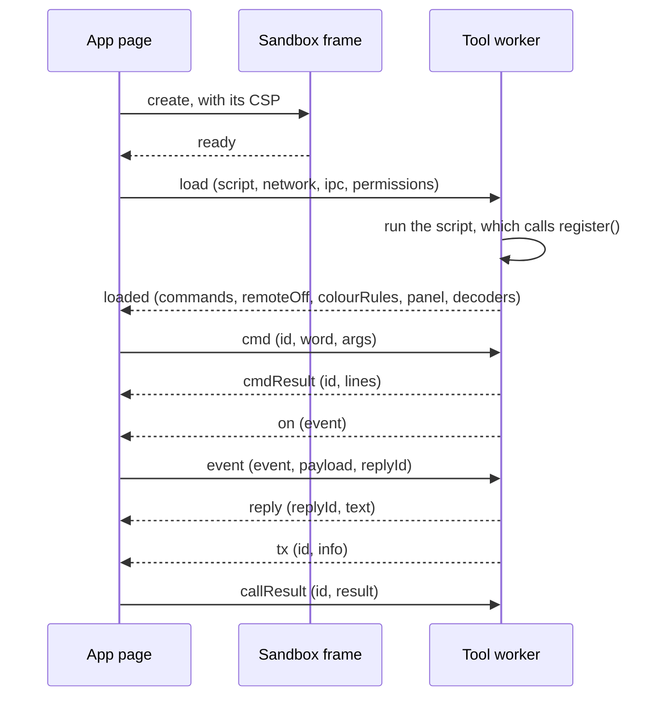

# Tool reference

This page lists everything a tool (a Shack plugin) works with. That is the manifest, the script's API, the messages
between the app and the sandbox, the limits, the lifecycle and the trust labels. It is for authors who write a
tool; [Write your first tool](first-tool.md) walks through one from start to finish.

The app ships no tools of its own. Every tool, the project's first-party ones in the
[`apachler/aprscaching-tools`](https://github.com/apachler/aprscaching-tools) registry included, is a signed script
that a player installs and that runs in the sandbox under the API below.

## What a tool ships

| File | Content |
|---|---|
| `tool.json` | The manifest (below). The player installs a tool by this file's URL. |
| The entry script | The JavaScript the sandbox runs, named by the manifest's `entry` (`tool.js` when left out), relative to the manifest's URL. Its SHA-256 is pinned in the signed manifest (`entrySha256`). |

The app's page fetches both without cookies (`credentials: "omit"`). A tool listed in a registry the instance
carries reaches the browser through the instance instead ([Fetched through the instance](tool-registry.md#fetched-through-the-instance)).
When the browser fetches from another origin than the app, the server answers with an
`Access-Control-Allow-Origin` header that allows the app's origin.

## Manifest fields

`validateManifest()` in `@aprscaching/tools` checks the manifest and normalises it. An install stops on the first
error it reports.

| Field | Type | Required | Rule | Error when it fails |
|---|---|---|---|---|
| `name` | string | yes | 2 to 40 characters of `a-z`, `0-9` and `-`, starting with a letter or digit. The tool's identity. | `invalid name (lowercase, 2–40 chars, [a-z0-9-])` |
| `title` | string | yes | Not blank; trimmed. The label users see. | `title required` |
| `author` | string | yes | Not blank; trimmed and upper-cased. The author's callsign. | `author (callsign) required` |
| `version` | string | yes | Not blank; trimmed. Free text, for example `1.0.0`. | `version required` |
| `permissions` | string array | yes | Each one a [capability](#capabilities); duplicates dropped. `[]` is allowed. | `permissions must be a list of known capabilities` |
| `surfaces` | string array | no | Each one a [surface](#surfaces); duplicates dropped; `["web"]` when left out or empty. | `surfaces must be a list of known surfaces (web/terminal/bbs/node/map)` |
| `remote` | boolean | no | `true` marks the tool's commands as callable by a remote connected station. Any other value counts as not set. | none |
| `description` | string | no | One line for the registry and the install prompt. Any other type is dropped. | none |
| `entry` | string | no | The script's URL or path, resolved against the manifest's URL. | `entry must be a string URL/path` |
| `entrySha256` | string | to install | The SHA-256 of the exact bytes `entry` serves, base64 (44 characters). `sign.mjs` sets it. | `entrySha256 must be the base64 SHA-256 of the entry script` |
| `connect` | string array | with `network` | At most 8 `https://` or `wss://` origins, with no path, query, fragment or credentials; normalised to `scheme://host[:port]`. | `connect must be a list of at most 8 origins`, `connect entries must be https:// or wss:// origins, without a path` |
| `pubkey` | string | to install | The author's raw Ed25519 public key, base64url. | `pubkey must be a base64url string` |
| `signature` | string | to install | A detached Ed25519 signature, base64, over the [signing bytes](#signing-and-trust). | none |

A tool that asks for `network` without a `connect` list fails with `a tool asking for network lists the origins it
reaches in connect`. Fields the validator does not know are dropped.

## Capabilities

The player approves a tool's `permissions` as a whole in the install prompt. A tool reaches a capability only
through the script API below. The app checks the grant on every request the sandbox relays, whatever the script
does inside its worker.

| Capability | What the tool gets |
|---|---|
| `command` | `register({ commands })`, run from **Run a tool command** in the Tools app |
| `monitor` | `tool.on("on_frame")` for heard frames, and colour rules: `register({ colourRules })`, `tool.setColourRules()` |
| `event` | `tool.on()` for the other [events](#events), with a reply to a connected session |
| `decoder` | `register({ decoders })`, run from **Decode** in the Tools app |
| `panel` | `register({ panel })`, `tool.setPanel()` (and `ipc.setPanel()`) |
| `map` | `tool.setMapLayer()`, drawn on the map when the tool targets the `map` surface |
| `ipc` | the [tool bus](#the-tool-bus): `emit`, `subscribe`, `call`, `provide` |
| `network` | `fetch`, `XMLHttpRequest`, `WebSocket` and `EventSource`, to the `connect` origins only |
| `beacon` | `tool.scheduleBeacon()`, behind the [transmit gate](#transmit-and-beacons) |
| `tx` | `tool.requestTx()`, behind the transmit gate, and the bus services that transmit |
| `geo` | nothing yet |

No capability lets a tool change how finds are verified.

## Surfaces

`surfaces` say where a tool's panel, colour rules and map layer appear. Commands and decoders appear in the Tools
app whatever the surfaces.

| Surface | Where |
|---|---|
| `web` | The **Tools** app |
| `terminal` | The packet terminal: its monitor colours and its panels |
| `bbs` | The BBS |
| `node` | The NET/ROM node console |
| `map` | The map: the tool's map layer |

## The script's API

The sandbox runs the entry script as the body of a function with three parameters, `register`, `ipc` and `tool`,
inside a Web Worker. The script is a classic script: `import` and `export` are syntax errors, and so is a
top-level `await`. Bundle any library into the one file; the project's tools are built that way
(README of [`apachler/aprscaching-tools`](https://github.com/apachler/aprscaching-tools), **Build**).

### `register(tool)`

The script calls `register()` while it runs. What it registered by the time it returns is what the app reads.
A later call replaces the commands, colour rules and decoders inside the worker, but the app keeps the lists it
read at load; `tool.setPanel()` and `tool.setColourRules()` change the others later.

| Field | Type | Content | Limits |
|---|---|---|---|
| `commands` | `{ [word]: handler \| { run: handler, remote?: false } }` | One handler per `/word`; `handler(args: string)` returns a string, a string array or a `Promise` of one, and its value becomes the output lines. `{ run, remote: false }` keeps a command from remote peers in a `remote` tool. | The word is matched exactly as typed, so use lower case. An answer later than 10 seconds reads `error: the tool did not answer`. |
| `colourRules` | `ColourRule[]` | Recolour or hide monitor lines ([below](#colour-rules)). Needs `monitor`. | 40 rules |
| `panel` | `PanelSpec` | The tool's first panel ([below](#panel-nodes)). Needs `panel`. | See [panel nodes](#panel-nodes) |
| `decoders` | `{ id, label, kind, decode(input), sample?, placeholder? }[]` | Text decoders the **Decode** box offers. `decode` returns a string or a `Promise` of one. `sample` is a line the **Use a sample** button fills in; `placeholder` shows in the empty box. | `sample` 2000, `placeholder` 120 characters |

A handler that throws or rejects answers `error: <message>`. A command the tool does not have answers
`no such command`; a decoder it does not have answers `no such decoder`.

### `tool`

`tool` is always there. Each method checks its permission inside the worker and throws `permission '<name>' not
granted` without it; the app checks again on its side.

| Member | Needs | Content |
|---|---|---|
| `tool.permissions` | | The capabilities the player granted, as a string array |
| `tool.log(message)` | | A line in the app's tool log (cut to 300 characters) |
| `tool.setPanel(spec)` | `panel` | Replace the tool's panel |
| `tool.setMapLayer(spec)` | `map` | Replace the tool's map layer: `{ id, points: { lat, lon, label?, glyph?, tone? }[] }`, at most 2000 points, a label of 40 characters and a glyph of 2. The map draws it when the tool targets the `map` surface. |
| `tool.setColourRules(rules)` | `monitor` | Replace the colour rules |
| `tool.on(event, handler)` | `monitor` for `on_frame`, `event` for the others | Call `handler(payload)` for each [event](#events) |
| `tool.requestTx(info)` | `tx` | Transmit one APRS information field; a `Promise` of `true` when it went to the radio, `false` when it was held or refused |
| `tool.scheduleBeacon(spec)` | `beacon` | Set the tool's beacon, `{ comment, intervalSec }`, or end it with `null`; a `Promise` that rejects with the reason when the transmit gate is closed |
| `tool.emit`, `tool.subscribe`, `tool.call`, `tool.provide` | `ipc` | The [tool bus](#the-tool-bus) |

Timers (`setTimeout`, `setInterval`) and promises work inside the worker. A tool that keeps state keeps it in its
own variables; it lasts while the tool runs.

### Events

`tool.on(event, handler)` asks the app to forward an event. The handler receives the payload the surface supplied:
the strings `surface`, `source`, `peerCall`, `myCall`, `dst` and `text` (each cut to 512 characters), the number
`channel`, and `station` when it is plain data.

| Event | Raised by | Payload |
|---|---|---|
| `on_frame` | every heard frame: the packet terminal (`source: "RF"`, with `dst` and `text`) and the map's live stations (`source: "APRS"`) | `peerCall` is the heard station |
| `on_tick` | the app, once a minute | none |
| `on_connect`, `on_disconnect` | a surface with connected sessions | `peerCall`, `myCall`, `channel`, `surface`, and `reply` |
| `on_beacon`, `on_find`, `on_spot` | reserved for the surfaces that raise them | |

When the surface offers one, `payload.reply(text)` answers the connected session. A reply is one line of at most
256 characters; each event's reply works four times, for two minutes, and only for a tool that holds `event`. The
reply travels through that surface, under its own transmit gate.

### Transmit and beacons

A tool transmits only through the app's browser radio link, the way the app's own features do:

- the tool holds `tx` (or `beacon` for a beacon);
- the player's callsign is control-verified, checked at every request;
- a transmit-capable radio is connected in **Settings → My radio** (the browser radio link), with the player's
  [transmit consent for this tab](../shack/my-radio.md#allow-transmitting-for-this-tab). A tool never asks for
  that consent itself; without it, the transmission is held and the app says so. The packet terminal's own TNC
  port is not a tool's to use, except through the `session.script` service.

Every frame goes out from the callsign the consent covers, to `APZACG` via `WIDE1-1`, shows in **Recent
transmissions** under the tool's title and flashes the transmit indicator. The app refuses an information field
that is empty, longer than 256 characters, more than one line, or third-party traffic (starting with `}`). It lets
each tool transmit once a minute (`TOOL_TX_MIN_GAP_MS`), its beacon included; a request inside that minute answers
`false`.

A beacon transmits its comment as an APRS status (`>comment`), at once and then every `intervalSec` seconds while
the gate is open. The app clamps the interval to 10 minutes through one day and the comment to one line of 62
characters. A tool has one beacon; a new `scheduleBeacon()` replaces it, and switching the tool off ends it.

### Colour rules

A rule matches a monitor line when every field it sets matches. A rule that sets none of the match fields never
matches. An exact `src` rule is checked first; then the first matching rule of the others wins.

| Field | Match |
|---|---|
| `src` | The source callsign is this, ignoring case. Up to 2000 such rules, one per callsign. |
| `srcPrefix` | The source callsign starts with this, ignoring case |
| `dstPrefix` | The destination starts with this, ignoring case |
| `textIncludes` | The line's text contains this, case-sensitive |
| `colorVar` | The colour token to tag the line with, such as `--st-user`. A value that is not `--name` is ignored. The station tokens are `--st-bbs`, `--st-beacon`, `--st-cacher`, `--st-digi`, `--st-dx`, `--st-igate`, `--st-node`, `--st-service`, `--st-user` and `--st-wx`. |
| `hidden` | `true` hides the line |

At most 40 rules without `src` count.

### The tool bus

The bus methods need `ipc`. They exist on `tool`, and on `ipc`, which is `undefined` unless the tool holds `ipc`.

| Method | Content |
|---|---|
| `emit(topic, data)` | Publish `data` on `topic` to every subscriber. Subscribers see the tool's manifest `name` as the sender. |
| `subscribe(topic, cb)` | Call `cb(data, from)` for each message on `topic`. There is no unsubscribe; the subscription ends when the tool is switched off. |
| `call(name, args)` | Call the service `name`. Returns a `Promise` of its answer, which is `undefined` when nobody offers it. The promise rejects when the service needs a capability the tool does not hold, when it fails, or when it does not answer in 10 seconds. |
| `provide(name, fn)` | Offer the service `name`: `fn(args)` returns the answer or a `Promise` of it. |
| `ipc.setPanel(spec)` | Replace the tool's panel. Needs `panel` as well. |

Topic and service names are cut to 64 characters, and an empty one is refused. Every payload is copied with the
structured-clone algorithm, so it carries data, never functions. The app's bus stops a chain of messages that
nests deeper than 16.

The sender name a subscriber receives is the emitting tool's manifest `name`; the app itself sends as `(host)`. A
player cannot install a second tool under a name an installed tool already has.

A service that makes the radio transmit needs `tx` as well as `ipc`. A call from a tool without `tx` is refused
with the error `service "<name>" needs the 'tx' permission, which <tool> does not hold`, and the service does not
run. Holding `tx` does not open the transmit gate: the packet terminal still transmits only while the player's
callsign is control-verified, with its own consent.

The app and the project's tools use these names:

| Name | Kind | Offered by | Needs | Payload |
|---|---|---|---|---|
| `station.seen` | topic | the **Station DB (NAMES.GP)** tool, while it is on | `ipc` | `{ call, type, source }` for each heard station: `source` is `RF` from the packet terminal or `APRS` from the map's live stations |
| `station.type` | service | the **Station DB (NAMES.GP)** tool, while it is on | `ipc` | Takes a callsign; answers its station type, or `""` when it has not heard it |
| `render.blocks` | topic | listened to by the **Block art (GIP)** tool | `ipc` | `{ text }`, or `{ cols, cells }` as in a `blocks` node, shown in its panel |
| `session.progress` | topic | the packet terminal, while a TNC is open | `ipc` | The state of a running session script: `{ status, step, total, captured, note }` |
| `session.script` | service | the packet terminal, while a TNC is open | `ipc` and `tx` | Takes `{ steps }`, a connected-mode script that connects and sends over the TNC; answers `{ ok: true }` |
| `link.ping.request` | topic | the **Link ping (RTT)** tool's `/ping` | `ipc` | `{}` |
| `link.rtt` | topic | listened to by the **Link ping (RTT)** tool | `ipc` | `{ ms }` |

## Panel nodes

A panel is `{ title?, nodes }`. The app renders it with its own elements and the theme's tokens; the tool never
touches the page. `sanitizePanel()` enforces these limits on every panel a tool sends, and drops a node of an
unknown kind.

| Node | Fields | Limits |
|---|---|---|
| `text` | `text`, `tone?` | 240 characters |
| `kv` | `key`, `value`, `tone?` | key 60, value 240 characters |
| `badge` | `text`, `tone?` | 40 characters |
| `bar` | `label`, `value`, `max`, `tone?` | label 60 characters; numbers |
| `table` | `head: string[]`, `rows: string[][]` | 8 columns of 40 characters; 100 rows of 8 cells of 80 characters |
| `blocks` | `cols`, `cells: { ch, c? }[]` | `cols` 1 to 200; 4000 cells of one character; `c` an ANSI colour 0 to 15 |

A panel holds at most 60 nodes and a title of 80 characters. `tone` is one of `default`, `muted`, `accent`, `ok`,
`warn` and `bad`; any other value is dropped.

## Messages between the app and the sandbox

The script API above is all a tool author needs. Under it, the app's page, a hidden frame and the tool's worker
exchange these messages with `postMessage`. The frame relays them unchanged, and the app drops any message that
does not come from the tool's own frame or does not have one of these shapes (`parseFrameMessage()` in
`apps/web/src/tools/sandbox.ts`). Every request reaches the app's tool host through the tool's own context
(`SandboxBridge`), which checks the grant; a tool that is switched off reaches nothing.



| Message | Direction | Payload | Notes |
|---|---|---|---|
| `ready` | frame → app | none | The frame is up; the app answers with `load`. |
| `load` | app → worker | `script`, `network`, `ipc`, `permissions` | Without `network`, the worker removes `fetch`, `XMLHttpRequest`, `WebSocket`, `WebTransport`, `EventSource`, `importScripts`, `Worker` and `SharedWorker` before it runs the script. |
| `loaded` | worker → app | `commands`, `remoteOff`, `colourRules`, `panel`, `decoders` | Lists are cut to 200 entries, colour rules to 40. |
| `error` | worker or frame → app | `error` | The script threw while loading, or the worker failed. Cut to 500 characters. |
| `cmd` · `cmdResult` | app → worker · back | `id`, `word`, `args` · `id`, `lines` | |
| `decode` · `decodeResult` | app → worker · back | `id`, `decId`, `input` · `id`, `out` | |
| `panel` | worker → app | `spec` | Sanitised before display; needs `panel`. |
| `map` | worker → app | `spec` | Sanitised; needs `map`. |
| `colours` | worker → app | `rules` | Needs `monitor`. |
| `log` | worker → app | `msg` | Cut to 300 characters. |
| `on` · `event` | worker → app · back | `event` · `event`, `payload`, `replyId?` | `on_frame` needs `monitor`, the others `event`. |
| `reply` | worker → app | `replyId`, `text` | Needs `event`; four replies per event, for two minutes. |
| `tx` · `beacon` | worker → app | `id`, `info` · `id`, `spec` | Answered with `callResult`. Need `tx` · `beacon` and the transmit gate. |
| `emit` · `subscribe` | worker → app | `topic`, `data` · `topic` | Need `ipc`. |
| `ipcEvent` | app → worker | `topic`, `data`, `from` | A message on a subscribed topic. |
| `call` | worker → app | `id`, `name`, `args` | Needs `ipc`; answered with `callResult`. |
| `callResult` | app → worker | `id`, `result` or `error` | `error` rejects the tool's promise. |
| `provide` | worker → app | `name` | Needs `ipc`. |
| `svcCall` · `svcResult` | app → worker · back | `id`, `name`, `args` · `id`, `result` or `error` | Another tool called the service. |

## Errors an install shows

| Message | Cause |
|---|---|
| `manifest <status>` | The manifest URL answered with an HTTP error. |
| `Failed to fetch` (in Chromium) | The manifest's server is unreachable, or its answer lacks the CORS header. |
| A validation error | See [manifest fields](#manifest-fields). |
| `Refused: Unsigned — refused` | The manifest has no `signature` or no `pubkey`. |
| `Refused: the manifest pins no hash of its code (entrySha256), …` | The signed manifest has no `entrySha256`. Sign it again with `sign.mjs`. |
| `Refused: the tool's code does not match its signed manifest.` | The script's bytes differ from `entrySha256`: the script changed after the manifest was signed, or someone serves other code. |
| `Refused: Signature INVALID — refused` | The signature does not match the manifest. |
| `Refused: Author key CHANGED since you last trusted it — refused` | The key differs from the registry's entry or from the one the player accepted before. |
| `Refused: you already have a tool named "<name>". …` | An installed tool from another address has the name. |
| `Install failed: the tool did not start in time` | The frame and worker did not report `loaded` within 15 seconds. |
| `Install failed: <message>` | The script threw while loading, or the entry could not be fetched. |

## Sandbox limits

The worker runs in an `<iframe sandbox="allow-scripts">` built from `srcdoc`, so it has an opaque origin. Its
Content-Security-Policy is:

```text
default-src 'none'; script-src 'unsafe-inline' 'unsafe-eval' blob:; worker-src blob:;
connect-src <the connect origins, or 'none'>; base-uri 'none'; form-action 'none'
```

- **No page.** The worker has no DOM; the tool shows itself only through panels, colour rules, its map layer and
  command output.
- **No app storage.** The app's cookies, session, local storage, IndexedDB, Cache Storage and service worker
  belong to another origin. The worker has no storage that outlives the tool.
- **Network only to `connect`, and only with `network`.** `connect-src` names the manifest's `connect` origins
  minus the app's own page and API origins, so a tool never reaches the app's API. A request leaves with
  `Origin: null` and none of the player's cookies, so the server answers with `Access-Control-Allow-Origin: *`
  (or `null`) for the tool to read the response.
- **No code from a server.** The CSP allows scripts only inline, through `eval` and from `blob:` URLs, so a tool
  cannot load code from a server; `import` is a syntax error in the script.
- **Answers within 10 seconds.** A command, a decoder, a service and a bus call may answer with a promise; one
  that has not settled after 10 seconds answers with an error.

## Lifecycle

1. The player opens **Shack → Tools** and installs the tool from the **Registry** list, or by its manifest URL.
2. The app fetches and validates the manifest, checks its signature and decides its trust label.
3. The player approves the permissions with **Approve and install**, or cancels.
4. The app fetches the entry, checks it against `entrySha256`, starts the frame and the worker, and runs the
   script. The tool starts switched on.
5. The tool's panel, colour rules and map layer appear on its surfaces; its commands and decoders appear in the
   Tools app; its events, bus messages and transmit requests reach the app's host.

An installed tool keeps running while the Tools app is closed. Its row has a switch, which turns it off and on, a
pin for the rail, and **Remove**, which closes its frame, frees its `name` and uninstalls it. Switching it off or
removing it also takes its pin off the rail and ends its beacon.

The app records each install in the player's settings (`acs.tools`: the manifest's address, the author key and
the grants approved, the switch), which follow the account like the rail pins. At every page load the app starts
each recorded tool again and checks it anew: the signature must verify under the recorded author key, the
manifest may ask for no permission beyond the recorded grants, and the script must match `entrySha256`. A tool
that fails a check stays installed with the reason and does not run; installing it again approves a new key or new
permissions.

## Versioning

`version` is free text that the app shows and never compares. A tool's identity is its `name`. The app refuses
to install a tool whose name an installed tool from another address already has; remove that one first. A changed
`version` is part of the signed manifest, so a new version is signed again; an installed tool runs the version its
address serves at the next start, as long as the recorded key signed it and it asks for no new permission. A
registry entry carries its own `version`, which is what the **Registry** list shows.

## Signing and trust

A tool carries `pubkey`, `signature` and `entrySha256`. The signature covers the canonical manifest: every field
except `signature`, with object keys sorted, as `manifestSigningBytes()` in `@aprscaching/tools` builds it.
`entrySha256` is one of those fields, so the signature covers the script's bytes too: after the prompt, the app
fetches the script, hashes it (`checkEntryHash()`), and runs it only when the hash matches. Whoever serves the
script (the author's server, a mirror, the instance carrying a registry) cannot change it without the tool being
refused. [`tools/toolkey`](../reference/cli.md#toolkey) makes a key pair and signs a manifest.

The app decides one of six trust labels before it shows the install prompt:

| Label | When |
|---|---|
| **Signed · registry-listed author key** | The signature is valid, the manifest was fetched from the URL the registry lists for this `name`, and `pubkey` equals the key the registry lists for it. |
| **Signed · matches the key you trusted before** | Valid, not registry-listed, and the key equals the one this browser accepted for this author before. |
| **Signed · unknown author key (trust-on-first-use)** | Valid, not registry-listed, and this browser does not know the key. |
| **Unsigned — refused** | No `signature` or no `pubkey`. The install stops. |
| **Author key CHANGED since you last trusted it — refused** | Valid, but the key differs from the registry's or the accepted one. The install stops. |
| **Signature INVALID — refused** | The signature does not verify. The install stops. |

Approving a signed tool stores its key for its author in this browser, under `acs.tool.keys`.

### What "registry-listed" covers

A registry is a JSON document of entries (`name`, `title`, `author`, `version`, `pubkey`, `entry`,
`description`), signed by an authority key. The sysop configures the instance's registries and a player may add
their own; each is pinned to its authority key when it is added. A registry signed by another key shows as **key
changed** and lists nothing until its key is confirmed again; one whose signature fails lists nothing.
[The tool registry](tool-registry.md) explains the file, the pinning and how to host one.

- The **registry-listed** label in the install prompt means the manifest was fetched from the URL the registry
  lists for its name and signed by the key the registry lists for it. The prompt names the registry, and marks
  one the player added as theirs. A relative script `entry` resolves against that URL, so the script comes from
  the listed site.
- A copy of a listed manifest served from any other URL is not registry-listed, even with a valid signature by
  the listed key: its relative `entry` resolves against the copy's site and runs that site's script. It gets
  the trust-on-first-use labels above and the normal install prompt.
- The script is covered through the signed `entrySha256`, whichever server delivers it.

## Next

- [Write your first tool](first-tool.md): build, run and publish the example tool.
- [The tool registry](tool-registry.md): the signed list of tools, end to end.
