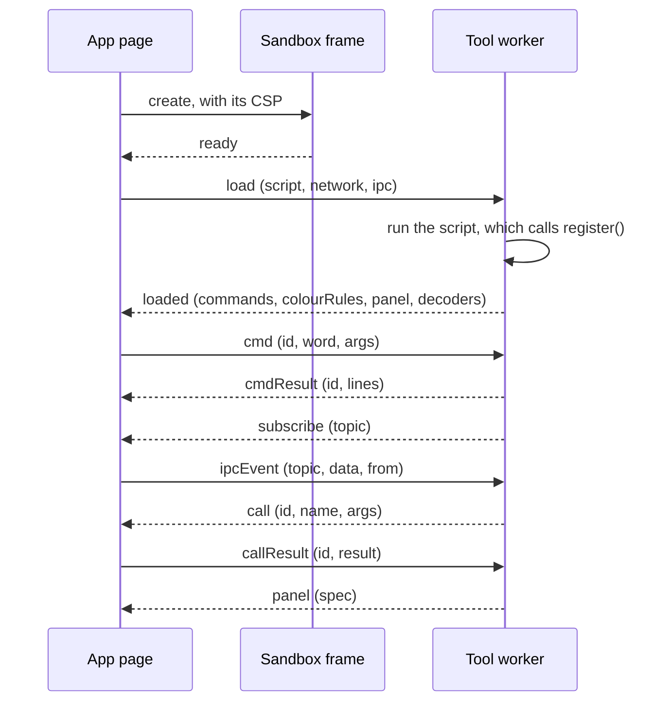

# Tool reference

This page lists everything an imported tool (a Shack plugin) works with. That is the manifest, the script's API,
the messages between the app and the sandbox, the limits, the lifecycle and the trust labels. It is for authors who
write a tool; [Write your first tool](first-tool.md) walks through one from start to finish.

## What a tool ships

| File | Content |
|---|---|
| `tool.json` | The manifest (below). The user imports a tool by this file's URL. |
| The entry script | The JavaScript the sandbox runs, named by the manifest's `entry` (`tool.js` when left out), relative to the manifest's URL. |

Both are fetched by the app's page without cookies (`credentials: "omit"`). When they live on another origin
than the app, their server answers with an `Access-Control-Allow-Origin` header that allows the app's origin.

## Manifest fields

`validateManifest()` in `@aprscaching/tools` checks the manifest and normalises it. An import stops on the first
error it reports.

| Field | Type | Required | Rule | Error when it fails |
|---|---|---|---|---|
| `name` | string | yes | 2 to 40 characters of `a-z`, `0-9` and `-`, starting with a letter or digit. The tool's identity. | `invalid name (lowercase, 2–40 chars, [a-z0-9-])` |
| `title` | string | yes | Not blank; trimmed. The label users see. | `title required` |
| `author` | string | yes | Not blank; trimmed and upper-cased. The author's callsign. | `author (callsign) required` |
| `version` | string | yes | Not blank; trimmed. Free text, for example `1.0.0`. | `version required` |
| `permissions` | string array | yes | Each one a [capability](#capabilities); duplicates dropped. `[]` is allowed. | `permissions must be a list of known capabilities` |
| `surfaces` | string array | no | Each one a [surface](#surfaces); duplicates dropped; `["web"]` when left out or empty. | `surfaces must be a list of known surfaces (web/terminal/bbs/node/map)` |
| `remote` | boolean | no | `true` marks the tool's commands as callable by a remote connected station. Any other value counts as not set. | none |
| `description` | string | no | One line for the registry and the import prompt. Any other type is dropped. | none |
| `entry` | string | no | The script's URL or path, resolved against the manifest's URL. | `entry must be a string URL/path` |
| `connect` | string array | with `network` | At most 8 `https://` or `wss://` origins, with no path, query, fragment or credentials; normalised to `scheme://host[:port]`. | `connect must be a list of at most 8 origins`, `connect entries must be https:// or wss:// origins, without a path` |
| `pubkey` | string | to sign | The author's raw Ed25519 public key, base64url. | `pubkey must be a base64url string` |
| `signature` | string | to sign | A detached Ed25519 signature, base64, over the [signing bytes](#signing-and-trust). | none |

A tool that asks for `network` without a `connect` list fails with `a tool asking for network lists the origins it
reaches in connect`. Fields the validator does not know are dropped.

## Capabilities

The user approves a tool's `permissions` as a whole in the import prompt. An imported tool reaches a
capability only through the script API below; the right-hand column says what that is.

| Capability | What a built-in tool gets | What an imported tool gets |
|---|---|---|
| `command` | `registerCommand()` | `register({ commands })`, run from **Run a tool command** in the Tools app |
| `monitor` | `on("on_frame")`, `addColouriser()` | `register({ colourRules })` |
| `event` | `on()` for lifecycle events | nothing |
| `decoder` | `addDecoder()` | `register({ decoders })`, run from **Decode** in the Tools app |
| `panel` | `setPanel()` | `register({ panel })`, and `ipc.setPanel()` with `ipc` |
| `map` | `setMapLayer()` | nothing |
| `ipc` | `emit`, `subscribe`, `provideService`, `callService` | the `ipc` object: `emit`, `subscribe`, `call`, `setPanel` |
| `network` | not used | `fetch`, `XMLHttpRequest`, `WebSocket` and `EventSource`, to the `connect` origins only |
| `beacon` | `scheduleBeacon()`, behind the transmit gate | nothing |
| `tx` | `requestTx()`, behind the transmit gate | nothing |
| `geo` | nothing | nothing |

The transmit gate lets a tool transmit only while the user's callsign is control-verified. No capability lets a
tool change how finds are verified.

## Surfaces

`surfaces` say where a tool's panel and colour rules appear. Commands and decoders of an imported tool appear in
the Tools app whatever its surfaces.

| Surface | Where |
|---|---|
| `web` | The **Tools** app |
| `terminal` | The packet terminal: its monitor colours and its panels |
| `bbs` | The BBS |
| `node` | The NET/ROM node console |
| `map` | The map, for a built-in tool's map layer |

## The script's API

The sandbox runs the entry script as the body of a function with two parameters, `register` and `ipc`, inside a
Web Worker. The script is a classic script: `import` and `export` are syntax errors, and so is a top-level
`await`. Bundle any library into the one file.

### `register(tool)`

The script calls `register()` while it runs. What it registered by the time it returns is what the app reads.
A later call replaces the commands, colour rules and decoders inside the worker, but the app keeps the lists it
read at load.

| Field | Type | Content | Limits |
|---|---|---|---|
| `commands` | `{ [word]: (args: string) => string \| string[] }` | One handler per `/word`. The handler returns at once; its value becomes the output lines. | The word is matched exactly as typed, so use lower case. A built-in command with the same word answers first. |
| `colourRules` | `ColourRule[]` | Recolour or hide monitor lines (below). Needs `monitor`. | 40 rules |
| `panel` | `PanelSpec` | The tool's first panel (below). Needs `panel`. | See [panel nodes](#panel-nodes) |
| `decoders` | `{ id, label, kind, decode(input: string): string }[]` | Text decoders the **Decode** box offers. `decode` returns at once. | A built-in decoder with the same `id` wins while it is on: `cw`, `psk31` and `7plus` are taken. |

A handler that throws answers `error: <message>`. A command the tool does not have answers `no such command`; a
decoder it does not have answers `no such decoder`. A handler that returns a `Promise` shows as
`[object Promise]`: work that waits answers through `ipc.setPanel()` instead.

### Colour rules

A rule matches a monitor line when every field it sets matches. A rule that sets none of the three match fields
never matches. The first matching rule wins.

| Field | Match |
|---|---|
| `srcPrefix` | The source callsign starts with this, ignoring case |
| `dstPrefix` | The destination starts with this, ignoring case |
| `textIncludes` | The line's text contains this, case-sensitive |
| `colorVar` | The colour token to tag the line with, such as `--st-user`. A value that is not `--name` is ignored. The station tokens are `--st-bbs`, `--st-beacon`, `--st-cacher`, `--st-digi`, `--st-dx`, `--st-igate`, `--st-node`, `--st-service`, `--st-user` and `--st-wx`. |
| `hidden` | `true` hides the line |

### `ipc`

`ipc` is `undefined` unless the tool holds `ipc`. Check it before use.

| Method | Content |
|---|---|
| `ipc.emit(topic, data)` | Publish `data` on `topic` to every subscriber. Subscribers see the sender as `(host)`. |
| `ipc.subscribe(topic, cb)` | Call `cb(data, from)` for each message on `topic`. There is no unsubscribe; the subscription ends with the tool. |
| `ipc.call(name, args)` | Call the service `name`. Returns a `Promise` of its answer, which is `undefined` when nobody offers it. |
| `ipc.setPanel(spec)` | Replace the tool's panel. Needs `panel` as well. Calls made before the tool finishes loading are dropped. |

Topic and service names are cut to 64 characters, and an empty one is refused. Every payload is copied with the
structured-clone algorithm, so it carries data, never functions. The app's bus stops a chain of messages that
nests deeper than 16.

The app and the built-in tools use these names:

| Name | Kind | Offered by | Payload |
|---|---|---|---|
| `station.seen` | topic | the **Station DB (NAMES.GP)** tool, while it is on | `{ call, type, source }` for each heard station: `source` is `RF` from the packet terminal or `APRS` from the map's live stations |
| `station.type` | service | the **Station DB (NAMES.GP)** tool, while it is on | Takes a callsign; answers its station type, or `""` when it has not heard it |
| `render.blocks` | topic | listened to by the **Block art (GIP)** tool | `{ text }`, or `{ cols, cells }` as in a `blocks` node, shown in its panel |
| `session.progress` | topic | the packet terminal, while a TNC is open | The state of a running session script: `{ status, step, total, captured, note }` |
| `session.script` | service | the packet terminal, while a TNC is open | Takes `{ steps }`, a connected-mode script; answers `{ ok: true }` |
| `link.ping.request` | topic | the **Link ping (RTT)** tool's `/ping` | `{}` |
| `link.rtt` | topic | listened to by the **Link ping (RTT)** tool | `{ ms }` |

## Panel nodes

A panel is `{ title?, nodes }`. The app renders it with its own elements and the theme's tokens; the tool never
touches the page. `sanitizePanel()` enforces these limits on every panel an imported tool sends, and drops a
node of an unknown kind.

| Node | Fields | Limits |
|---|---|---|
| `text` | `text`, `tone?` | 240 characters |
| `kv` | `key`, `value`, `tone?` | key 60, value 240 characters |
| `badge` | `text`, `tone?` | 40 characters |
| `bar` | `label`, `value`, `max`, `tone?` | label 60 characters; numbers |
| `table` | `head: string[]`, `rows: string[][]` | 8 columns of 40 characters; 100 rows of 8 cells of 80 characters |
| `blocks` | `cols`, `cells: { ch, c? }[]` | `cols` 1 to 200; 4000 cells of one character; `c` an ANSI colour 0 to 15 |

A panel holds at most 60 nodes and a title of 80 characters. `tone` is one of `default`, `muted`, `accent`, `ok`,
`warn` and `bad`; any other value is dropped.

## Messages between the app and the sandbox

The script API above is all a tool author needs. Under it, the app's page, a hidden frame and the tool's worker
exchange these messages with `postMessage`. The frame relays them unchanged, and the app drops any message that
does not come from the tool's own frame or does not have one of these shapes (`parseFrameMessage()` in
`apps/web/src/tools/sandbox.ts`).



| Message | Direction | Payload | Notes |
|---|---|---|---|
| `ready` | frame → app | none | The frame is up; the app answers with `load`. |
| `load` | app → worker | `script`, `network`, `ipc` | Without `network`, the worker removes `fetch`, `XMLHttpRequest`, `WebSocket`, `WebTransport`, `EventSource`, `importScripts`, `Worker` and `SharedWorker` before it runs the script. |
| `loaded` | worker → app | `commands`, `colourRules`, `panel`, `decoders` | Lists are cut to 200 entries, colour rules to 40. |
| `error` | worker or frame → app | `error` | The script threw while loading, or the worker failed. Cut to 500 characters. |
| `cmd` | app → worker | `id`, `word`, `args` | |
| `cmdResult` | worker → app | `id`, `lines` | |
| `decode` | app → worker | `id`, `decId`, `input` | |
| `decodeResult` | worker → app | `id`, `out` | |
| `panel` | worker → app | `spec` | From `ipc.setPanel()`; sanitised before display. |
| `emit` | worker → app | `topic`, `data` | Only with `ipc`; otherwise dropped. |
| `subscribe` | worker → app | `topic` | Only with `ipc`. |
| `ipcEvent` | app → worker | `topic`, `data`, `from` | A message on a subscribed topic. |
| `call` | worker → app | `id`, `name`, `args` | Only with `ipc`. |
| `callResult` | app → worker | `id`, `result` | |

## Errors an import shows

| Message | Cause |
|---|---|
| `manifest <status>` | The manifest URL answered with an HTTP error. |
| `Failed to fetch` (in Chromium) | The manifest's server is unreachable, or its answer lacks the CORS header. |
| A validation error | See [manifest fields](#manifest-fields). |
| `Refused: Signature INVALID — refused` | The signature does not match the manifest. |
| `Refused: Author key CHANGED since you last trusted it — refused` | The key differs from the registry's entry or from the one the user accepted before. |
| `Import failed: the tool did not start in time` | The frame and worker did not report `loaded` within 15 seconds. |
| `Import failed: <message>` | The script threw while loading, or the entry could not be fetched. |

## Sandbox limits

The worker runs in an `<iframe sandbox="allow-scripts">` built from `srcdoc`, so it has an opaque origin. Its
Content-Security-Policy is:

```text
default-src 'none'; script-src 'unsafe-inline' 'unsafe-eval' blob:; worker-src blob:;
connect-src <the connect origins, or 'none'>; base-uri 'none'; form-action 'none'
```

- **No page.** The worker has no DOM; the tool shows itself only through panels, colour rules and command output.
- **No app storage.** The app's cookies, session, local storage, IndexedDB, Cache Storage and service worker
  belong to another origin. The worker has no storage that outlives the tool.
- **Network only to `connect`, and only with `network`.** `connect-src` names the manifest's `connect` origins
  minus the app's own page and API origins, so a tool never reaches the app's API. A request leaves with
  `Origin: null` and none of the user's cookies, so the server answers with `Access-Control-Allow-Origin: *`
  (or `null`) for the tool to read the response.
- **No code from a server.** The CSP allows scripts only inline, through `eval` and from `blob:` URLs, so a tool
  cannot load code from a server; `import` is a syntax error in the script.
- **Handlers answer at once.** A command, a decoder or the `register()` call returns its value synchronously.
  Timers and promises run inside the worker, and their results reach the app through `ipc`.

## Lifecycle

1. The user opens **Shack → Tools** and imports the tool by its manifest URL, or from the **Registry** list.
2. The app fetches and validates the manifest, checks its signature and decides its trust label.
3. The user approves the permissions with **Approve + run**, or cancels.
4. The app fetches the entry, starts the frame and the worker, and runs the script.
5. The tool's panel and colour rules appear on its surfaces; its commands and decoders appear in the Tools app.

An imported tool lasts for the page's session. Reloading the page ends it, and the user imports it again. There
is no switch to turn an imported tool off; a reload removes it.

## Versioning

`version` is free text that the app shows and never compares. A tool's identity is its `name`. A second tool
with the name of one already loaded, a built-in included, keeps its commands and decoders. It shows no panel or
colour rules. A changed `version` is part of the signed manifest, so a new version is signed again. A registry
entry carries its own `version`, which is what the **Registry** list shows.

## Signing and trust

A tool may carry `pubkey` and `signature`. The signature covers the canonical manifest: every field except
`signature`, with object keys sorted, as `manifestSigningBytes()` in `@aprscaching/tools` builds it.
[`tools/toolkey`](../reference/cli.md#toolkey) makes a key pair and signs a manifest.

The app decides one of six trust labels before it shows the import prompt:

| Label | When |
|---|---|
| **Verified · registry-listed author key** | The signature is valid and `pubkey` equals the key the registry lists for this `name`. |
| **Signed · matches the key you trusted before** | Valid, not in the registry, and the key equals the one this browser accepted for this author before. |
| **Signed · unknown author key (trust-on-first-use)** | Valid, and neither the registry nor this browser knows the key. |
| **Unsigned · you're trusting the URL only** | No `signature` or no `pubkey`. |
| **Author key CHANGED since you last trusted it — refused** | Valid, but the key differs from the registry's or the accepted one. The import stops. |
| **Signature INVALID — refused** | The signature does not verify. The import stops. |

Approving a signed tool stores its key for its author in this browser, under `acs.tool.keys`.

!!! warning "A signed manifest is refused"
    The app checks the signature over the validated manifest, which holds every optional field, set or not.
    Its canonical form writes an unset field as `undefined`, while `tools/toolkey` signs the file as written.
    The two differ unless the manifest sets both `remote: true` and `connect`, so a signed manifest shows as
    **Signature INVALID** and the import stops. Unsigned tools import. [TODO.md](https://github.com/apachler/aprscaching/blob/dev/TODO.md)
    tracks the fix.

### What "verified" covers

The registry is a JSON document of entries (`name`, `title`, `author`, `version`, `pubkey`, `entry`,
`description`), signed by an authority key the app pins at build time (`VITE_TOOL_REGISTRY_AUTHORITY`); the app
reads it from `VITE_TOOL_REGISTRY`, `/tools/registry.json` by default. A registry with another authority key or
a broken signature is ignored, and the **Registry** list stays empty.

- The **verified** badge in the **Registry** list means the entry is in that signed registry.
- The **Verified** label in the import prompt means the manifest was signed by the key the registry lists for its
  name.
- Neither covers the script. The signature covers the `entry` URL, not the bytes served there, so whoever
  controls that server can change the script without breaking the signature. Pinning the script's hash in the
  manifest is planned (`entryHash` in [TODO.md](https://github.com/apachler/aprscaching/blob/dev/TODO.md)).

## Next

- [Write your first tool](first-tool.md): build, run and publish the example tool.
- [Writing a Shack plugin](plugins.md): how the plugin system fits together.
