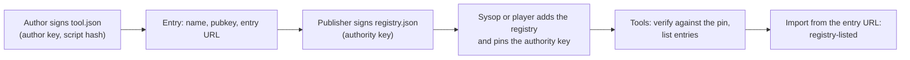

# The tool registry

This page explains tool registries end to end: what a registry file is, how an instance and its players choose
which ones the Tools app lists, how a registry's key is pinned, and how to host a registry on GitHub. It is for
tool authors and anyone who publishes a registry. At the end you can publish a signed registry and know what a
listing does and does not promise.

## What a registry is

A registry is one signed JSON file: a list of tools, each with the author key that signs it and the address of
its `tool.json`. The **Tools** app lists the tools of every registry the instance and the player switched on. A
tool imported from an entry's address and signed by the key the entry lists shows as **Signed · registry-listed
author key** in the import prompt.



## Which registries the Tools app lists

| Registry | Who adds it | Shown as |
|---|---|---|
| The project registry | Bundled with every release, served by the instance at `/tools/registry.json`. The sysop can switch it off. | **instance** |
| The instance's registries | The sysop, in **Instance settings → Tools** ([Tool registries](../run/day-to-day/instance-settings.md#tool-registries)), or `TOOL_REGISTRIES` in the environment | **instance** |
| A player's own registries | The player, in the Tools app ([Add a registry](../shack/tools.md#add-a-registry)), while the sysop allows it | **yours**: added by the player, not checked by the instance |

The app loads each registry on its own: one that fails, is unreachable or has a changed key shows its own state
and does not hold up the others. A tool listed by several registries shows once, under the first that lists it,
with every registry that lists it.

## Pinning a registry's key

The app trusts a registry only under the key someone confirmed for it, never under the key the file names:

1. Whoever adds a registry gives its address. The app fetches the file once and shows the fingerprint of its
   authority key (four groups of four hex digits, `3f2a 9c01 bb7e 4d10`), how many tools it lists, and a few titles.
2. They compare the fingerprint with the one the publisher gives, in the repository's README, on a website or in
   person, and confirm only when every digit matches. The key is then pinned to the entry.
3. Every later load verifies the file against the pinned key. A file signed by another key shows as **key
   changed** and lists nothing until the same person compares and confirms the new key.

A publisher states the fingerprint wherever people find the registry. The fingerprint of a key is the first 64 bits
of SHA-256 over the raw Ed25519 key, the same form federation keys use.

## Fetched through the instance

While **Fetch tool registries through this instance** (`TOOL_REGISTRIES_PROXY`) is on, the gateway fetches each added
registry, the manifests its entries name and the scripts those name, and serves them from the instance's own
address:

- A player's address never reaches the registry's host.
- The gateway keeps each file for an hour and serves the last good copy while the host is unreachable, so tools
  keep importing without internet.
- It fetches without cookies, refuses private and LAN addresses unless the federation policy allows them
  (`FED_ALLOW_PRIVATE`), and fetches only files the registry leads to. A registry file may hold 256 KB, a manifest
  64 KB, a script 512 KB, and one registry's files 4 MB together.
- A player's own registry is fetched for that player alone, and counts against a limit of 60 fetches an hour.

The gateway is only a carrier: the browser verifies every signature against the pinned key and every script against
its manifest's hash. With the setting off, the browser fetches each registry from its publisher.

## The file format

```json
{
  "entries": [
    {
      "name": "hello-tool",
      "title": "Hello tool",
      "author": "OE8APR",
      "version": "1.0.0",
      "pubkey": "uibFUCjcBnxAe8mRQ1v2neJd0fPV_7Vs0Y59K5vH5Oc",
      "entry": "tools/hello/tool.json",
      "description": "Example signed tool: command, colour rule, panel, ROT13 decoder."
    }
  ],
  "authority": "22usQMnB0VLUKlwA176NK2EZwqcSxcgx0M_rS2jNWp0",
  "sig": "…"
}
```

| Field | Content |
|---|---|
| `entries` | The listed tools, in the order **Registry** shows them |
| `entries[].name` | The tool's manifest `name`. One entry per name |
| `entries[].title`, `author`, `version`, `description` | What the **Registry** list shows; keep them equal to the manifest |
| `entries[].pubkey` | The author's Ed25519 public key, base64url, exactly as in the signed manifest |
| `entries[].entry` | The `tool.json` address. A relative address resolves against the registry's own URL |
| `authority` | The public key that signed the file. It must equal the key pinned for the registry |
| `sig` | An Ed25519 signature, base64, over the `entries` array serialised with object keys sorted |

The signature covers `entries` only: any change to an entry, its order included, needs a new signature.
`authority` and `sig` sit outside what is signed. Use relative entries: they resolve the same wherever the
registry is served, and a manifest's relative `entry` script resolves against the manifest's own URL.

## Host a registry on GitHub

A GitHub repository serves a registry with no server of your own. Both `raw.githubusercontent.com` and GitHub
Pages send `Access-Control-Allow-Origin: *`, so the app can fetch from either.

1. Lay the repository out with the registry at the root and each tool in a folder of its own:

    ```text
    registry.json
    tools/hello/tool.json
    tools/hello/tool.js
    ```

2. Make an authority key on a computer you trust, and keep its private value offline:

    ```bash
    node tools/toolkey/genkey.mjs
    ```

3. Sign each tool's manifest (with the author's key), list each tool in `registry.json` with a relative `entry`
   such as `tools/hello/tool.json`, then sign the registry with the authority key:

    ```bash
    TOOL_PRIVATE_KEY=<author key> node tools/toolkey/sign.mjs manifest tools/hello/tool.json
    TOOL_PRIVATE_KEY=<authority key> node tools/toolkey/sign.mjs registry registry.json
    ```

4. Commit, push and tag a release (`git tag v1.0.0`).
5. Publish the authority key's fingerprint in the README. The app shows it when the registry is added.

People add the registry by one of these addresses:

| Address | Serves |
|---|---|
| `github:owner/repo@v1.0.0` | The tag's `registry.json`, from `raw.githubusercontent.com` |
| `github:owner/repo/path/to/registry.json@main` | A file on a branch |
| `github:owner/repo` | `registry.json` on the default branch |
| `https://owner.github.io/repo/registry.json` | GitHub Pages, when the repository publishes one |

A `@tag` pins one release: the list changes only when people switch to a newer tag. A branch follows every push.
The signatures protect either way: a file changed by anyone without the authority key fails, and a script changed
without a new manifest signature fails its hash.

## The project registry

The project registry lives in its own repository,
[apachler/aprscaching-tools](https://github.com/apachler/aprscaching-tools). Its `CONTRIBUTING.md` covers
submitting a tool, and its `MAINTAINERS.md` covers signing and releases.

### Bundled with each release

Each APRScaching release bundles a tagged snapshot of the project registry in `apps/web/public/tools/`, so every
instance serves it from its own address and it works offline. The snapshot keeps the repository's layout:
`/tools/registry.json` lists `tools/hello/tool.json`, which resolves to `/tools/tools/hello/tool.json`. Nothing in
the files is rewritten. To take a new release into the app:

```bash
node tools/toolkey/bundle-registry.mjs v1.0.0
```

The script fetches the tag from GitHub and checks the registry's signature against the project key pinned in
`packages/shared/src/toolregistries.ts`, each manifest's signature against the author key its entry lists, and each
script against its manifest's `entrySha256`. It writes nothing when any check fails, and verifies the bundled
registry again once it is written.

To follow the project registry between releases, add it as a GitHub registry as well
(`github:apachler/aprscaching-tools@<tag>`). A tool listed by both shows once.

## What "registry-listed" covers

- A tool counts as registry-listed only when its manifest was fetched from the exact address its entry names (a
  relative entry resolved against the registry's URL) and signed by the key the entry lists. The **Import…** button
  beside an entry uses that address. The import prompt names the registry that lists it.
- A copy of a listed manifest served from any other address is not registry-listed, even when the listed key signed
  it: its script would come from the other site. It gets the trust-on-first-use labels.
- If the manifest at the listed address is signed by another key than the entry's, the import is refused as
  **Author key CHANGED**.
- The manifest's signature covers `entrySha256`, the hash of the script's bytes, and the app runs a script only
  when its bytes match. A listing vouches for the signer, and the hash ties the code to that signature.

[Signing and trust](tool-reference.md#signing-and-trust) lists every label and when it applies.

## What keeps players safe

- **Tools never run on the instance.** The instance lists registries and may carry their files; every tool runs in
  the player's browser, in a sealed sandbox apart from their session, passkeys and stored keys.
- **The browser decides trust.** It checks each registry against its pinned key, each manifest against its author's
  signature, and each script against its signed hash. Nothing the instance or a registry's host serves can widen
  that.
- **Gated abilities need the player's grant.** A tool gets `tx`, `beacon`, `network` and `geo` only when the player
  approves them in the import prompt.
- **Transmitting needs more.** A tool that asks to transmit also needs the player's verified callsign and their
  transmit consent for the tab.

## Rotate or revoke a key

| Event | What happens |
|---|---|
| An author changes their key | The author signs the manifest with the new key; the registry's publisher updates the entry's `pubkey` and signs the registry again. Imports from the listed address show as registry-listed again. A copy elsewhere shows **Author key CHANGED** to players who accepted the old key. |
| An author's key leaks | The publisher removes the entry, or lists the new key, and signs again. There is no revocation list: a browser that accepted the leaked key still shows **Signed · matches the key you trusted before** for a manifest it signs from an address no registry lists. |
| A tool must go | Remove its entry and sign again. Players who imported it keep it until they reload the page. |
| A registry's authority key changes | Sign the registry with the new key and publish the new fingerprint. Every instance and player that pinned the old key sees **key changed** until they compare and confirm the new one. |
| A registry's authority key leaks | As above, and tell everyone who pinned it: until they confirm a new key, the leaked key still signs what they see. |

## Limits

- **One key per registry.** A registry is pinned to one authority key; a rotation needs everyone to confirm the new
  key.
- **No revocation list.** A removed entry stops vouching; author keys browsers accepted stay accepted.
- **Ten registries per player**, twenty per instance beside the project registry.

## Next

- [Write your first tool](first-tool.md): build, sign and host a tool.
- [Tool reference](tool-reference.md#signing-and-trust): every trust label and what the signature covers.
