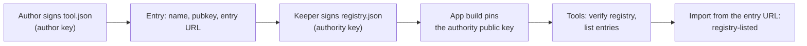

# The tool registry

This page explains the tool registry end to end: what the file is, where it lives, how a tool gets listed, and how
a sysop runs a registry of their own. It is for tool authors, the registry's keeper and sysops who build the app.
At the end you know which file to edit, which key signs it, and what a listing does and does not promise.

## What the registry is

The registry is one signed JSON file: a list of tools, each with the author key that signs it and the address of
its `tool.json`. The **Tools** app fetches the file, checks its signature against an authority key built into the
app, and shows the entries under **Registry**. A tool imported from an entry's address and signed by the key the
entry lists shows as **Signed · registry-listed author key** in the import prompt.



Two settings, both read when the web app is built, decide which registry an instance shows:

| Setting | Meaning | Default |
|---|---|---|
| `VITE_TOOL_REGISTRY` | The registry's URL, absolute or relative to the app | `/tools/registry.json`, served with the app |
| `VITE_TOOL_REGISTRY_AUTHORITY` | The authority's Ed25519 public key, base64url, that must have signed the registry | The project's key, `J12Zxjkj1-wbUYMgw9wEMfiNB85u4y6tyiQLfQaCink` |

The app fetches the registry without cookies each time **Tools** opens. It shows nothing under **Registry** when
the URL answers 404, an error with **Retry** when it cannot load it, and "failed its signature check" when the
file's `authority` is not the pinned key or the signature does not verify.

## The file format

```json
{
  "entries": [
    {
      "name": "hello-tool",
      "title": "Hello tool",
      "author": "OE8APR",
      "version": "1.0.0",
      "pubkey": "J12Zxjkj1-wbUYMgw9wEMfiNB85u4y6tyiQLfQaCink",
      "entry": "/tools/hello/tool.json",
      "description": "Example signed tool: command, colour rule, panel, ROT13 decoder."
    }
  ],
  "authority": "J12Zxjkj1-wbUYMgw9wEMfiNB85u4y6tyiQLfQaCink",
  "sig": "r6BYLYK/doOytPnyUly48TrtwvThRLhwZsAQKTOA+RNnHlqqY/4ih/ATNHh8XQwsYhivpBJInIPYDqwg5y1BBQ=="
}
```

| Field | Content |
|---|---|
| `entries` | The listed tools, in the order **Registry** shows them |
| `entries[].name` | The tool's manifest `name`. One entry per name |
| `entries[].title`, `author`, `version`, `description` | What the **Registry** list shows; keep them equal to the manifest |
| `entries[].pubkey` | The author's Ed25519 public key, base64url, exactly as in the signed manifest |
| `entries[].entry` | The `tool.json` address. A relative address resolves against the registry's own URL |
| `authority` | The public key that signed the file. It must equal the app's `VITE_TOOL_REGISTRY_AUTHORITY` |
| `sig` | An Ed25519 signature, base64, over the `entries` array serialised with object keys sorted |

The signature covers `entries` only: any change to an entry, its order included, needs a new signature.
`authority` and `sig` sit outside what is signed.

## Where the project's registry lives

The project's registry is [`apps/web/public/tools/registry.json`](https://github.com/apachler/aprscaching/blob/dev/apps/web/public/tools/registry.json).
The web build copies it to `/tools/registry.json`, so every instance built from the repository serves the
project's registry from its own address. It lists the example `hello-tool`, whose files sit beside it in
`apps/web/public/tools/hello/`.

A change to the file reaches users with the next app build: a self-hosted instance shows it after its sysop
updates and rebuilds, and the Desktop app with its next release. Until then each instance keeps the registry it
was built with.

### Get your tool listed

1. Host and sign your tool ([Write your first tool](first-tool.md#package-and-host-it)). Serve it over `https://`
   with `Access-Control-Allow-Origin: *`.
2. Open a pull request that adds your entry to `apps/web/public/tools/registry.json`: `name`, `title`, `author`,
   `version`, `pubkey`, `entry` (the absolute `https://` address of your `tool.json`) and `description`. Leave `sig`
   as it is.
3. The keeper reviews the tool ([What a reviewer checks](first-tool.md#what-a-reviewer-checks)), signs the file
   again and merges it.

The keeper checks that the manifest at `entry` validates, that its signature verifies with the `pubkey` you give,
and that the script does what the description says with no more permissions than it needs.

### Sign the registry (the keeper)

The maintainer keeps the authority's private key offline; it is never in the repository and never in CI. To sign
after editing the entries:

```bash
TOOL_PRIVATE_KEY=<authority private value> node tools/toolkey/sign.mjs registry apps/web/public/tools/registry.json
```

`sign.mjs` reads `entries` (or a bare array), writes `authority` and `sig`, and saves the file in place. Commit
the signed file. A file signed by any other key fails the app's check.

## Run your own registry (sysop)

An instance can show its own registry instead of the project's: a club's tools, or the project's entries plus
your own.

1. Make an authority key on a computer you trust:

    ```bash
    node tools/toolkey/genkey.mjs
    ```

    It prints a private value and a public key. Keep the private value offline: whoever holds it decides what
    your users see as registry-listed.

2. Write `registry.json` with your entries (the format above). To include the project's tools, copy their
   entries; your signature then vouches for them.
3. Sign it:

    ```bash
    TOOL_PRIVATE_KEY=<your private value> node tools/toolkey/sign.mjs registry registry.json
    ```

4. Host the file. Next to the app, replace `apps/web/public/tools/registry.json` in your checkout before you build.
   Elsewhere, serve it over `https://` with `Access-Control-Allow-Origin` allowing your app's origin, and point
   `VITE_TOOL_REGISTRY` at its URL; then you update the file without rebuilding.
5. Build the web app with your key and URL, and deploy that build:

    ```bash
    VITE_TOOL_REGISTRY_AUTHORITY=<your public key> \
    VITE_TOOL_REGISTRY=https://tools.example.org/registry.json \
    pnpm --filter @aprscaching/web build
    ```

    Bare metal and Pocket serve `apps/web/dist`. The Desktop build script builds the app the same way, so set the
    two variables in its environment.

6. Open **Shack → Tools**. Your entries show under **Registry**.

!!! warning "The Docker image ignores these settings"
    The Self-host Docker image builds the web app inside the image, and its build receives no `VITE_` settings:
    `.env` stays out of the build context and the Dockerfile passes no build arguments. A Docker instance always
    shows the project's registry. Building a custom image is the only way around it today.

Every change to the authority key, and to the URL, needs a new build. A change to the file itself needs one only
when the file ships with the app.

## What "registry-listed" covers

- A tool counts as registry-listed only when its manifest was fetched from the exact address its entry names (a
  relative entry resolved against the registry's URL) and signed by the key the entry lists. The **Import…** button
  beside an entry uses that address.
- A copy of a listed manifest served from any other address is not registry-listed, even when the listed key signed
  it: its script would come from the other site. It gets the trust-on-first-use labels.
- If the manifest at the listed address is signed by another key than the entry's, the import is refused as
  **Author key CHANGED**.
- The signature covers the manifest, including the script's address, but not the script's bytes. Whoever controls
  the server behind `entry` can change the script without breaking any signature. Pinning the script's hash
  (`entryHash`) is tracked in [TODO.md](https://github.com/apachler/aprscaching/blob/dev/TODO.md).

[Signing and trust](tool-reference.md#signing-and-trust) lists every label and when it applies.

## Rotate or revoke a key

| Event | What works today |
|---|---|
| An author changes their key | The author signs the manifest with the new key; the keeper updates the entry's `pubkey` and signs the registry again. Imports from the listed address then show as registry-listed again: the registry's key wins over the key a browser accepted before. A copy elsewhere shows **Author key CHANGED** to users who accepted the old key. |
| An author's key leaks | The keeper removes the entry, or lists the new key, and signs again. There is no revocation list: a browser that accepted the leaked key still shows **Signed · matches the key you trusted before** for a manifest it signs from an address the registry does not list. |
| A tool must go | Remove its entry and sign again. Users who imported it keep it until they reload the page. |
| The authority key changes | Sign the registry with the new key and build the app with the new `VITE_TOOL_REGISTRY_AUTHORITY`. Builds with the old key reject the new file as failing its signature check until they are rebuilt; there is no overlap window. |
| The authority key leaks | As above. Builds that pin the leaked key accept anything it signs until they are rebuilt. |

## Limits

- **One authority per build.** The app pins a single key, set at build time. A multi-key allowlist for overlapping
  rotations is tracked in [TODO.md](https://github.com/apachler/aprscaching/blob/dev/TODO.md).
- **Settings need a rebuild.** `VITE_TOOL_REGISTRY` and `VITE_TOOL_REGISTRY_AUTHORITY` are read when the web app
  is built, and the Docker image does not pass them in.
- **One registry per instance.** Users cannot add a registry of their own.
- **No script pinning.** The listing vouches for the manifest and its signer, not for the bytes of the script.
- **No revocation list.** A removed entry stops vouching; keys browsers accepted stay accepted.

## Next

- [Write your first tool](first-tool.md): build, sign and host a tool.
- [Tool reference](tool-reference.md#signing-and-trust): every trust label and what the signature covers.
