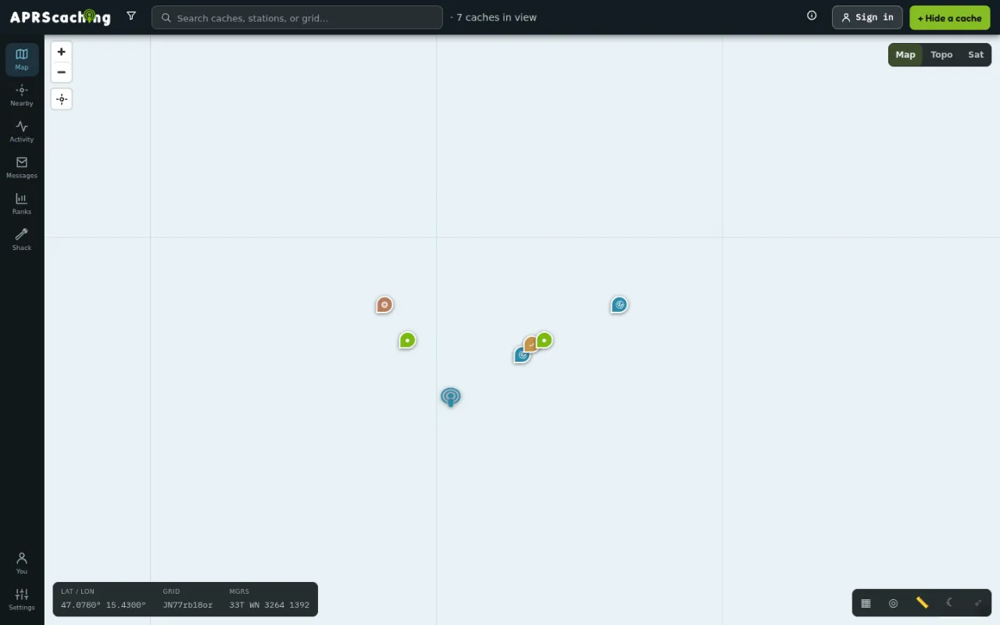
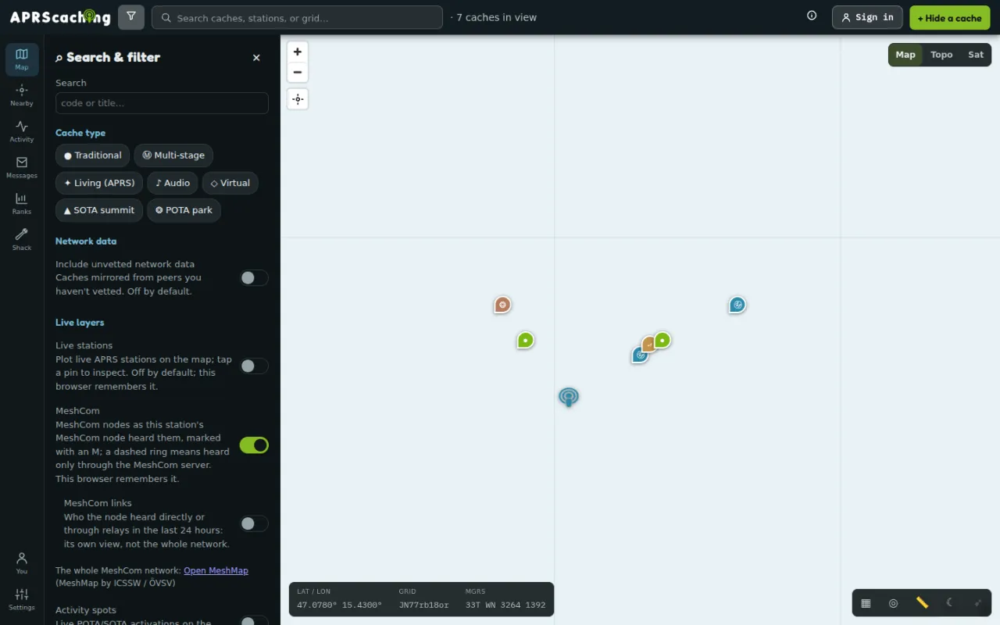
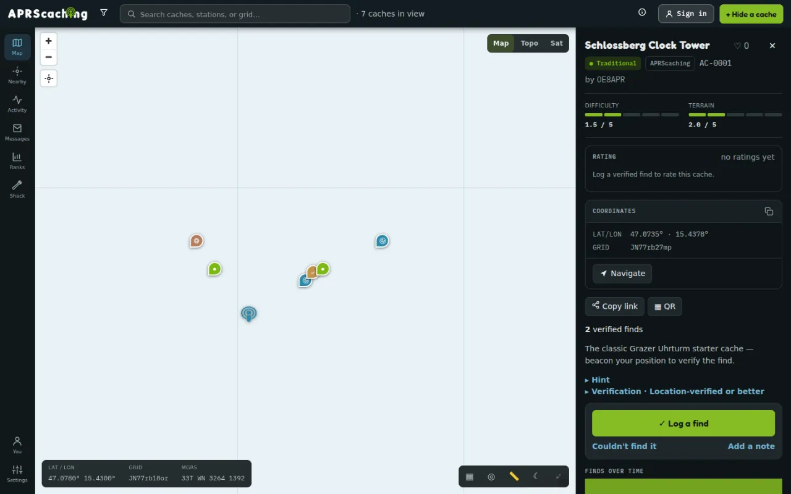

# Caching

The cache game is the heart of aprscaching: someone hides a cache, you go there and log the find. This page
walks through the app. New here? Start with [Start here](../start-here.md) and [Your account](account.md).

## Finding your way around

| On a phone (bottom bar) | On a computer (left rail) | What it is |
|---|---|---|
| **Map** | **Map** | The map with caches and live stations |
| **Nearby** | **Nearby** | The closest caches and stations, nearest first |
| **Hide** / **Log** (centre button) | **+ Hide a cache** (top bar) | Hide a cache — or, when a cache is selected, log it |
| **Activity** | **Activity** | Recent finds, top finders, top corroborators |
| **You** | **You**, **Ranks**, **Messages**, **Shack**, **Settings** | Your profile; on a phone the Shack and Settings are under **You → Advanced** |

The **Manual** icon in the top bar opens this manual.

{ width="720" loading=lazy }

## The map

- **Search & filter** (the funnel icon): search by code or title, filter by **Cache type**, include
  **unvetted network data** from other instances, and turn on **Live layers** — live APRS stations and
  POTA/SOTA activations.
  { width="720" loading=lazy }
- **Basemap**: **Map**, **Topo** or **Sat**.
- **Map tools**: grid-square overlay, range rings, a ruler (distance and bearing), the day/night line, and
  the bearing from your home locator to the selected cache.
- The corner readout shows the cursor position as **Lat / Lon**, **Grid** (Maidenhead) and **MGRS**.
- **Nearby → Download this area** keeps the caches of the current area for use without mobile coverage.

## Cache types

| Type | What it is |
|---|---|
| **Traditional** | One container at a fixed spot. |
| **Multi-stage** | Several stages; each stage's position is revealed when you unlock the previous one. |
| **Virtual** | A place to visit, with no container. |
| **Audio** | A stage unlocked by an audio clue. |
| **Living (APRS)** | Moves with an APRS station — you find it by meeting the station. |
| **SOTA summit · POTA park · WWFF reserve · Bunker · Castle** | Places from the ham-radio award programs and landmarks, often imported by the instance. |

## Open a cache

Tap a marker on the map, a row in **Nearby**, or a search result. The cache sheet shows:

- the title, type, source (**APRScaching** or **imported · …**), code (`AC-1234`) and **by** the owner;
- **Difficulty** and **Terrain** (1–5);
- **Min. verification · Tier B** — the lowest tier a find needs to count as verified here;
- **Rating**, the **Hint** (tap to reveal), photos under **Media**;
- **Coordinates** with a copy button, the grid square, and **Navigate** to open your maps app
  (Google, Apple or OpenStreetMap);
- **Copy link** and **▦ QR** to share it;
- the **Logbook** of everyone's finds, DNFs and notes.

{ width="720" loading=lazy }

## Log a find

At the cache, tap **✓ Log a find** (or **Log** in the bottom bar). Allow location access when the browser
asks — that reading is what verifies your find. If you refuse, the find is still logged, just not verified by
your phone.

The result shows how well your find is verified:

| Badge | Tier | Meaning |
|---|---|---|
| **Verified · RF** | A | Your APRS position was heard on the air near the cache, by a receiving station that isn't yours, on a believable track. Peer instances can also confirm this. |
| **Verified · App** | B | Your phone's location at logging time matched the cache (within the cache's radius plus your GPS accuracy). |
| **Verified · C** · **Logged · unverified** | C | Only an internet (APRS-IS) position was available. The find is recorded but not confirmed. |

If a cache requires a higher tier than your find reached, the find is recorded but shown as unverified.
Your find is signed with your device key (**signed with your device key ✍**); if you verified your
callsign, it can also be **announced to APRS-IS**.

No signal at the cache? The find is **Saved — offline, will sync when you're back online**.

**Couldn't find it** records a DNF; **Add a note** posts a note to the logbook.

### Log from your radio

No phone with you? Send an APRS text message from your radio to the instance's service call — `APRSCG`
unless the instance names another:

| Message | Logs |
|---|---|
| `FOUND AC-1234 nice spot` | a find, with optional log text |
| `DNF AC-1234 muggles` | a did-not-find |
| `NOTE AC-1234 log is full` | a note |
| `HELP` | replies with the command list |

The dash in the code is optional. Your callsign must be verified on your account (**Settings → Account**);
the log goes to the account that holds it.

- **Heard by one of the instance's own receiving stations** (its attested sites), the message is logged at
  once.
- **Arrived only over the internet** (APRS-IS, or a relayed MeshCom message), it waits under **Profile →
  Logs sent over the air** until you tap **Confirm** — anyone can put your callsign on an internet message,
  so the app asks you first. Unconfirmed messages expire after seven days.

The find is verified the usual way, at the time you sent the message: beacon your position near the cache
first, and a find heard by an independent receiving station reaches **Tier A**. A radio message carries no
phone location, so without such a beacon it is recorded at **Tier C**.

Your radio gets an acknowledgement for a numbered message, sent back the way your message came: from the
receiving station's own radio when it can transmit (no internet needed), through the MeshCom node that heard
you, or over APRS-IS. A text reply ("AC-1234 found, logged Tier A") comes only if the operator has turned
replies on; `HELP` is always answered. At most ten commands per hour are accepted from one callsign, all
its SSIDs together; more are ignored, without an acknowledgement.

### The "you're near" prompt

When you walk into a cache's area with the app open, a banner appears: **📍 You're near AC-1234 — …** with
**Log it** and **Dismiss**.

## Staged caches

A multi-stage cache shows **Stages · 1/3 unlocked**. Unlock the next stage by:

- **geo** — standing at the current stage and tapping **I'm here — reveal**;
- **nfc** — tapping **Scan NFC tag** on the tag at the stage, or typing the code printed on it;
- **audio / open** — following the clue, then **Reveal next stage**.

## Hide a cache

1. Tap **+ Hide a cache** (phone: **Hide**). You need to be signed in.
2. Place the pin. On a phone it starts at your location; otherwise tap or click the map where the cache is,
   or tap **Use my location**. Drag the pin to adjust.
3. Fill in **Title** and **Type** (the line under the type says what it means); set **Difficulty & terrain**
   with the sliders.
4. Under **Advanced**, optionally: **Hint**, **Description**, **Drive-in**, **Country**, **Tags**, and
   **Rating & federation** — who may rate it, and the scope —
   - **Public** — shared with linked instances;
   - **Unlisted** — shared, but not listed;
   - **Local only** — stays on this instance. The hint is never shared.
5. Tap **Hide cache**. It gets a code like `AC-1234`.

Add photos afterwards from the cache's **Media** section. A **Living (APRS)** cache asks for the station
callsign it follows; you can also create one from **Settings → My stations**. The minimum tier for a cache and
its stages are set through the [HTTP API](../reference/api.md).

## Adopt a cache

When a cache's owner leaves — they erased their account, or stopped looking after it — the sysop can put the
cache up for adoption. **Nearby → Up for adoption** lists those caches, nearest first; most are archived, so
they are not on the map.

1. Open the cache. The **Up for adoption** card says why it is offered.
2. Tick **I have checked that the container is in place** if you have been to the site, and add a note for
   the sysop if you like.
3. Tap **Request adoption**. You need to be signed in with a control-verified callsign
   (**Settings → Account → verify**).

The sysop approves one request. The cache becomes yours with all its finds and logbook; if you confirmed the
container is in place it is active again, otherwise it stays archived until you edit it and set it active.
You get an alert either way, and you can withdraw a pending request from the same card.

If a cache of yours is offered, you get an alert and the card shows **Keep my cache**: tap it and the offer
ends. You have 14 days before the cache can change hands.

## Community

- **Activity** — recent finds, **Top finders**, and **Top corroborators**: the receiving stations whose
  radios verify other people's finds.
- **Ranks** — the **🏆 Leaderboard** by points or finds, for everyone or **this area**. Tap a callsign to see
  their profile: finds, points, hides, badges.
- **You** — your own profile, badges, and how many finds your stations helped verify.
- **Favorite** (♡) and rate caches you found; the owner sees **needs maintenance** flags.

When two living caches meet (within 150 m inside 15 minutes), both record a **rendezvous** — a social
record only, it earns no points.

## Sharing and exporting

- **Search & filter → Share this view** copies a link to the current map view.
- Each cache has **Copy link** and a printable **QR** code.
- Caches as **GPX/KML**, station tracks, and your finds as **ADIF** (for your logbook program) are available
  from the public [read API](../reference/api.md#public-read-api).

## Heritage places on the map

Instance operators can import places from other programs so they appear as caches: SOTA, POTA, WWFF,
WWBOTA/UKBOTA, IOTA, Geocaching Australia, OpenCaching, and peaks, castles and lighthouses from
OpenStreetMap and Wikidata. Each shows where it came from with a link back, and the same place from two
sources appears once — the ham-radio program wins (a SOTA summit hides the matching OSM peak). Imported
places stay on the importing instance. How to import: [Administration](../operate/administration.md).
