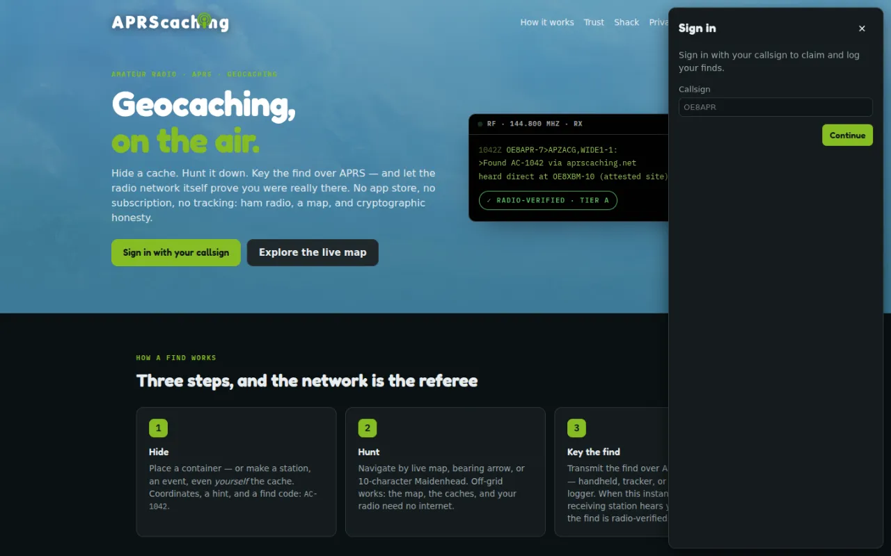
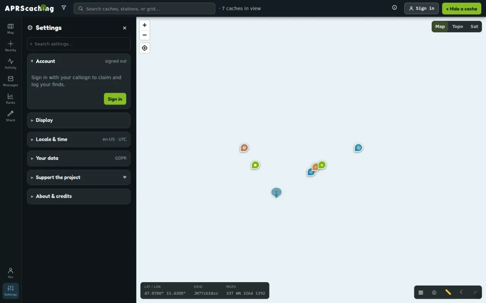

# Your account

This page is for every signed-in player. It shows how to sign out, hold several callsigns and read the licence
badge. It also lists the settings and shows how to export or erase your data.

Your account is your callsign. To create one, see [Join](join.md).

## Sign out

Open **Settings → Account**.

- **Sign out** ends the session on this device.
- **Sign out everywhere** ends every session of your account, this device included. The app asks first. Use
  it after you lose a phone or sign in on a shared computer.

Switching your active callsign also signs your other devices out.

{ width="720" loading=lazy }

## Several callsigns

One account can hold several licensed base callsigns, such as a club call or a call from another country.

1. Open **Settings → Account** and tap **Add a callsign**.
2. Type the base callsign, for example `OE8APR`, and tap **Add**. The app says the call was added and asks
   you to verify it.
3. Tap **verify** next to the new callsign ([Verify your callsign](join.md#verify-your-callsign)).

Each callsign is verified on its own. A verified callsign shows **✓ you control this call**.

**Set active** picks the callsign you operate as. The active one shows **active**. Switching never asks you
to verify again. Your past finds stay with the callsign you logged them under.

An [SSID](../glossary.md#ssid) needs no extra step. `-7` (handheld), `-9` (mobile), `-10`
([IGate](../glossary.md#igate)) and the rest share their base callsign's verification.

Finds logged under an SSID, such as `OE8APR-7`, count for the base callsign: on the leaderboard, on your
profile, for your badges, and for rating a cache you found.

## The register badge

Next to each callsign, **Settings → Account** shows whether a public licence register lists it:

| Badge | Meaning |
|---|---|
| **listed in FCC register** | A register lists the call as licensed. The badge names the register. |
| **listed as expired** | A register lists the call, but not as currently licensed. |
| **not in a public register** | No register this instance reads lists the call. |

The register badge shows that a licence exists, not who uses it. Only **✓ you control this call** shows that
the call is yours. Many countries publish no register, so **not in a public register** is normal. It never stops you from using the call.
See [Licence registers](../reference/licence-sources.md) for the registers.

## All settings

Open **Settings** from the left rail on a computer. On a phone, tap **More**, then **Settings**. The search box
at the top filters the groups.

Signed out, you see **Account**, **Display**, **Locale & time**, **Your data**, **Support the project** and
**Help & credits**. Signed in, the other groups appear too.

{ width="720" loading=lazy }

| Group | What it holds |
|---|---|
| **Account** | Sign in and out, your callsigns, verification, your email, your passkeys ([Use more than one device](join.md#use-more-than-one-device)) |
| **Display** | **Appearance** (Auto, Light, Dark or Phosphor), **Units**, and the CRT effect in Phosphor |
| **Profile** | What others see on your profile |
| **Home weather station** | Your own weather station ([Weather stations](../shack/rig-weather.md#weather-stations)) |
| **My stations** | Your stations and living caches |
| **My radio (browser)** | A radio connected to the browser ([Connect your radio](../shack/my-radio.md)) |
| **Announce finds** | Each verified find sent to APRS-IS as a status message; off by default, needs a verified callsign ([Announce your finds](log-a-find.md#announce-your-finds-on-aprs-is)) |
| **Near-cache radio message** | An APRS or MeshCom message to your radio near a cache; off by default, needs a verified callsign ([The "you're near" prompt](find-a-cache.md#the-youre-near-prompt)) |
| **Notifications** | **Email digest**, **Browser push** and the **Watchlist** ([Alerts](community.md#alerts-and-the-watchlist)) |
| **Locale & time** | Language, date and number format, time zone |
| **Your data** | Export or erase your data |
| **Support the project** | Donations, and what they pay for. A donation earns thanks, never features. |
| **Help & credits** | The manual, the tour again, a link to report a bug, **About this instance**, credits |

Dark is the default appearance. Phosphor is a green-screen terminal look.

## Your data

Open **Settings → Your data**.

- **Export my data** downloads a full copy of everything the instance holds about you. It includes how each of
  your callsigns was verified.
- **Erase my account** removes your account, your keys and your personal data. Your finds stay, but without
  your name or callsign on them. The app asks **Permanently erase OE8APR?** first; tap **Erase everything**
  to go ahead. The app then signs you out and closes Settings.

!!! warning
    Erasing cannot be undone. It covers the whole account: every callsign it holds, with their SSIDs. Your
    passkeys stop working. Other instances that copied your records erase them too.

Both need you signed in. Signed out, the group shows **Sign in** instead.

## Next

- [The Shack at a glance](../shack/index.md): when you want to operate your radio.
- [Privacy by default](../about.md#privacy-by-default): what the instance keeps and why.
