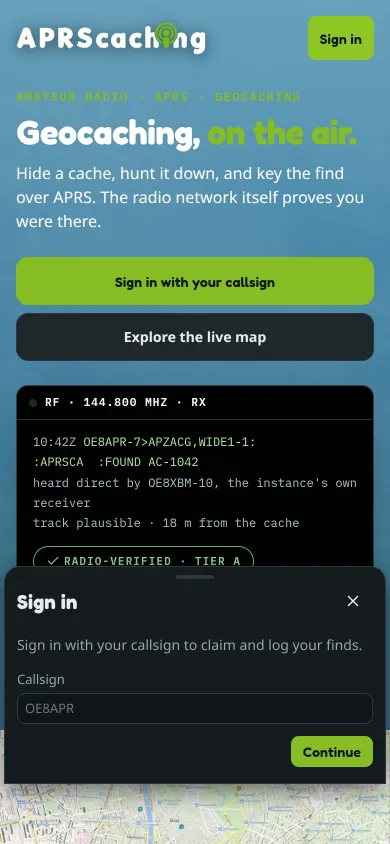
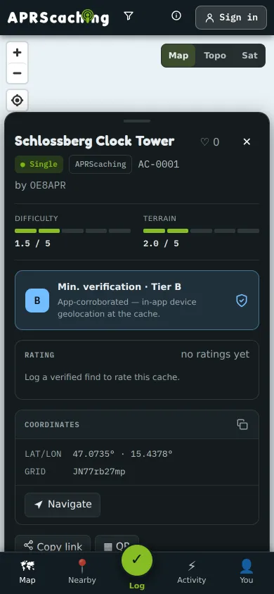

# Your first find

This tutorial takes you from opening the app to a logged find. You need your callsign and a phone or a
computer with a browser; nothing to install.

Everything below happens in your web browser — on your phone or your computer. Open
**[aprscaching.net](https://aprscaching.net)** (or the address of your club's instance).

1. **Sign in.** Tap **Sign in** (top right), type your callsign, tap **Continue**. On first visit, tap
   **Create account with a [passkey](../glossary.md#passkey)** — your phone or computer stores the key; there is no password. You can
   add an email address for recovery, or use **Email me a link** instead of a passkey.

    { width="280" loading=lazy }
2. **Verify your callsign.** Open **You** and tap **Verify callsign** under your call (it opens
   **Settings → Account**, where **verify** sits next to each callsign you hold). The
   default is **On the air**: the app shows a message to send, such as `VERIFY 482913` to `APRSCG`. Transmit
   it within 30 minutes as an APRS message from your radio or a [MeshCom](../glossary.md#meshcom) message from your node; your callsign
   is verified once this instance's own receiving station hears it directly on the air. You can instead
   publish a code under your `<call>.ampr.org` name, or sign with your ARRL [LoTW](../glossary.md#lotw) callsign certificate — and
   a [sysop](../glossary.md#sysop) can verify you by hand. Details: [Verify your callsign](join.md#verify-your-callsign).
3. **Find a cache.** Browse the map, or tap **Nearby** for the closest caches. Tap one to open it: you see
   its description, difficulty and terrain, the hint, and **Navigate** to hand the coordinates to your maps
   app.

    { width="280" loading=lazy }
4. **Log it.** At the spot, tap **✓ Log a find**. Allow location access when your browser asks — that is
   how the app confirms you were there. The result shows how well the find is verified (see below).
5. **Hide your own.** Tap **+ Hide a cache** (or **Hide** on a phone). On a phone the pin starts at your
   location; otherwise tap or click the map where it is (or **Use my location**). Give it a
   title, type, difficulty and terrain, and tap **Hide cache**.

More in [What is APRScaching?](index.md).

## Next

- [Cache types](cache-types/index.md): what else you can hunt.
- [Log a find](log-a-find.md): every way to log, including by radio.
