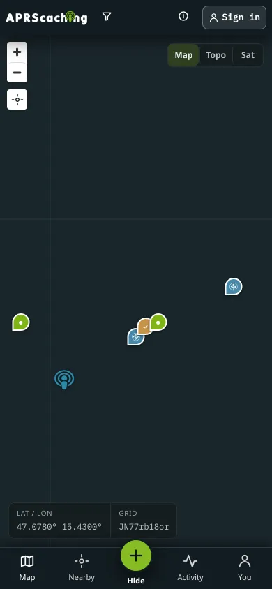

# Your first find

This tutorial takes you from opening the app to your first logged find. You need your callsign and a phone
with a web browser. At the end your find is in the cache's logbook, with a badge that says how it was verified.

## Before you start

- Your amateur-radio [callsign](../glossary.md#callsign).
- A phone with a web browser and location turned on. A computer works for the first steps, but you log at the
  cache.
- The address of your instance: [aprscaching.net](https://aprscaching.net), or the address your club gives you.

## Steps

### Sign in

1. Open the address in your browser. The front page opens.
2. Tap **Sign in with your callsign**, or **Sign in** in the top bar. The sign-in sheet opens.
3. Type your **Callsign** and tap **Continue**.

    { width="280" loading=lazy }

4. Tap **Create account with a passkey**. Your phone asks for your fingerprint, face or PIN, and stores the
   [passkey](../glossary.md#passkey). There is no password. You can tap **Email me a link** instead.

The map opens. Your callsign shows in the top bar, marked **unverified**.

### Verify your callsign

1. Tap **More**, then **You**, then **Verify callsign**. On a computer, **You** is in the left rail.
   **Settings → Account** opens.
2. Tap **verify** next to your callsign and follow the steps. The usual way is a short APRS message from your
   radio. [Verify your callsign](join.md#verify-your-callsign) explains every method.

You can log finds before this step. A verified callsign puts your finds on the leaderboard and lets you log
from your radio.

### Choose your cache

1. Tap **Map** and move the map to where you are.

    { width="280" loading=lazy }

2. Tap **Nearby**. The list shows the caches closest to the centre of the map, nearest first.

3. Tap a cache. Its sheet opens with the description, **Difficulty**, **Terrain** and the **Hint**.

    { width="280" loading=lazy }

4. Tap **Navigate**, then your maps app (**Google**, **Apple** or **OpenStreetMap**). The maps app opens with a
   route to the cache.

### Log the find

1. At the cache, open its sheet again and tap **✓ Log a find**. The button shows **Locating…** while the phone
   gets a fix.
2. Tap **Allow** when the browser asks for your location. The phone's reading is what verifies your find.

The result card opens. It shows **Logged**, a badge such as **Location-verified**, and one line that says why.

## Check that it worked

- The result card shows a badge. **Radio-verified** or **Location-verified** means the find counts as
  verified. **Logged** means it is on record, but nothing placed you at the cache.
- Scroll down the cache sheet to the **Logbook**. Your callsign is at the top.
- If the card says **Saved** and **offline**, your phone had no signal. The find syncs when the signal returns.

If the badge is **Logged**, the line under it says what was missing. [How finds are verified](verification.md)
has tips.

## Next

- [Log a find](log-a-find.md): DNFs, notes, and logging from your radio.
- [Cache types](cache-types/index.md): what else you can hunt.
