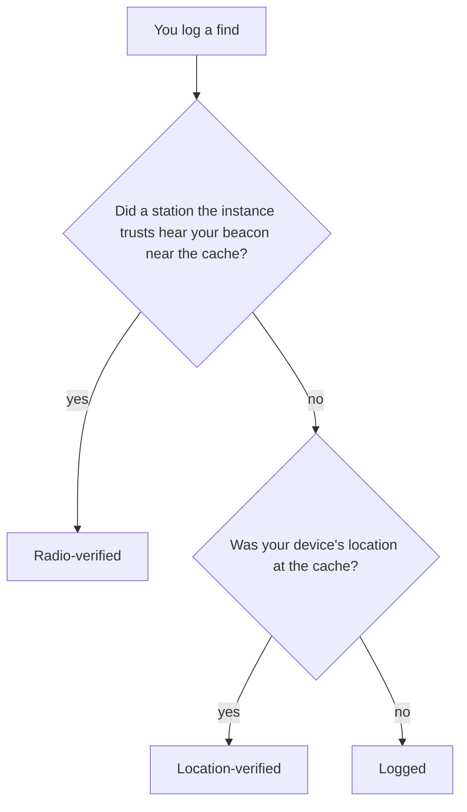

# How finds are verified

This page answers one question: how does the app know you were really at the cache? It is for players who
want to understand their badge, and to earn a better one next time.

## Three badges

Every find gets one badge. It says what placed you at the cache when you logged it.

| Badge                 | Letter | What placed you at the cache                                             |
| --------------------- | ------ | ------------------------------------------------------------------------ |
| **Radio-verified**    | A      | A receiving station that is not yours heard your radio near the cache.   |
| **Location-verified** | B      | Your phone's location, read as you logged, was at the cache.             |
| **Logged**            | C      | Nothing independent. The find is on record, but not verified.            |

**Radio-verified** and **Location-verified** finds count as verified. They earn points, badges and a place on
the leaderboard. A **Logged** find stays in the logbook, but does not count.

## What each badge needs

### Radio-verified

All of these must hold:

- Your radio beacons its position, and the beacon is heard **on the air** by a receiving station your
  instance trusts. The instance's sysop vouches for each such station. The beacon can be APRS or MeshCom; a
  MeshCom position counts only when a trusted node hears it directly, not one relayed over the mesh or passed
  on by the MeshCom server.
- That station is not yours. A station you run cannot vouch for your own find.
- The position is within **150 m** of the cache.
- The beacon was heard in the **30 minutes** before you logged.
- Your track makes sense. A beacon at the cache while your other beacons are far away, too far to travel
  between them, does not count.

Another instance in the network can also confirm that it heard you on the air. That can happen after you log;
the logbook then shows *confirmed later*.

A [living cache](../glossary.md#living-cache) travels with a station. There, you need to be within 150 m of
that station. Both of you must be heard within 5 minutes of each other.

### Location-verified

- Your device reads its location when you tap **✓ Log a find**.
- The reading is within **150 m** of the cache, plus the reading's own accuracy. Accuracy counts up to 200 m,
  so a poor reading can never stretch the circle beyond 350 m.
- The reading is taken within **2 minutes** of the log.

A location you type in never counts. Only your device's own reading does.

### Logged

Everything else. That includes any position that reached the instance only over the internet
([APRS-IS](../glossary.md#aprs-is)). Anyone can send such a position with any callsign, so it proves nothing
about where you were.

## Improve your badge

- **Allow location access** when the browser asks. Without it, a find without a radio can only be **Logged**.
- **Log at the cache**, not at home afterwards. The reading must be near the cache when you log.
- **Wait for a good fix.** Outdoors, with a clear view of the sky, the reading is more accurate. A reading
  that is hundreds of metres off may miss the cache.
- **Beacon from the cache** with your APRS radio, then log within 30 minutes. If a receiving station of your
  instance can hear you there, the find becomes **Radio-verified**.
- **Log with the callsign you beacon with.** The station must hear the exact callsign you log with: a beacon
  from `OE8APR-7` does not verify a find logged as `OE8APR`. A find logged by radio uses the radio's callsign.
- **No receiving station nearby?** Ask your sysop where the instance listens. A sysop can add one, or trust a receiver
  a member lends ([Set up an ingest box](../run/radios/ingest-box.md),
  [Lend a receiver](../run/radios/lend-a-receiver.md)).

## Caches that need a better badge

Each cache shows what a find needs under **Verification** on its sheet. Most need **Location-verified or
better**. Some caches need **Radio-verified**: the hider asked for it, or the sysop set it for the whole
instance.

A find below the cache's minimum stays on record with its own badge. It does not count as verified. The result
card says so: *This cache needs a Radio-verified find. Yours was Location-verified, so it is on record but
does not count as verified.*

## Why the internet path never counts

A position that only came over the internet could come from anyone, so only a radio heard on the air or your
own device can place you at a cache.

## Next

- [Hide a cache](hide-a-cache.md): place a cache of your own.
- [The trust model](../reference/trust-model.md): the precise rules behind the badges.
