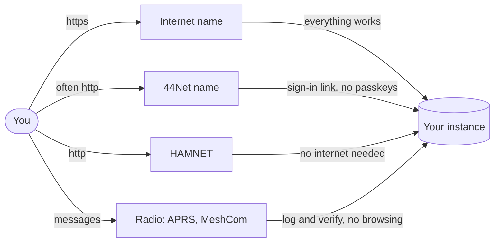

# Getting to your instance

Where do you open APRScaching, and what works on each way in? This page explains it for players. You need no
setup knowledge, and at the end you know which way in suits you.

## Instances and your home instance

The site you use is one **[instance](../glossary.md#instance)**: one APRScaching server, run by a ham, a club
or a group for their region. Many instances run side by side. The best known is `aprscaching.net`;
`aprscaching.com` forwards to it.

Instances link up into one network. Caches and confirmations of finds travel between them, so your map also
shows caches from other instances.

- **Your home instance** is the one your account lives on. You sign in there, and your finds are logged there.
- **A cache from another instance** opens with *mirrored from* and the name of its home instance. You can
  read it, but you log your find on its home instance. It shows here once that instance publishes the find.
- **An instance your sysop has not vetted** marks its caches **unvetted**. They stay off your map until you
  turn on **Include unvetted network data** under **Search & filter**.

## The ways in

An instance can be reachable in several ways. Your sysop decides which ones it offers.

| Way in | What it is | What you use it for |
|---|---|---|
| **Internet name** | An `https://` address, such as `https://aprscaching.net` | Everything |
| **44Net name** | A name ending in `ampr.org`, in the amateur-radio part of the internet ([44Net](../glossary.md#44net)). Often plain `http://` | The map, finds and logs; some phone features need https |
| **HAMNET** | An amateur-radio IP network reached over radio links, not over the internet ([HAMNET](../glossary.md#hamnet)). It needs no internet | The map, finds and logs, without the internet |
| **Radio** | APRS or [MeshCom](../glossary.md#meshcom) messages to the instance's service call | Logging finds and verifying your callsign, not browsing |

## What works on each way in

Some phone features work only on a secure page: an `https://` address. On a plain `http://` page your
browser turns them off.

| Feature | `https://` | Plain `http://` |
|---|---|---|
| The map, caches and logs | Yes | Yes |
| Sign in with a [passkey](../glossary.md#passkey) | Yes | No: use a one-time sign-in link |
| Your phone's location (for **Location-verified** finds) | Yes | No: finds reach **Logged**, or **Radio-verified** when a receiving station hears your beacon |
| Your radio in the browser (USB or Bluetooth) | Yes, in a Chromium browser such as Chrome or Edge | No |
| Push notifications | Yes | No: the in-app watchlist still works |

On a plain `http://` instance, the sign-in panel says passkeys need a secure page. You then sign in with a
**one-time sign-in link**. On a HAMNET or field instance without email, your sysop makes the link for your
callsign and hands it to you, as a QR code or on your screen. The link works once, for 15 minutes. Ask your
sysop; [One-time sign-in links](../run/day-to-day/sign-in-links.md) is the page they follow.

Radio links and HAMNET carry no encryption: amateur rules forbid it. Anyone in range can read what you send
there, so use these ways in for the game, never for anything private.

## Find out which ways your instance offers

Open **Settings → Help & credits → About this instance**. It names the instance, its sysop, the ways in it
publishes (its internet, 44Net or HAMNET name), how many peer instances it names and the version it runs. A way
in the sysop did not publish is not listed: ask your sysop. For logging over the radio, the instance names its service call when you verify
your callsign; it is your sysop's callsign with SSID 15 unless the instance names another ([Log from your radio](log-a-find.md#log-from-your-radio)).

## On the air

Logging over the radio is a transmission from your station, so a few rules apply. You need a licence and your
own callsign. Nothing on amateur bands is encrypted: your messages and your position are public. What the
instance transmits on its own, such as replies to your messages, follows the settings its sysop chose. You
remain the control operator of your own station ([On-air etiquette and rules](../shack/on-air.md)).

## Next

- [Join](join.md): sign in on your home instance and verify your callsign.
- [Help and FAQ](help-faq.md): answers to the questions players ask most.
