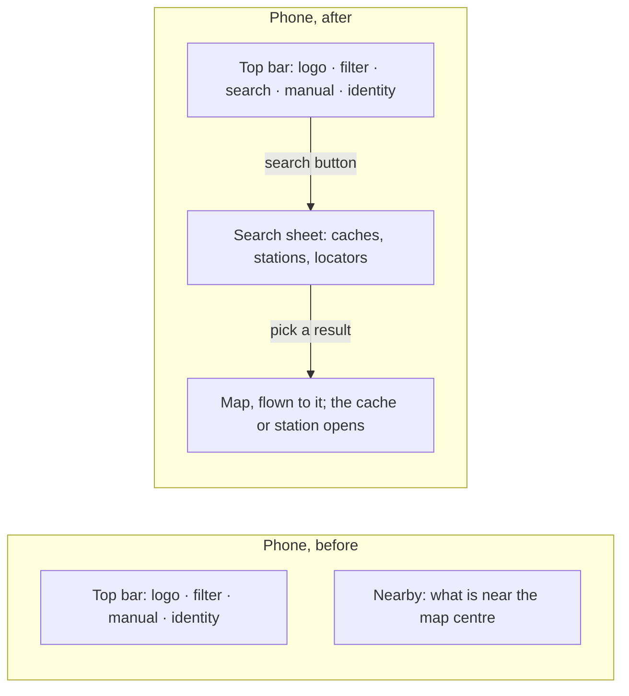
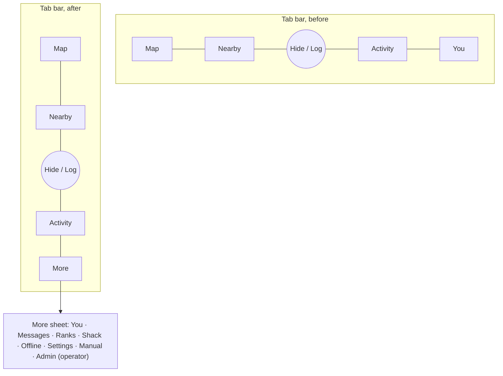

# Proposal: navigation and search on phones — October 2026

A batch of information-architecture changes for the owner to approve before anything is built (design
handover, G7). It comes out of the design review (`design-review-2026-10.md`, R-20 and R-21) and the
journeys walk (`apps/web/test/visual/journeys.mjs`). Nothing here is in the app yet.

## Why

On a phone, several destinations the desktop rail offers have no path from the map:

| Destination | Desktop (rail ≥ 1024 px) | Phone today |
|---|---|---|
| Map, Nearby, Activity, You | rail | tab bar |
| Ranks | rail | Activity → leaderboard link |
| Shack | rail | You → *Advanced — the Shack* |
| Settings | rail | the identity chip in the top bar |
| Offline | rail | Nearby → *Offline packs* |
| **Messages** | rail | **no path** (only a `?view=messages` link) |
| **Search** (caches, stations, a grid locator) | top bar from 960 px | **none**; Nearby lists what is near the map centre |

The journeys walk got stuck on a phone at "Open the Shack" from the map, and could not reach Messages at all.

## Proposal 1 — Search on every screen size

**Before:** the search field lives in the top bar and is hidden below 960 px.

**After:** below 960 px, a search button (magnifier icon, named "Search") sits in the top bar where the field
is on desktop. It opens a full-width search sheet with the same suggestions (`SearchSuggest`): caches,
stations, grid locators. Escape or the close button returns to the map with the focus back on the button.

Cost: small. The search component exists; it needs a sheet wrapper and a top-bar button below 960 px.

## Proposal 2 — One "More" destination on the phone

**Before:** five tabs (Map, Nearby, Hide/Log, Activity, You). The rail's other destinations hide in different
places, and Messages in none.

**After:** the fifth tab becomes **More**, a sheet that lists every destination the rail has, in the rail's
order: You (profile) at the top, then Messages, Ranks, Shack, Offline, Settings, the manual, and Admin for the
instance's operator. The sheet is the phone's equivalent of the rail, so the two can never drift: both read
the same nav table (`nav.ts`).

Cost: small to medium. The sheet is a list of `Button`s over `NAV_ITEMS`; the You panel moves into it as its
first entry. The tour's step that points at the tab bar needs its anchor moved.

## Proposal 3 — The rail and the More sheet show what needs attention

**After:** a dot on Messages when there is a message for you since you last looked, and on Settings when a
callsign verification is pending, in both the rail and the More sheet. Today these are only visible inside the
panels.

Cost: small, once the Messages panel refreshes on its own; today it loads once when opened.

## What does not change

- The desktop layout (rail, docked panels).
- The Shack stays an app launcher, and APRS functions stay outside it (`ui-ux.md` §5).
- Deep links (`?view=…`) keep working.

## Decision needed

Approve, change or drop each of the three. The build follows in one change, with the visual harness and the
journeys walk re-run on phone and desktop.
