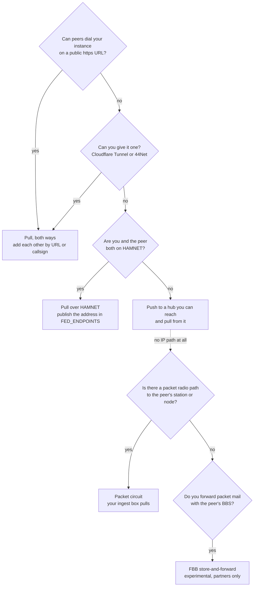

# Choose how to connect

This page helps the [sysop](../../glossary.md#sysop) pick how an instance joins the federation. It starts from
where the instance runs and what it can reach; at the end you know which transport to set up, what to
configure, and how quickly records and find confirmations will move. How each transport works step by step is in
[Federation transports](transports.md).

## Start from what your instance can reach

Make the instance reachable whenever you can. A reachable instance pulls and is pulled, gets new records within
seconds, and its receivers confirm finds the moment they are logged anywhere in the network. An instance that
only pushes shares its records with its hub within seconds of a write, and its receivers confirm finds through
the hub's relay once it collects the question, about 15 seconds later
([Which instances can answer](how-it-works.md#how-a-find-gets-confirmed-across-instances)).

## By situation

| Situation | Use | Configure | Records arrive | Find confirmation |
|---|---|---|---|---|
| Both instances on the internet with https | [Pull](transports.md#pull), each adds the other | **Instance admin → Federation → Add peer** by URL, or `FED_PEERS=<url>#<fingerprint>`; or by callsign with a `web=` TXT record ([Join the network](index.md)) | seconds after a write (notify); at most `FED_SYNC_INTERVAL_MS`, 5 min | both ways, within seconds of the log |
| Home connection behind CGNAT, no open ports | A [Cloudflare Tunnel](../networks/cloudflare.md) to get a public URL, then pull | the tunnel, then as above | as above | both ways |
| Behind NAT, on mobile data, or a box you cannot expose | [Push to a hub](transports.md#push-to-a-hub) you can reach, pull from it, and collect its [relay](transports.md#rendezvous-relay) queries | spoke: `FED_HUB_URL`, the hub's `FED_SUBMIT_SECRET`, `FED_RELAY_SECRET`, the hub in `FED_PEERS`; hub: `FED_SUBMIT_SECRET`, `FED_SUBMIT_INSTANCES`, `FED_RELAY_SECRET` ([Hubs, relays and the registry](hubs-and-relays.md)) | to the hub: 3 s after a write; from the hub: as pull | the spoke asks its peers; the hub and the peers it knows ask the spoke through the relay, answered within about 15 s |
| Others need to read a firewalled spoke's feed directly | The hub's [rendezvous relay](transports.md#rendezvous-relay) | hub: `FED_RELAY_SECRET`; spoke: `FED_HUB_URL` and `FED_RELAY_SECRET` | an answer at the spoke's next collect, 15 s | as push |
| A 44Net address under your callsign | [Pull over 44Net](transports.md#addresses-https-44net-and-hamnet); peers add you by callsign | a `44net` entry in `FED_ENDPOINTS` and the `_aprscaching` TXT record ([44Net name and identity](../networks/44net-identity.md)) | as pull | both ways, with peers on the internet or 44Net |
| HAMNET only, no internet | [Pull over HAMNET](transports.md#addresses-https-44net-and-hamnet) with peers on HAMNET | a `hamnet` entry in `FED_ENDPOINTS`; peers add `http://<HAMNET address>` ([HAMNET only](../networks/hamnet.md)) | as pull, among HAMNET peers | among HAMNET peers |
| No IP path for the records, but a packet radio path to the peer's station or node | A [packet circuit](transports.md#packet-circuit), pulled by your ingest box | the peer: `FED_LINK_SERVE=1` and `FED_LINK_CALL` on its box, an `ax25` or `netrom` entry in `FED_ENDPOINTS`; you: `FED_LINK_PULL=1` and `FED_LINK_CALL` on your box, the peer added once with its key compared | one session per `FED_LINK_PULL_MS`, 1 h | none: questions need an IP path |
| No IP path at all, but FBB forwarding with the peer's BBS | [FBB store-and-forward](transports.md#fbb-store-and-forward), experimental, off by default | `FED_BBS=1` on both, the partner marked for federation, batches queued by hand or timer ([Federation over FBB](fbb.md)) | hours to days | none: questions need an IP path |
| A club hub with many spokes | One reachable hub; each spoke pushes to it, pulls from it and collects its relay queries | as push; the hub's sysop trusts each spoke | the hub sees every spoke within seconds of a write; each spoke sees the hub's records and the other spokes', at its next pull from the hub | the hub asks its peers and its spokes; a spoke asks the hub and, through it, the other spokes it trusts |
| A field station: Pocket or Desktop on a trip | Follow your home instance and push to it; sync before you go | `FED_PEERS` and `FED_HUB_URL` both pointing home, `FED_SYNC_REGION` for your area ([Before a trip](../pocket/trips.md)) | pulled on Wi-Fi before the trip; pushed when the phone is back online, within 30 s to 10 min | the phone asks while it has a connection; with `FED_RELAY_SECRET` set it answers through home while online |

## How long things take

| What | When it happens | Setting |
|---|---|---|
| Scheduled pull from every peer, push to the hub, relay collection, corroboration retries | every 5 minutes | `FED_SYNC_INTERVAL_MS` (`0` turns the schedule off) |
| Pull after a peer writes | within seconds, when the peer can reach your URL | none: the peer's notify |
| Push after a write | 3 s after the last write, 15 s at most in a stream of writes | none |
| **Sync now** | at once: pulls from every peer and pushes to the hub | **Instance admin → Federation** |
| Push after an outage | 30 s after the failure, doubling up to 10 min, then at once | none |
| Relay: a spoke collects its queries, an asker reads relayed answers | every 15 seconds | `FED_RELAY_POLL_MS` (`0` leaves it to the 5-minute schedule) |
| Find confirmation | when the find is logged, 3 s per peer; through a hub's relay, at the spoke's next collect; retried 1, 6 and 24 h later | `FED_CORROBORATION_QUORUM` |
| Packet circuit pull | one session per interval, one peer at a time | `FED_LINK_PULL_MS` (1 h) |
| FBB batch | at the next forwarding sessions: hours to days | `FED_BBS` |

## Next

- [Join the network](index.md): add a peer and compare key fingerprints.
- [Federation transports](transports.md): every transport, step by step.
