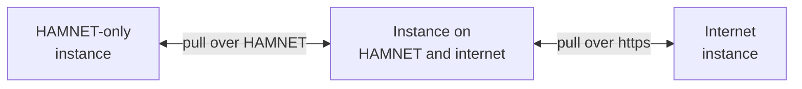

# Federation over HAMNET

This page shows the [sysop](../../glossary.md#sysop) how to federate an instance over HAMNET, with no internet.
At the end your instance mirrors its HAMNET peers, they mirror you, and an instance on both networks carries
records between HAMNET and the internet.

HAMNET is an amateur IP network that is not on the internet. Stations reach it over RF links, and licensed hams
also reach it through HAMNET VPN access, such as HamCloud's `44.148.128.0/17`. European HAMNET uses addresses from
`44.128.0.0/10`. [44Net](../networks/44net.md) is another thing: amateur address space (`44.0.0.0/9` and
`44.128.0.0/10`) whose reachability from the internet is decided per subnet, through BGP, 44Net Connect or the
IPIP mesh. The two share address space, so an address never tells you which network it is on, and APRScaching
never guesses: you declare a HAMNET address, as a `hamnet` endpoint or an `http://` peer
([HAMNET and 44Net Connect](../networks/hamnet.md#hamnet-and-44net-connect)).

## Before you start

- An instance with a HAMNET address routed to its box: an RF link, or HAMNET VPN access.
- A signing key (`FED_PRIVATE_KEY`, [Sign your feeds](index.md#sign-your-feeds)).
- The HAMNET addresses of the instances you want to federate with, and a way to reach their sysops: on the air,
  by phone or in person.
- What runs without the internet, and what does not, is in [HAMNET only](../networks/hamnet.md).

## Federate with a HAMNET peer

1. **Declare your HAMNET address.** Publish it as a `hamnet` endpoint, so peers that learn your addresses try it:

    ```bash
    FED_ENDPOINTS='[{"transport":"hamnet","address":"44.143.1.2:8080","priority":10}]'
    ```

    A HAMNET name works as well as an address. An instance that is on the internet too lists its `https` address
    beside it ([One instance, several addresses](../networks/several-addresses.md)).

2. **Exchange addresses and fingerprints** with the other sysop, over the air or by phone. Your key fingerprint
   is under **Instance admin → Federation → Your key fingerprint**.

3. **Add the peer** by its HAMNET address, either way:
    - in `FED_PEERS`, as `http://<name or address>[:port]#<fingerprint>`: it starts `trusted` once its key matches
      ([HAMNET peers in FED_PEERS](index.md#hamnet-peers-in-fed_peers));
    - under **Instance admin → Federation → Add peer**, as `http://<name or address>[:port]`: compare the
      fingerprint the look-up shows, add it unvetted, then choose **Trust**.

4. **The other sysop adds you** the same way.

The `http://` scheme is your declaration that the peer is on HAMNET. Your instance dials it like a `hamnet`
endpoint: plain http with a 2-second timeout, so a pull moves on quickly when a route is down. Plain http
changes no trust, since every record is signed by its home instance.

## Discovery over HAMNET

- **Peer exchange works on HAMNET.** A trusted HAMNET peer lists the instances it trusts with their `hamnet`
  addresses. Your instance lists them under **Instance admin → Federation →
  Discovered**, switched off and unvetted; **Follow** dials their HAMNET address
  ([Discovery](index.md#discovery)).
- **mDNS does not cross HAMNET.** An announcement stays on its own network segment, so it finds a station on your
  LAN or hotspot, never one across a HAMNET link ([Field discovery on a LAN](index.md#field-discovery-on-a-lan)).
- **LAN addresses are never listed.** A peer you reach on your own LAN is left out of your list, since no other
  instance can reach that address.

## From HAMNET to the internet, and back

An instance on both networks bridges them. It follows its HAMNET peers at their `hamnet` addresses and its
internet peers at their `https` addresses, and passes on what it mirrored on its transit feed, each record as its
home instance signed it (`FED_RESERVE`, by default the records of instances it trusts).



- **Records reach the other side.** An internet instance that follows the bridge receives the records of the
  HAMNET-only instance through the bridge, and checks each against its home's key, which the bridge hands on.
  The same holds the other way round. A record crosses at most four instances
  ([A hub passes its spokes' records on](hubs-and-relays.md#a-hub-passes-its-spokes-records-on)).
- **Trust stays with each sysop.** The internet instance shows the HAMNET-only instance as unvetted until its
  own sysop compares that instance's fingerprint and chooses **Trust**; it needs no route to HAMNET for that.
  The bridge lends no trust.
- **The bridge passes on what it trusts.** With `FED_RESERVE=trusted` it passes on only the records of instances
  it trusts itself. Trust the HAMNET peers whose records should cross.
- **Find confirmation does not cross.** An instance asks only peers it can dial. An internet instance cannot ask
  a HAMNET-only instance, and an origin known only through a hub is never asked
  ([Which instances can answer](how-it-works.md#how-a-find-gets-confirmed-across-instances)).

## What works over HAMNET

| Works | Does not work over plain http on HAMNET |
|---|---|
| Pull and notify between HAMNET peers, and the transit feed | Passkeys, device location for Tier B finds, the Web Serial and Web Bluetooth radio: they need https |
| Peer exchange with trusted HAMNET peers | Adding a peer by callsign, unless a DNS-over-HTTPS resolver on HAMNET reaches ARDC's name servers |
| Corroboration among HAMNET peers that reach each other | A registry located by `FED_REGISTRY_DNS`; set `FED_REGISTRY` to a document on HAMNET |
| Sign-in by email link (a mail server on HAMNET) or the sysop's one-time link | mDNS across a HAMNET link |

The full list, with workarounds, is in [HAMNET only](../networks/hamnet.md#what-works-and-the-workarounds).

## Next

- [Join the network](index.md): peers, trust and discovery.
- [HAMNET only](../networks/hamnet.md): what the instance does with no internet path.
- [On-air stations](../compliance/on-air-stations.md#44net-amprnet-and-hamnet): the rules for traffic that crosses
  amateur RF.
