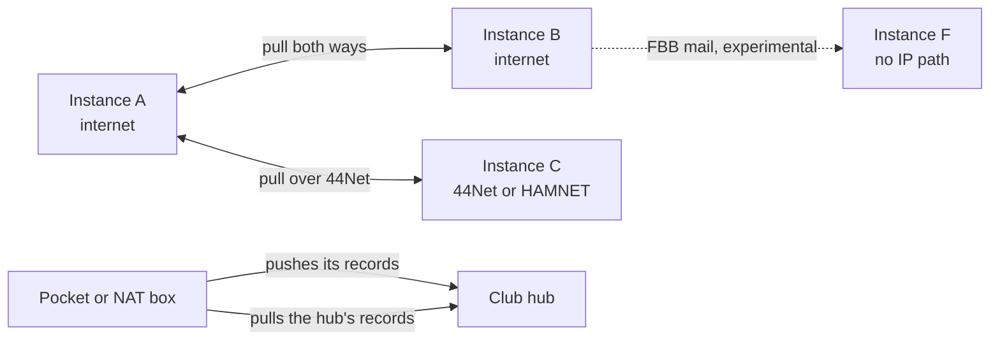
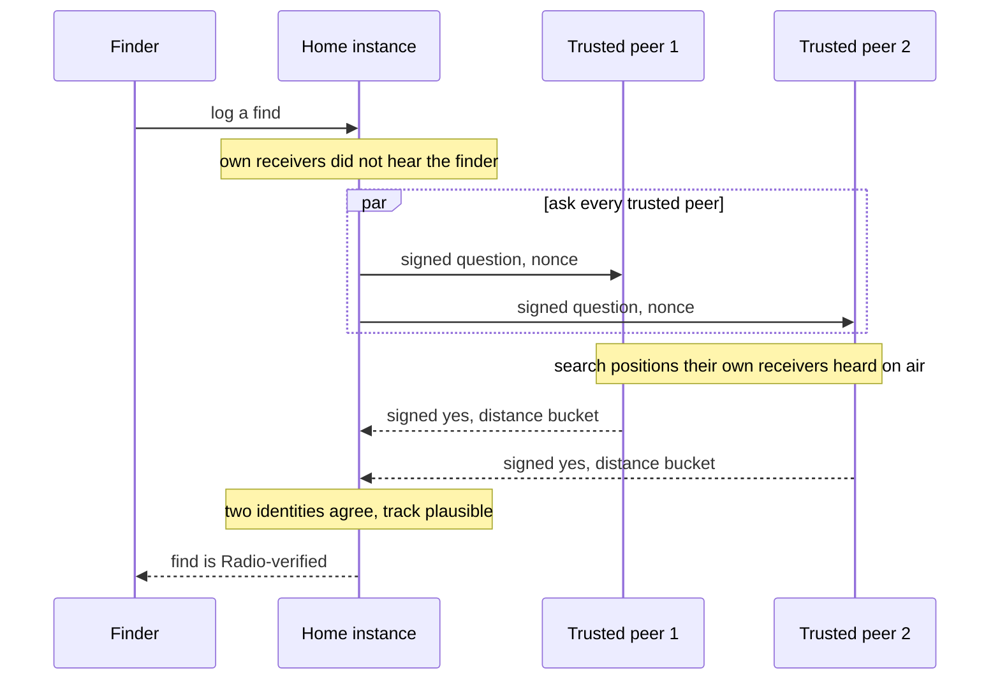

# How federation works

What does it mean that APRScaching instances form one network, and what keeps that network honest? This page
answers both for the [sysop](../../glossary.md#sysop) who is deciding whether to federate, and for anyone curious
how a cache hidden on one instance shows up on another. It explains; the steps are in
[Join the network](index.md).

## One network, no central server

Every [instance](../../glossary.md#instance) is complete on its own: its own map, accounts, receivers and
database. Federation links independent instances into one network without putting anyone in charge of it.
There is no central server to sign up with, no company account and no single place that can switch the
network off. Two sysops who know each other link their instances directly.

What the network gives the people on it:

- **Players see caches from across the network.** A cache hidden on an instance your sysop trusts appears on
  your map, marked *mirrored from* its home instance. Finds logged there travel with it, so a cache's log reads the same
  everywhere.
- **Finds are confirmed across instances.** When your own instance did not hear a finder on the air, it can
  ask the instances it trusts whether their receivers did. Enough independent "yes" answers lift the find to
  **Radio-verified** (Tier A), even though the finder was heard far from your receivers.
- **Trust stays local.** Each sysop decides which peers to trust. A record from a peer you have not vetted
  stays hidden; a peer you block disappears.
- **Deletes reach everyone.** When a player erases their account or a sysop removes a cache, a signed deletion
  travels the same paths and removes the copies on every instance that mirrored them.
- **Each instance keeps working alone.** A peer that goes offline costs you nothing but its updates. An
  instance on a phone in the field or on a box with no internet carries on, and catches up when a path returns.

## The moving parts

**Signed records.** Everything that travels is a record signed by the instance it comes from: a cache, a find,
a callsign key, a bulletin, a deletion. A receiving instance checks the signature before it keeps anything, so
the path a record took does not matter. The internet, 44Net, HAMNET and packet radio all carry the same bytes,
and none of them can change a record without breaking its signature.

**Keys and fingerprints.** Each instance has its own signing key (`FED_PRIVATE_KEY`). A
[key fingerprint](../../glossary.md#key-fingerprint) is a short checksum of it, four groups of four hex digits.
Two sysops read their fingerprints to each other over a channel they already trust, such as a phone call or a
QSO. That check, not the URL, is what tells you the key belongs to the instance you meant.

**Peers and trust levels.** A [peer](../../glossary.md#peer) is another instance yours exchanges records with.
Each peer has a trust level that you set: **trusted** (shown on the map, and a voice in find confirmation),
**unvetted** (kept, but hidden until a player asks to see it), or **blocked** (ignored on every path). A new peer
starts unvetted, however it arrived, unless you pinned its fingerprint in advance.

**Mirrors.** Your instance keeps a copy of what its peers publish, in tables of its own that are for display
only. A mirrored cache is read on your instance and logged on its home instance. A record only moves forward:
an older copy, replayed, changes nothing.

**Tombstones.** A [tombstone](../../glossary.md#tombstone) is a signed deletion record. It travels ahead of the
records in every exchange, so a deleted cache or an erased account is never mirrored back. Instances keep
tombstones for good.

**Corroboration quorum.** [Corroboration](../../glossary.md#corroboration) is one instance asking its trusted
peers whether their own receivers heard a finder near a cache. A find needs two independent identities to agree
(`FED_CORROBORATION_QUORUM`), counted by operator, so one sysop with several instances is one voice
([How a find gets confirmed across instances](#how-a-find-gets-confirmed-across-instances)).

## How records travel

Records move one hop: from the instance that signed them to an instance that fetched them or was handed them.
An instance publishes only its own records, never what it mirrored from others, so a peer you want to see is a
peer you follow.

An arrow starts at the instance that opens the connection.

- **Pull** is the usual path: your instance fetches each peer's new records on a schedule, and a peer that has
  news asks you to fetch at once.
- **Push** is for an instance nobody can reach, such as a phone on mobile data or a box behind a carrier's NAT:
  it sends its records to a hub it can reach.
- **Store-and-forward** over FBB packet mail is for a peer with no IP path at all. It is experimental and off by
  default.

[Choose how to connect](choose.md) matches each situation to a path, and [Federation transports](transports.md)
explains every transport step by step, with who starts it, what it sends, when and what to configure.

A hub keeps what its spokes push for its own map and its own members. It does not pass a spoke's records on to
its other peers or to the other spokes: each of those follows the spoke itself, or reads its feed through the
hub's [relay](transports.md#rendezvous-relay).

## How a find gets confirmed across instances

This is the exchange that makes a network of small instances stronger than any one of them. A player logs a
find on their home instance. That instance's own receivers did not hear the player near the cache, perhaps
because the cache is 200 km away. Other instances may have heard them. Federation asks them.

**When it happens.** At the moment the find is logged, and only when the find has not already reached
Radio-verified on its own. The question goes to every **trusted** peer at once (at most 16), and each has 3
seconds to answer, so the player sees the result with the log.

**What the question says.** "Did your own receivers hear `OE8APR-7` within this area, in this half-hour, at a
receiving site other than these?" The area is snapped to a grid of about 500 m and the time to 10-minute
buckets, so the question never reveals the exact spot or second. The "other than these" list holds the finder's
own calls and stations: a station the finder controls never vouches for them. The asking instance signs the
question with its key and adds a fresh random number (a nonce).

**How a peer answers.** The peer checks the question's signature and refuses a peer it blocked. It searches
only positions that one of its own attested receiving sites heard directly on the air and delivered through its
own ingest box. A copy from APRS-IS never counts, because anyone with a public passcode can inject one. It
answers "yes, within about this distance, around this time" in 100 m and 10-minute buckets, or "no". It signs the
answer and binds it to the question's nonce, so the answer cannot be replayed or reused for another question.

**The quorum.** The asking instance checks each answer's signature against the key it pinned for that peer.
It counts the "yes" answers by identity: by the operator the registry names, else the callsign the peer was
added under, else its key. When two identities agree (`FED_CORROBORATION_QUORUM`), and the finder's own track
could have been at that place at that time, the find becomes **Radio-verified** (Tier A) and records which
instance confirmed it.

**Confirmed later.** When a trusted peer could not be reached (a timeout, a failed connection, a rate limit or
a server error), the same question goes to the peers that missed it again 1, 6 and 24 hours after the find, and
never after 72 hours. Answers already in hand still count, as long as their peer is still trusted. A find lifted
this way shows *confirmed later*. A verified "no" from a trusted peer ends the retries.

**Which instances can answer.** A peer answers only when it is reachable at an address the asking instance
can dial: its https URL, its 44Net name or its HAMNET address. A question never travels through a hub, the relay
or packet radio. A spoke that only pushes to a hub therefore is never asked, so its receivers confirm finds
logged on the spoke itself, and not finds logged elsewhere. To let a firewalled instance's receivers confirm
finds for the network, make it reachable: a Cloudflare Tunnel or a 44Net address gives it an address peers can
dial ([Choose how to connect](choose.md)).

**What a sysop configures.** A signing key (`FED_PRIVATE_KEY`) to ask at all; the peers you trust; your own
receiving sites under **Instance admin → Trusted receiving stations** or `FIRST_PARTY_SITES`, without which your
instance never vouches for anyone; and optionally `FED_CORROBORATION_QUORUM`, `FED_CORROBORATION_REQUIRE_KNOWN`
and `FED_REVEAL_IGATE` ([Running federation safely](index.md#running-federation-safely)).

## What travels, and what never does

| Travels to peers | Never leaves your instance |
|---|---|
| Caches hidden on your instance, with their title, type, D/T, position and description | Caches the hider marked **local-only** |
| Finds, DNFs and notes on those caches, signed by the finder where they signed them | Finds on local-only or imported caches |
| Callsign keys, and whether each call is verified | Imported data: heritage places and caches imported from other platforms |
| Bulletins, tombstones and account moves | The hint of every cache, and the description of an **unlisted** cache |
| | Accounts, email addresses, sessions, passkeys and profiles |
| | Station positions, tracks, messages and packet logs |

An **unlisted** cache travels without its description, and a mirror keeps it off its map as its
home does. Corroboration answers say "heard within a distance, around a time", in coarse buckets; the receiving
station's callsign is shared only when both sysops opt in (`FED_REVEAL_IGATE`).

## What federation cannot do

- **Lift trust by itself.** A record from an instance you never vetted stays hidden, whatever path brought it.
  A beacon or a mail batch from an unknown instance is quarantined, never applied.
- **Forge or alter a record.** A relay, a hub, a tunnel or an RF path in between can delay or drop records, but
  not change them unnoticed.
- **Recall a record.** A peer that mirrored a cache keeps its copy until a tombstone arrives. A peer that is
  offline sees the deletion when it next syncs.
- **Hide anything on the air.** Over amateur RF, records are signed and readable, never encrypted
  ([Automatic stations on the air](../compliance/on-air-stations.md)).

## Next

- [Choose how to connect](choose.md): which path suits your instance.
- [How federation stays honest](../../reference/federation-trust.md): the exact rules behind keys, quorum and
  replay.
