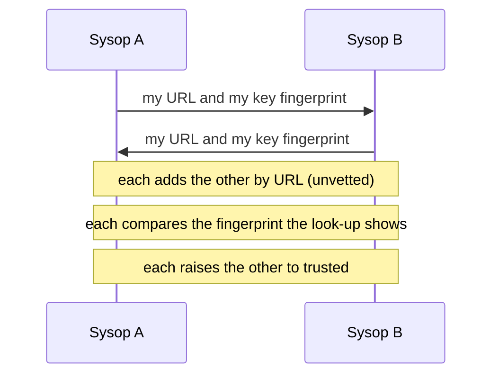

# Join the network

This page shows the [sysop](../../glossary.md#sysop) how to connect an instance to others. At the end your
instance mirrors the peers you trust, and they mirror you.

As a player you need none of this: caches from the instances yours trusts appear on your map, and your finds
travel to them.

Federation lets independent instances share caches, finds and keys as signed records. Each record carries its
own signature, so no instance has to trust the network in between. The same records travel over HTTPS, over
plain HTTP on a 44Net or HAMNET name, and over packet radio. On amateur RF a signature authenticates but never
conceals ([Automatic stations on the air](../compliance/on-air-stations.md)). Any shape can join: Self-host,
Desktop or Pocket.

## Before you start

- An instance that answers on its public `APP_URL` ([Your first hour](../first-hour.md)).
- The URLs of instances you know, and a way to reach their sysops that you already trust: a phone call, a
  meeting, or a contact on the air.
- Sysop access to **Instance admin**.

## Joining the network

Two sysops join their instances in five steps. Each adds the other, and each compares the other's
[key fingerprint](../../glossary.md#key-fingerprint) before trusting it.



1. **Check your signing key.** `FED_PRIVATE_KEY` must be set ([Sign your feeds](#sign-your-feeds)). Your
   instance id follows `APP_URL`'s host.
2. **Exchange addresses and fingerprints.** Give the other sysop your `APP_URL` and your key fingerprint,
   from **Instance admin → Federation → Your key fingerprint**. Take theirs. Use a channel you already
   trust, not the federation itself.
3. **Add the peer.** Under **Instance admin → Federation**, choose **Add peer**, enter the other instance's
   URL and choose **Look up**. Your instance fetches its descriptor and shows its instance id, its URL and the
   fingerprint of its signing key. When that fingerprint is the one its sysop gave you, choose **Add as
   unvetted**. Your instance now mirrors it, hidden on the map.
4. **The other sysop adds you** the same way, comparing your fingerprint.
5. **Trust the peer.** Choose **Trust** on its row. The dialog repeats the fingerprint and asks whether you
   compared it with the other sysop; confirm only when you did. A trusted peer shows on the map and counts
   toward Tier A.

**Optional:** publish who runs the instance with `FED_OPERATOR` (the instance publishes its service call beside
it), and ask a registry authority for an entry
([The instance registry](hubs-and-relays.md#the-instance-registry)). A 44Net peer joins by callsign instead
([Peers by callsign](../networks/44net-identity.md#peers-by-callsign)).

### Peers in `FED_PEERS`

A peer can also be listed in `FED_PEERS`, comma-separated base URLs, which the gateway reads at start. Each
entry may pin the peer's key fingerprint after a `#`:

```bash
FED_PEERS=https://a.example#630dcd2966c43366,https://b.example
```

- **With a fingerprint** the peer starts `trusted` once its key matches it. A peer whose key does not match is
  refused, and its row shows the error.
- **Without one** the peer starts `unvetted`, like a peer added by URL, until you compare its fingerprint and
  trust it.

The fingerprint is 16 hex digits, shown as four groups of four (`630d cd29 66c4 3366`); written without
the spaces, or with colons between the groups, it means the same. A peer's sysop reads it from
their Instance admin, or prints it with `node tools/fedkey/fingerprint.mjs --url https://a.example`, which
fetches it over the network and so belongs on the peer's own side. A level you set in Instance admin stays
when the gateway restarts.

## Sign your feeds

Your instance signs its feeds and its corroboration questions with `FED_PRIVATE_KEY`. Without a key the feeds
still serve, unsigned, and peers do not mirror them.

The installers generate the key: `deploy/setup.sh` for Self-host, and the setup questions on Pocket. Elsewhere,
from the repository root:

```bash
node tools/fedkey/genkey.mjs --raw     # prints the value for FED_PRIVATE_KEY
```

Without `--raw` it also prints the public key the instance publishes. Set the value as a secret in
the `.env` on Self-host, Desktop and Pocket. Never
commit it, and never copy one instance's key to another.

### Rotate your key

Rotate the key when it may have leaked, from the repository root:

```bash
FED_PRIVATE_KEY="<current key>" node tools/fedkey/rotatekey.mjs
```

It prints three values: set the new `FED_PRIVATE_KEY`, `FED_KEY_HISTORY` and `FED_ROTATIONS`, then restart.
Peers follow the rotation and accept the old key for a grace of 7 days (`FED_ROTATION_GRACE_DAYS`). To reject
a leaked key at once, publish it as revoked:
`FED_KEY_HISTORY='[{"x":"<leaked public key>","revoked":true}]'`.
[Signed feeds](../../reference/federation-trust.md#signed-feeds) explains how peers follow a rotation.

### Compare key fingerprints

A URL says where a peer answers, not who holds its key: someone between you and the peer could answer with a
key of their own. Comparing fingerprints with the peer's sysop closes that gap, which is why trusting a peer
always repeats its fingerprint.

1. Open **Instance admin → Federation**. **Your key fingerprint** shows your instance's, four groups of four
   hex digits, for example `630d cd29 66c4 3366`. Each peer's row shows the fingerprint of the key your
   instance pinned for it.
2. Reach the peer's sysop by a channel the network does not carry: a phone call, a QSO, or in person.
3. Read your fingerprint to them, and have them read theirs to you. Each compares what they hear with the
   peer's row on their own list.
4. They match: the keys are the right ones. They differ: [block the peer](#peers-and-trust) and find out why
   before you trust it.

`deploy/aprscaching doctor` prints the same fingerprints, yours and each `FED_PEERS` peer's, and warns when a
peer's key does not match the fingerprint its entry pins. Compare again after either of you
[rotates a key](#rotate-your-key).

## What the installer sets

On a public instance `deploy/setup.sh` writes the safe posture out, so you see it in `.env`:
`FED_AUTO_PROMOTE=0`, `FED_CORROBORATION_QUORUM=2` and `FED_DISCOVER=0`. A value you chose stays, with a warning
when it is unsafe. A LAN instance starts with federation off.

| Flag | Asks for | Writes |
|---|---|---|
| `--fed-peers URL[#FINGERPRINT],…` | the https peers you know, each with its key fingerprint; a 44Net peer is refused here | `FED_PEERS` |
| `--fed-submit-instances ID,…` | on a hub (`FED_SUBMIT_SECRET` set), the spokes allowed to push; required | `FED_SUBMIT_INSTANCES` |
| `--fed-registry-key KEY` | with `FED_REGISTRY` or `FED_REGISTRY_DNS`, the registry authority's key; required | `FED_REGISTRY_KEY` |
| `--net44-name NAME` | this instance's 44Net name, such as `aprscaching.oe8apr.ampr.org` | `FED_ENDPOINTS` (https and 44net) |

A 44Net peer (a name under `ampr.org` or an address in `44/8`) never goes into `FED_PEERS`. Admit it from
**Instance admin → Federation**, which binds it to its callsign and holds it `unvetted`.

## Running federation safely

The defaults are safe. These settings decide how much a stranger can do.

| Setting | Safe choice | Secure by default |
|---|---|---|
| `FED_PEERS` | List the peers you know, each with its key fingerprint. Only a matching key starts `trusted`. | yes |
| `FED_DISCOVER` | Leave at `0`, or accept that learned peers arrive disabled and wait for you to enable them. | yes (off) |
| `FED_AUTO_PROMOTE` | Leave at `0`, so only you promote a peer to `trusted`. | yes (`0`) |
| `FED_SUBMIT_SECRET` / `FED_SUBMIT_INSTANCES` | On a hub, list the spokes you expect; new spokes still arrive `unvetted`. | yes (submit off) |
| `FED_REGISTRY` / `FED_REGISTRY_DNS` + `FED_REGISTRY_KEY` | Pin the registry authority's key; DNS may only locate the document. | yes (no registry) |
| `FED_CORROBORATION_QUORUM` | Keep at least `2`, so no single peer can lift a find to Tier A. | yes (`2`) |
| `FED_CORROBORATION_REQUIRE_KNOWN` | Set `1` to answer corroboration questions only from your peers. | no (answers anyone, coarsened) |
| `FED_REVEAL_IGATE` | Leave off unless you and your peers want IGate credit to cross instances. | yes (off) |
| `FED_ALLOW_PRIVATE` | Leave off, so federation never reaches your LAN except the peers you configured. | yes (off) |
| 44Net peers | Admitted `unvetted`; promote them yourself. Automatic admission trusts `DOH_URL`'s DNSSEC flag. | yes (`unvetted`) |

Keep `FED_PRIVATE_KEY` secret, and [rotate it](#rotate-your-key) if it may have leaked. The doctor checks this
posture on every run ([federation.posture](../troubleshooting.md#federationposture)).

## Peers and trust

Each peer is a row with a trust level:

| Trust | What your instance does |
|-------|-----------|
| `trusted` | Mirrors it, and counts it toward Tier A corroboration. A `FED_PEERS` entry whose pinned fingerprint matches starts here. |
| `unvetted` | Mirrors it, hidden on the map by default. Peers added by URL, unpinned `FED_PEERS` entries, and peers from the registry, discovery, 44Net and hub pushes start here. |
| `blocked` | Never mirrors it, never shows it. A blocked peer stays blocked even when `FED_PEERS` lists it. |

Change a peer's trust under **Instance admin → Federation**. Each row shows the peer's trust level, its key
fingerprint with a copy button, and its last pull and push. **Trust** needs a pinned key: a peer found by
discovery pins one on its first sync, as `unvetted`, and you compare its fingerprint before you trust it.
Blocking a peer hides everything it sent.

### Remove a peer

**Remove** on a peer's row deletes the peer and its pinned key. What it published stays mirrored, treated like
anything from an instance you do not know: hidden on the map and in offline packs unless the viewer includes
unvetted peers, and never a voice in corroboration. Nothing new from it applies. To hide everything it published,
block it instead.

Added again, a removed peer starts `unvetted`: your instance fetches its key afresh, and you compare the
fingerprint again. A peer listed in `FED_PEERS` comes back at every start, so take it out of `FED_PEERS` and
restart the gateway before you remove it.

- **Auto-promotion.** `FED_AUTO_PROMOTE=<n>` promotes an `unvetted` peer to `trusted` after `n` confirmed
  corroborations. A peer that denies a find the quorum confirmed is penalised.
- **A peer moves to a new URL.** One instance id belongs to one live row, so the new URL is refused while the
  old row holds the id. Remove the old row, then add the new URL.

[How federation stays honest](../../reference/federation-trust.md) explains the row binding and the quorum.

## Keeping mirrors fresh

Your instance pulls from its peers on a schedule, every 5 minutes (`FED_SYNC_INTERVAL_MS`, `0` turns it off).
Peers also
ask for a pull after they write, so new records arrive sooner.

- **Sync now.** **Instance admin → Federation → Sync now** pulls from every peer and pushes to the hub at
  once. From a script, post to `/federation/sync` with the operator secret; this one only pulls:

    ```bash
    curl -X POST -H "x-operator-secret: $OPERATOR_SECRET" https://<your instance>/federation/sync
    ```

    A JSON body narrows the pull to some feeds and a page cap, from 1 to 50:
    `{"types":["cache","key"],"maxPages":10}`. Deletes always come too, and the next pass carries on where a
    capped one stopped.

- **One region only.** `FED_SYNC_REGION=S,W,N,E` pulls only the caches inside that box, in decimal degrees,
  from peers that filter by region. A peer without the filter sends every cache. Deletes are never filtered.
  It suits an instance that serves one area, such as a phone in the field
  ([Before a trip](../pocket/trips.md)).
- **Discovery.** `FED_DISCOVER=1` learns peers from your trusted peers' lists. It takes only `https` URLs, adds
  each learned peer `unvetted` and disabled, and stops at 200. Choosing a trust level for a discovered peer
  enables it.
- **Private networks.** Federation refuses to fetch loopback, private,
  link-local and CGNAT addresses, so a URL from another party never reaches your LAN. The peers you configured
  (`FED_PEERS`, `FED_HUB_URL`) are exempt. Set `FED_ALLOW_PRIVATE=1` for a federation that lives entirely on a
  LAN.

## Check that it worked

- **Instance admin → Federation** shows each peer with its trust, its key fingerprint, its last pull and push,
  and any error.
- `deploy/aprscaching doctor` checks the key, the posture and that each peer in `FED_PEERS` answers, and prints
  each key fingerprint
  ([federation checks](../troubleshooting.md#federation-federation)).

## Next

- [Hubs, relays and the registry](hubs-and-relays.md): reach peers behind a firewall.
- [Instance admin at a glance](../day-to-day/index.md): running it day to day.
