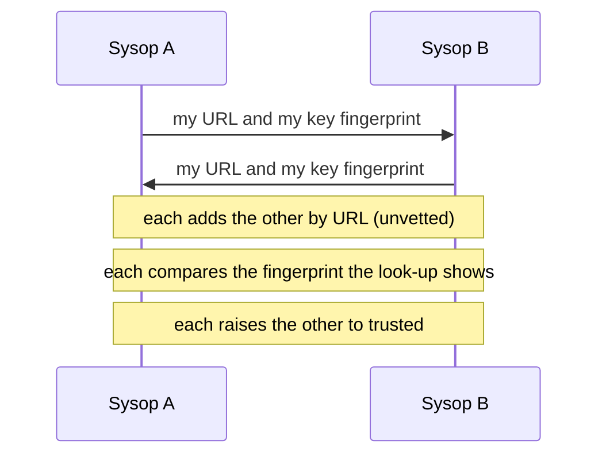

# Join the network

This page shows the [sysop](../../glossary.md#sysop) how to connect an instance to others. At the end your
instance mirrors the peers you trust, and they mirror you.

As a player you need none of this: caches from the instances yours trusts appear on your map, and your finds
travel to them.

Any shape can join: Self-host, Desktop or Pocket. What federation is and why it can be trusted is in
[How federation works](how-it-works.md); which path suits your instance is in [Choose how to connect](choose.md).
This page sets up the usual one: two instances that can reach each other pull from each other.

## Before you start

- An instance that answers on its public `APP_URL` ([Your first hour](../first-hour.md)).
- The URLs of instances you know, and a way to reach their sysops that you already trust: a phone call, a
  meeting, or a contact on the air.
- Sysop access to **Instance admin**.

## Joining the network

Two sysops join their instances in five steps. Each adds the other, and each compares the other's
[key fingerprint](../../glossary.md#key-fingerprint) before trusting it.



1. **Check your signing key.** `FED_PRIVATE_KEY` must be set ([Sign your feeds](#sign-your-feeds)). Your
   instance id follows `APP_URL`'s host.
2. **Exchange addresses and fingerprints.** Give the other sysop your `APP_URL` and your key fingerprint,
   from **Instance admin → Federation → Your key fingerprint**. Take theirs. Use a channel you already
   trust, not the federation itself.
3. **Add the peer.** Under **Instance admin → Federation**, choose **Add peer**, enter the other instance's
   URL and choose **Look up**. Your instance fetches its descriptor and shows its instance id, its URL and the
   fingerprint of its signing key. When that fingerprint is the one its sysop gave you, choose **Add as
   unvetted**. Your instance now mirrors it, hidden on the map.
4. **The other sysop adds you** the same way, comparing your fingerprint.
5. **Trust the peer.** Choose **Trust** on its row. The dialog repeats the fingerprint and asks whether you
   compared it with the other sysop; confirm only when you did. A trusted peer shows on the map and counts
   toward Tier A.

**Optional:** publish who runs the instance with `FED_OPERATOR` (the instance publishes its service call beside
it), and ask a registry authority for an entry
([The instance registry](hubs-and-relays.md#the-instance-registry)). A 44Net peer joins by callsign instead
([Peers by callsign](../networks/44net-identity.md#peers-by-callsign)). An instance without 44Net can be
added by callsign too, with one DNS record under your `<call>.ampr.org`
([Identity without 44Net](../networks/44net-identity.md#identity-without-44net)).

### Peers in `FED_PEERS`

A peer can also be listed in `FED_PEERS`, comma-separated base URLs, which the gateway reads at start. Each
entry may pin the peer's key fingerprint after a `#`:

```bash
FED_PEERS=https://a.example#630dcd2966c43366,https://b.example
```

- **With a fingerprint** the peer starts `trusted` once its key matches it. A peer whose key does not match is
  refused, and its row shows the error.
- **Without one** the peer starts `unvetted`, like a peer added by URL, until you compare its fingerprint and
  trust it.

The fingerprint is 16 hex digits, shown as four groups of four (`630d cd29 66c4 3366`); written without
the spaces, or with colons between the groups, it means the same. A peer's sysop reads it from
their Instance admin, or prints it with `node tools/fedkey/fingerprint.mjs --url https://a.example`, which
fetches it over the network and so belongs on the peer's own side. A level you set in Instance admin stays
when the gateway restarts.

## Sign your feeds

Your instance signs its feeds and its corroboration questions with `FED_PRIVATE_KEY`. Without a key the feeds
still serve, unsigned, and peers do not mirror them.

The installers generate the key: `deploy/setup.sh` for Self-host, and the setup questions on Pocket. Elsewhere,
from the repository root:

```bash
node tools/fedkey/genkey.mjs --raw     # prints the value for FED_PRIVATE_KEY
```

Without `--raw` it also prints the public key the instance publishes. Set the value as a secret in
the `.env` on Self-host, Desktop and Pocket. Never
commit it, and never copy one instance's key to another.

### Rotate your key

Rotate the key when it may have leaked, from the repository root:

```bash
FED_PRIVATE_KEY="<current key>" node tools/fedkey/rotatekey.mjs
```

It prints three values: set the new `FED_PRIVATE_KEY`, `FED_KEY_HISTORY` and `FED_ROTATIONS`, then restart.
Peers follow the rotation and accept the old key for a grace of 7 days (`FED_ROTATION_GRACE_DAYS`). To reject
a leaked key at once, publish it as revoked:
`FED_KEY_HISTORY='[{"x":"<leaked public key>","revoked":true}]'`.
[Signed feeds](../../reference/federation-trust.md#signed-feeds) explains how peers follow a rotation.

### Compare key fingerprints

A URL says where a peer answers, not who holds its key: someone between you and the peer could answer with a
key of their own. Comparing fingerprints with the peer's sysop closes that gap, which is why trusting a peer
always repeats its fingerprint.

1. Open **Instance admin → Federation**. **Your key fingerprint** shows your instance's, four groups of four
   hex digits, for example `630d cd29 66c4 3366`. Each peer's row shows the fingerprint of the key your
   instance pinned for it.
2. Reach the peer's sysop by a channel the network does not carry: a phone call, a QSO, or in person.
3. Read your fingerprint to them, and have them read theirs to you. Each compares what they hear with the
   peer's row on their own list.
4. They match: the keys are the right ones. They differ: [block the peer](#peers-and-trust) and find out why
   before you trust it.

`deploy/aprscaching doctor` prints the same fingerprints, yours and each `FED_PEERS` peer's, and warns when a
peer's key does not match the fingerprint its entry pins. Compare again after either of you
[rotates a key](#rotate-your-key).

## What the installer sets

On a public instance `deploy/setup.sh` writes the safe posture out, so you see it in `.env`:
`FED_AUTO_PROMOTE=0` and `FED_CORROBORATION_QUORUM=2`. A value you chose stays, with a warning
when it is unsafe. A LAN instance starts with federation off.

| Flag | Asks for | Writes |
|---|---|---|
| `--fed-peers URL[#FINGERPRINT],…` | the peers you know, each with its key fingerprint: `https://` peers, and `http://` HAMNET or LAN peers; an https peer on 44Net is refused here | `FED_PEERS` |
| `--fed-submit-instances ID,…` | on a hub (`FED_SUBMIT_SECRET` set), the spokes allowed to push; required | `FED_SUBMIT_INSTANCES` |
| `--fed-registry-key KEY` | with `FED_REGISTRY` or `FED_REGISTRY_DNS`, the registry authority's key; required | `FED_REGISTRY_KEY` |
| `--net44-name NAME` | this instance's 44Net name, such as `aprscaching.oe8apr.ampr.org` | `FED_ENDPOINTS` (https and 44net) |

An https peer on 44Net (a name under `ampr.org`, or an address in 44Net: `44.0.0.0/9` or `44.128.0.0/10`)
never goes into `FED_PEERS`. Admit it from **Instance admin → Federation**, which binds it to its callsign and
holds it `unvetted`.

### HAMNET peers in FED_PEERS

A HAMNET peer goes into `FED_PEERS` as `http://<name or address>[:port]`, optionally followed by
`#<fingerprint>`:

```ini
FED_PEERS=https://peer.example.org#3f2a9c01bb7e4d10,http://44.143.1.2:8080#9c013f2abb7e4d10
```

- **The scheme declares the network.** An `http://` entry is a HAMNET peer: no address range tells a HAMNET
  host from an internet-reachable 44Net one, so the gateway reads what you wrote. It is dialled like a
  `hamnet` endpoint: plain http, with a 2-second timeout, so a sync moves on quickly when this host has no
  route to HAMNET. A peer added at an `http://` address under **Add peer** is dialled the same way.
- **A LAN peer is the exception.** An `http://` entry at a loopback, private or CGNAT address is a LAN peer
  and keeps the normal timeout.
- **Trust is unchanged.** The peer starts `unvetted`, and only a key that matches its `#<fingerprint>` makes it
  `trusted`, as for an https peer. Its records are signed, so plain http carries nothing a middlebox could
  forge.
- **The fetch guard allows it.** Every `FED_PEERS` origin is allowed whatever it resolves to;
  `FED_ALLOW_PRIVATE` is only for addresses a peer advertises, not for the ones you list.
- **Name or address, no path.** An `http://` entry with a path, or a scheme other than `https://` and
  `http://`, is refused by `setup.sh`, and `deploy/aprscaching doctor` warns about it.

## Running federation safely

The defaults are safe. These settings decide how much a stranger can do.

| Setting | Safe choice | Secure by default |
|---|---|---|
| `FED_PEERS` | List the peers you know, each with its key fingerprint: `https://`, or `http://` for a [HAMNET peer](#hamnet-peers-in-fed_peers). Only a matching key starts `trusted`. | yes |
| `FED_DISCOVER` | On: the instances your trusted peers trust are listed, switched off and unvetted until you follow one. `0` stops it. | yes (nothing is pulled until you follow) |
| `FED_PEER_EXCHANGE` | On: your trusted peers, never an unvetted or blocked one, are listed to your peers with their fingerprints and public addresses. `0` keeps the list to yourself. | yes (trusted only) |
| `FED_MDNS` | `listen` lists instances on your local network; `announce` tells them about yours too. Neither pulls anything until you follow. | yes (off; `listen` on Pocket and Desktop) |
| `FED_AUTO_PROMOTE` | Leave at `0`, so only you promote a peer to `trusted`. | yes (`0`) |
| `FED_SUBMIT_SECRET` / `FED_SUBMIT_INSTANCES` | On a hub, list the spokes you expect; new spokes still arrive `unvetted`. | yes (submit off) |
| `FED_REGISTRY` / `FED_REGISTRY_DNS` + `FED_REGISTRY_KEY` | Pin the registry authority's key; DNS may only locate the document. | yes (no registry) |
| `FED_CORROBORATION_QUORUM` | Keep at least `2`, so no single peer can lift a find to Tier A. | yes (`2`) |
| `FED_CORROBORATION_REQUIRE_KNOWN` | Set `1` to answer corroboration questions only from your peers. | no (answers anyone, coarsened) |
| `FED_REVEAL_IGATE` | Leave off unless you and your peers want IGate credit to cross instances. | yes (off) |
| `FED_ALLOW_PRIVATE` | Leave off, so federation never reaches your LAN except the peers you configured and the instances mDNS found. | yes (off) |
| 44Net peers | Admitted `unvetted`; promote them yourself. Automatic admission trusts `DOH_URL`'s DNSSEC flag. | yes (`unvetted`) |

Keep `FED_PRIVATE_KEY` secret, and [rotate it](#rotate-your-key) if it may have leaked. The doctor checks this
posture on every run ([federation.posture](../troubleshooting.md#federationposture)).

## Peers and trust

Each peer is a row with a trust level:

| Trust | What your instance does |
|-------|-----------|
| `trusted` | Mirrors it, and counts it toward Tier A corroboration. A `FED_PEERS` entry whose pinned fingerprint matches starts here. |
| `unvetted` | Mirrors it, hidden on the map by default. Peers added by URL, unpinned `FED_PEERS` entries, followed discovered instances, and peers from the registry, 44Net and hub pushes start here. |
| `blocked` | Never mirrors it, never shows it. The block covers the instance at every address: `FED_PEERS`, the registry, discovery, 44Net and hub pushes never bring it back. |

Change a peer's trust under **Instance admin → Federation**. Each row shows the peer's trust level, its key
fingerprint with a copy button, and its last pull and push. **Trust** needs a pinned key and sends the
fingerprint you compared: a peer added from the registry pins one on its first sync, as `unvetted`, and you
compare its fingerprint before you trust it. A script that trusts a peer over `OPERATOR_SECRET` sends the
fingerprint too. Instances your instance only heard of wait in their own group ([Discovery](#discovery)).
Blocking a peer hides everything it sent. Every trust change, and every peer added, followed or removed, lands in
**Instance admin → Audit log** ([The audit log](../day-to-day/moderation.md#the-audit-log)).

### Remove a peer

**Remove** on a peer's row deletes the peer and its pinned key. What it published stays mirrored, treated like
anything from an instance you do not know: hidden on the map and in offline packs unless the viewer includes
unvetted peers, and never a voice in corroboration. Nothing new from it applies. To hide everything it published,
block it instead.

Added again, a removed peer starts `unvetted`: your instance fetches its key afresh, and you compare the
fingerprint again. A peer listed in `FED_PEERS` comes back at every start, so take it out of `FED_PEERS` and
restart the gateway before you remove it.

- **Auto-promotion.** `FED_AUTO_PROMOTE=<n>` promotes an `unvetted` peer to `trusted` after `n` confirmed
  corroborations. A peer that denies a find the quorum confirmed is penalised.
- **A peer moves to a new URL.** One instance id belongs to one live row, so the new URL is refused while the
  old row holds the id. Remove the old row, then add the new URL.

[How federation stays honest](../../reference/federation-trust.md) explains the row binding and the quorum.

## Keeping mirrors fresh

Your instance pulls from its peers on a schedule, every 5 minutes (`FED_SYNC_INTERVAL_MS`, `0` turns it off).
The schedule covers every enabled peer, the ones you added in Instance admin as well as `FED_PEERS`. Peers also
ask for a pull after they write, so new records arrive sooner ([Pull](transports.md#pull)).

- **Sync one peer now.** **Sync now** on a peer's row pulls from that peer at once and shows what arrived, or
  why the pull failed; the row keeps its last pull time and error. A peer takes three of these a minute.
  From a script: `POST /federation/peers/sync` with `{"url":"<the peer's url>"}` and the operator secret.

- **Sync now.** **Instance admin → Federation → Sync now** pulls from every peer and pushes to the hub at
  once. From a script, post to `/federation/sync` with the operator secret; this one only pulls:

    ```bash
    curl -X POST -H "x-operator-secret: $OPERATOR_SECRET" https://<your instance>/federation/sync
    ```

    A JSON body narrows the pull to some feeds and a page cap, from 1 to 50:
    `{"types":["cache","key"],"maxPages":10}`. Deletes always come too, and the next pass carries on where a
    capped one stopped.

- **One region only.** `FED_SYNC_REGION=S,W,N,E` pulls only the caches inside that box, in decimal degrees,
  from peers that filter by region. A peer without the filter sends every cache. Deletes are never filtered.
  It suits an instance that serves one area, such as a phone in the field
  ([Before a trip](../pocket/trips.md)).
- **Private networks.** Federation refuses to fetch loopback, private,
  link-local and CGNAT addresses, so a URL from another party never reaches your LAN. The peers you configured
  (`FED_PEERS`, `FED_HUB_URL`) are exempt, and so is an instance mDNS found, at the address that announced it
  ([Field discovery on a LAN](#field-discovery-on-a-lan)). Set `FED_ALLOW_PRIVATE=1` for a federation that
  lives entirely on a LAN.

## Discovery

Your instance can hear of instances you have not added. Your trusted peers list the instances they trust (peer
exchange), and instances on your local network announce themselves (mDNS). Either way the new instance is
**listed, switched off and unvetted**: nothing is pulled from it, and what reaches you of its records through a
hub stays hidden on the map, until you follow and trust it.

### Peer exchange

- **What your instance lists.** It serves its trusted peers at `/federation/exchange`: each one's instance id,
  key fingerprint and addresses, less any on a LAN. An unvetted or blocked peer is never listed. **Instance
  admin → Instance settings → List trusted peers** (`FED_PEER_EXCHANGE`, on by default) stops the list.
- **What it learns.** It reads the list of each trusted peer once an hour, when it pulls
  from that peer. It never reads the list of an unvetted or blocked peer. `FED_DISCOVER=0` stops it.
- **Bounds.** At most 200 discovered instances wait at once. A listing goes 14 days after the last trusted peer
  named it, and at once when the peer that named it is no longer trusted.

The [wire format](../../reference/federation-wire.md#peer-exchange) has the fields.

### The Discovered group

**Instance admin → Federation → Discovered** lists each instance with where it was heard (*listed by* a peer, or
*on this network*), the key fingerprint each source gave, and its addresses.

- **Follow** fetches the instance's descriptor at those addresses and checks that it answers as that instance,
  with a key whose fingerprint every source gave. It then becomes a normal peer at the address that answered:
  enabled and `unvetted`.
- **Trust** does the same and trusts it at once. Its dialog repeats the fingerprint: compare it with the other
  sysop first, as for any peer ([Compare key fingerprints](#compare-key-fingerprints)).
- **Block** blocks the instance. No listing and no announcement brings it back.

An instance whose records a hub already passes on to you keeps one entry: the listing joins the hub's. **Follow**
keeps the key the hub handed on, and **Trust** trusts that key without a route to the instance, so an instance
you can reach only through a hub, such as one on HAMNET, can still be trusted.

**Key mismatch.** When two sources give different fingerprints, or one gives another fingerprint than the key
your instance already pinned, the entry is marked **key mismatch** and **Follow** and **Trust** are off. A
listing never changes a pinned key. Ask the other sysop for the fingerprint, then add the instance under **Add
peer** when it matches. A followed peer that a source lists with another key shows the same warning on its row.

### Field discovery on a LAN

Instances on one Wi-Fi network or phone hotspot find each other by mDNS, with no internet and no address typed
in. `FED_MDNS` sets what an instance does; it is read at start.

| `FED_MDNS` | What the instance does | Default on |
|---|---|---|
| `off` | Neither listens nor announces | Self-host, bare metal, Oracle Cloud |
| `listen` | Lists the instances that announce themselves, marked *on this network* | Pocket, Desktop |
| `announce` | Listens, and announces its own instance id, key fingerprint and port | none |

1. **The other station announces.** Its sysop sets `FED_MDNS=announce` and restarts. Announcing needs an
   instance id (from `APP_URL`) and `FED_PRIVATE_KEY`. A Desktop app answers on `127.0.0.1` only: set `HOST` to
   `0.0.0.0` so the other station reaches it.
2. **It appears under Discovered** on yours, *on this network*, within about 5 minutes.
3. **Compare fingerprints** face to face, then choose **Trust**, or **Follow** to mirror it unvetted.

`FED_ALLOW_PRIVATE` stays off. Your instance reaches the address an announcement came from, and only that
address: from the moment mDNS finds an instance there, and for good once you follow it. The address is the one
the answer was sent from, so an announcement cannot point your instance at another host on the LAN. mDNS is
not authenticated, which is why the fingerprint is compared before trust, as for any peer.

mDNS stays on one network segment: it does not cross a router, a VPN or HAMNET. If nothing appears on a phone,
Android may be filtering multicast; list the other station in `FED_PEERS` as `http://<address>:<port>`
instead. [Federation over HAMNET](hamnet.md) covers peers beyond the LAN.

## Check that it worked

- **Instance admin → Federation** shows each peer with its trust, its key fingerprint, its last pull and push,
  and any error.
- `deploy/aprscaching doctor` checks the key, the posture and that each peer in `FED_PEERS` answers, and prints
  each key fingerprint
  ([federation checks](../troubleshooting.md#federation-federation)).

## Next

- [Hubs, relays and the registry](hubs-and-relays.md): reach peers behind a firewall.
- [Federation transports](transports.md): every transport, step by step.
- [Federation over HAMNET](hamnet.md): peers on the amateur network, with no internet.
- [Instance admin at a glance](../day-to-day/index.md): running it day to day.
