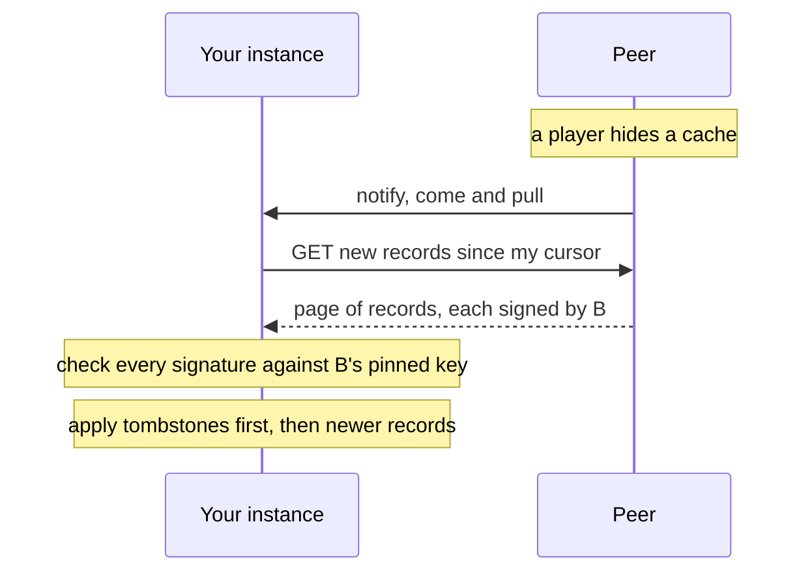
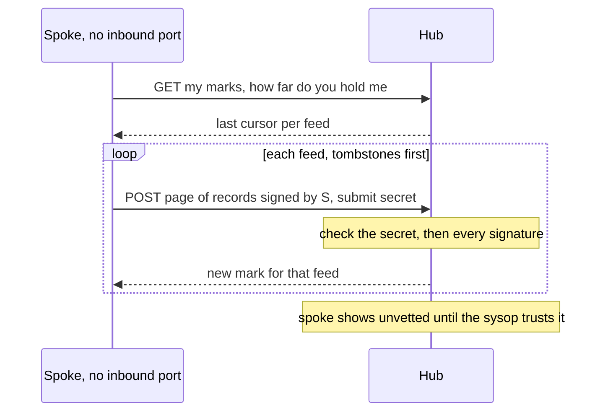
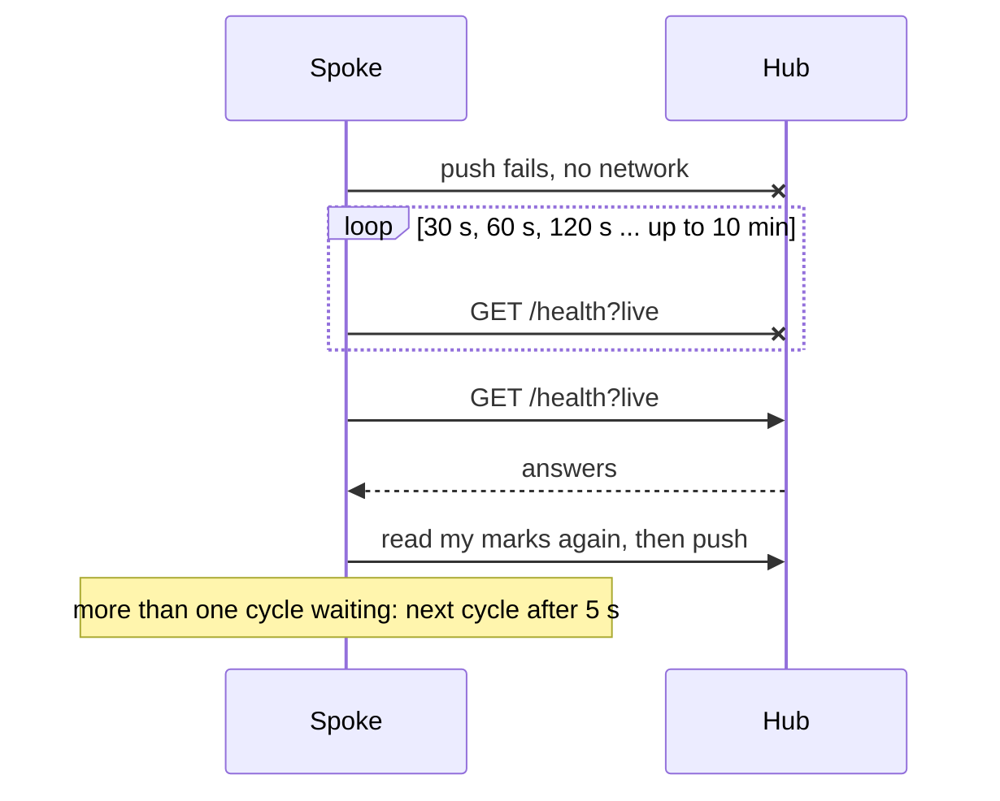
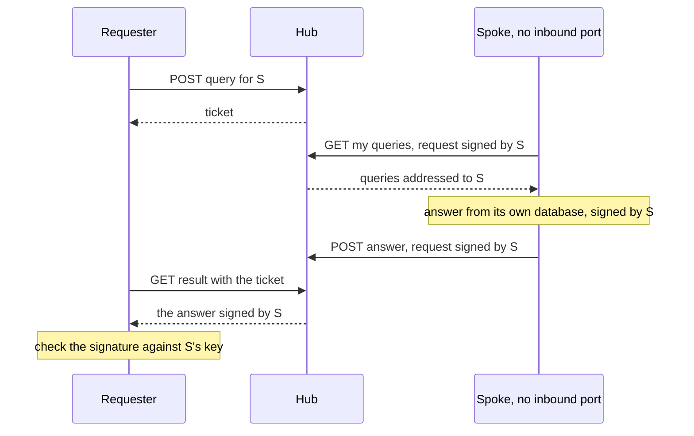
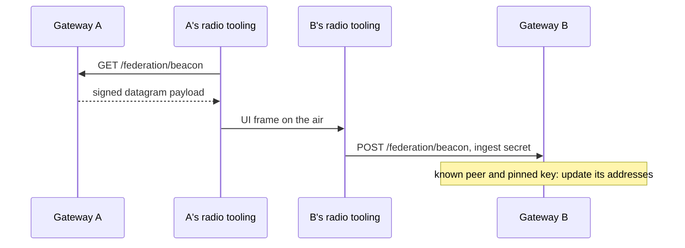
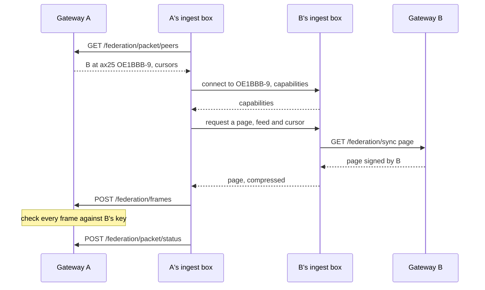
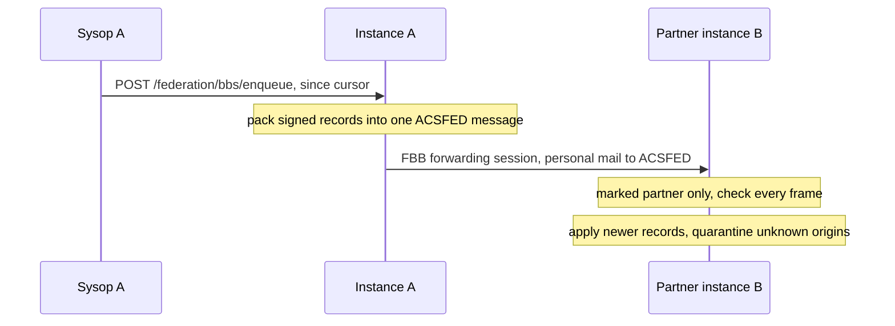

# Federation transports

This page lists every way federation records travel between instances, for the sysop who sets them up and the
integrator who wants the facts. For each one it says what it carries, who starts it, how it works step by
step, when it runs, what you configure, its limits and how far it is tested. Which one suits your instance is in
[Choose how to connect](choose.md); the bytes on the wire are in
[Federation wire format](../../reference/federation-wire.md).

## Every transport at a glance

The records are the same signed frames on every transport. The receiving instance checks each signature
against the key it pinned for the record's origin, so no transport adds or removes trust
([How federation stays honest](../../reference/federation-trust.md)).

| Transport | Carries | Who starts it | Delay | Default | Tested |
|---|---|---|---|---|---|
| [Pull](#pull) over https, 44Net or HAMNET | caches, finds, keys, bulletins, tombstones, account moves; the caches, finds and tombstones a hub passes on | the instance that wants the records | seconds after a write, at most `FED_SYNC_INTERVAL_MS` (5 min) | on for every peer you add | CI, two instances on one host |
| [Push to a hub](#push-to-a-hub) | caches, finds, keys, bulletins, tombstones, account moves | the spoke | 3 s after a write, 15 s at most in a stream of writes; 30 s to 10 min after an outage | off | CI, two instances on one host |
| [Rendezvous relay](#rendezvous-relay) | a firewalled spoke's caches, finds or keys feed, and questions to confirm a find | a requester with the hub's relay secret; an instance asking a spoke to confirm a find | the spoke's next collect, `FED_RELAY_POLL_MS` (15 s) | off | CI, two instances on one host; server tests with three |
| [Corroboration exchange](#corroboration-exchange) | one question and its answer about a find | the instance where the find is logged | seconds; through a relay, the spoke's next collect; retried 1, 6 and 24 h later | on with a signing key | CI, two instances on one host; server tests with three |
| [Presence beacon](#presence-beacon) | an instance's addresses, one datagram | the operator's own tooling | whenever it transmits | endpoints only | unit tests |
| [Packet circuit](#packet-circuit) (AX.25, NET/ROM) | caches, finds, keys, bulletins, tombstones, account moves | the pulling instance's ingest box | at most `FED_LINK_PULL_MS` (1 h) per session, one peer at a time | off (`FED_LINK_SERVE`, `FED_LINK_PULL`) | local loop over AX.25/AXUDP; not on real radios |
| [FBB store-and-forward](#fbb-store-and-forward) | a batch of feed records as packet mail | the sysop, by hand or timer | hours to days | off (`FED_BBS`) | local loop over AX.25; not on real BBS networks |

None of the transports has run between independent instances on live infrastructure: the public internet,
44Net, HAMNET or a BBS network. The CI federation test runs two real gateways side by side on one machine.

## Pull

**What it carries.** Every feed: caches, finds, callsign keys, bulletins, tombstones and account moves.
Tombstones come first, so a deletion arrives before the record it deletes. Last comes the transit feed: the
caches, finds and tombstones the peer mirrored from other instances and passes on, each still signed by its home
([A hub passes its spokes' records on](hubs-and-relays.md#a-hub-passes-its-spokes-records-on)).

**How it works.** Your instance asks each peer, "what is new since my last cursor?" The peer answers with a
page of up to 500 records it signed itself. Your instance checks each signature, applies what is newer than what
it holds, and keeps the cursor for next time. When the peer writes something new, it sends your instance a short
"come and pull" ping (`POST /federation/notify`), and your instance pulls at once. The ping is unsigned and only
asks for a pull your instance would make anyway: a ping from an instance you do not follow is ignored.



**When.** Every `FED_SYNC_INTERVAL_MS` (default 300000, 5 minutes; `0` turns the schedule off), for every
enabled peer. A notify brings records within seconds when the peer can reach your URL. **Sync now** under
**Instance admin → Federation** pulls from every peer at once; **Sync now** on a peer's row pulls from that one,
three times a minute at most.

**Configure.** A signing key on the peer; the peer added under **Instance admin → Federation** or in
`FED_PEERS` ([Join the network](index.md)). Optional: `FED_SYNC_REGION` to pull one area's caches only.

**Limits.** A page is at most 4 MiB and 500 records; a pass reads at most 50 pages per feed and carries on at
the next. Each address gets 5 seconds to answer, a `hamnet` address 2.

### Addresses: https, 44Net and HAMNET

A pull, a notify and a corroboration question go to the same addresses. A peer publishes its own in
`FED_ENDPOINTS`; your instance learns them from its descriptor on every sync, from its callsign's DNS record, or
from its beacon. It tries them in priority order (lower first), keeps the first that answers for the rest of the
sync, and tries the URL it added the peer under last.

| `transport` | `address` | Reached over | Notes |
|---|---|---|---|
| `https` | `https://aprs.example.net` | https on the internet | the usual address |
| `44net` | `aprscaching.oe8apr.ampr.org` or `https://aprscaching.oe8apr.ampr.org` | plain http on the name; with `https://`, https first and then plain http | a name under `<call>.ampr.org`, never a raw 44.x address |
| `hamnet` | `44.143.1.2`, `aprscaching.oe8xyz.hamnet.example`, optional `:port` | plain http | only HAMNET hosts reach it; any other peer gives up after 2 seconds |
| `ax25`, `netrom` | `OE8APR-10`, `ACSNOD` | a [packet circuit](#packet-circuit) from the puller's ingest box | `FED_LINK_PULL` on the puller's box; an http pull never uses them |
| `bbs` | `OE8APR@OE8XBB.#KTN.AUT.EU` | nothing dials it | a directory entry for packet operators, published with the rest |

```bash
FED_ENDPOINTS='[{"transport":"https","address":"https://aprs.example.net","priority":10},{"transport":"44net","address":"https://aprscaching.oe8apr.ampr.org","priority":20},{"transport":"hamnet","address":"44.143.1.2","priority":30}]'
```

A peer added by callsign reads the addresses from the `_aprscaching` TXT record under `<call>.ampr.org`
(`host=` for 44Net, `web=` for https), and those stay whatever its descriptor says
([44Net name and identity](../networks/44net-identity.md#3-name-and-identity)). Plain http on 44Net and HAMNET
changes no trust: every record is signed, and a corroboration answer is bound to its question. The addresses an
instance serves to browsers are set in `EXTRA_ORIGINS`
([One instance, several addresses](../networks/several-addresses.md)).

**Tested.** Pull and notify run in CI between two gateways; the region filter has server tests. Address order and the fall back
from https to http are covered by the gateway's tests. Real 44Net and HAMNET routing is untested.

## Push to a hub

**What it carries.** Every feed the pull serves, the spoke's own records only: tombstones, caches, finds,
callsign keys, account moves and bulletins, in that order, so a deletion arrives before the record it deletes.

**How it works.** The spoke sends pages of its signed records to the hub's `POST /federation/submit`, with the
hub's submit secret. The secret decides who may introduce a new key to the hub; the hub checks every record's
signature, and the records must all be signed by the spoke itself. The first push registers the spoke as an
**unvetted** peer on the hub. The hub answers each page with how far it now holds that feed, and the spoke saves
that mark, so a restart or a restored backup resumes where the hub stands.



**When.** Shortly after a write on the spoke: 3 seconds after the last write, so a burst of writes goes in
one cycle, and at most 15 seconds after the first, so a steady stream of writes still goes out. A cycle with
nothing new sends nothing. The push also runs in the scheduled cycle with pull, every `FED_SYNC_INTERVAL_MS`,
and **Sync now** pushes immediately. One cycle runs at a time. While the hub is unreachable, writes wait for
the catch-up below.

**Configure.** On the hub: `FED_SUBMIT_SECRET`, and `FED_SUBMIT_INSTANCES` to name the spokes allowed. On the
spoke: `INSTANCE`, `FED_PRIVATE_KEY`, `FED_HUB_URL` and the hub's `FED_SUBMIT_SECRET`; add the hub to `FED_PEERS`
to pull from it too ([Push to a hub](hubs-and-relays.md#push-to-a-hub)).

**Limits.** A submission is at most 4 MiB, 500 records a page and 50 pages per feed per cycle. Once the hub's
sysop trusts the spoke, the hub passes its records on to the other spokes and to every instance that pulls the
hub, as the spoke signed them (`FED_RESERVE`).

### Catch-up after an outage

A phone or a box on a flaky line loses its hub often. Catch-up makes it resume promptly instead of waiting for the
next scheduled cycle.



After a push fails for a network reason, the spoke probes the hub's `/health?live` after 30 seconds, doubling
the wait up to 10 minutes. The first answer starts a full cycle at once, which reads the hub's marks again.
While more pages wait than one cycle sends, the next cycle follows 5 seconds later. **Instance admin →
Federation** shows the last push, the records waiting and since when the hub is unreachable; the hub shows a spoke
as stale after `FED_SPOKE_STALE_HOURS` (24) without a push.

**Tested.** Push, marks, resume and catch-up run in CI between two gateways and in the server tests.

## Rendezvous relay

**What it carries.** Two kinds of query for a firewalled spoke: one feed page on request (its caches, finds or
callsign keys since a cursor, at most 1000 records, signed by the spoke), and a question to confirm a find
(the same signed question and answer as the [corroboration exchange](#corroboration-exchange)).

**How it works.** The relay is a mailbox on the hub, so a question can reach a spoke that nobody can dial. A
requester leaves a query for the spoke at the hub and gets a ticket. The spoke collects the queries addressed to
it on its own outbound connection, answers each from its own database, and posts the answer back. The requester
collects the answer with its ticket. The spoke signs each collect and answer request with its federation key,
and the hub checks that key against the one it already holds for the spoke, so no spoke can answer for another.
The answer is signed by the spoke: a feed page is checked record by record, as for a pull, and a corroboration
answer is checked against the question it answers, as a direct one.



**Who asks.** Two kinds of requester.

- **A script or tool** asks for feed pages. It holds the hub's `FED_RELAY_SECRET`, may hold up to 50 queries
  waiting and make 60 a minute. To apply a relayed page on an instance, post it to that instance's
  `POST /federation/frames` with its operator or ingest secret: the frames go through the same checks as a pull.
- **An instance** asks on its own, to confirm a find. When a trusted peer has no address it can dial, or none
  of its addresses answers, the instance leaves its signed question with a hub: its own queue when the peer is
  one of its push spokes, else its `FED_HUB_URL` hub and then its other trusted peers, three hubs at most, the
  first that takes it. It posts the question to the hub's `POST /federation/corroborate`, addressed to the
  spoke. The hub queues it only for one of its own push spokes, and only from an instance whose key it holds and
  whose signature verifies, with the same caps per instance; it answers 202 with a ticket. The asking instance
  reads the answer with that ticket, signing the read with its own key, so the relay secret alone does not read
  it.

**When.** The spoke collects its queries every `FED_RELAY_POLL_MS` (default 15000, 15 seconds; `0` leaves it to
the scheduled cycle) and in every scheduled cycle, so while it is online an answer is ready within about 15
seconds. An asking instance reads the answers it waits for on the same cadence. A query the spoke collected
but did not answer goes back to the queue after 5 minutes; an unanswered query older than an hour goes at the
nightly cleanup. A corroboration question stays answerable for an hour: one still unanswered then is asked
again at the next [later attempt](#corroboration-exchange).

**Configure.** On the hub: `FED_RELAY_SECRET`. On the spoke: `FED_HUB_URL` and `FED_RELAY_SECRET` (any value turns
the spoke's collecting on; the spoke never sends it), a signing key, and a hub that already knows the spoke's key
through a push, a pull or the registry ([Rendezvous relay](hubs-and-relays.md#rendezvous-relay)). For a question to
confirm a find, the spoke also pushes to the hub, and the hub knows the asking instance's key: it pulls from it,
or the asking instance pushes to it. Optional: `FED_RELAY_POLL_MS`.

**Limits.** An answer is at most 8 MiB. A spoke collects at most 25 queries per round. Over
[FBB](#fbb-store-and-forward) the relay carries feed queries only: a round trip there takes longer than a
corroboration question stays answerable.

**Tested.** Enqueue, collect, answer and result, for a feed query and for a corroboration question the hub
queues for its push spoke, run in CI between two gateways. A find confirmed by a firewalled spoke's receiver
through its hub runs in the server tests with three instances: the asker, the hub and the spoke.

## Corroboration exchange

**What it carries.** One signed question about a find ("did your own receivers hear this call, here, then?")
and one signed answer. Nothing of it is mirrored or forwarded.

**How it works.** [How a find gets confirmed across instances](how-it-works.md#how-a-find-gets-confirmed-across-instances)
explains it in full, with its diagram. As a transport: the asking instance posts the question to the peer's
`POST /federation/corroborate` at the peer's pull addresses, up to three of them, in the same order as a pull. A
trusted peer nobody can dial, such as a spoke that only pushes, gets the same question through a hub's
[relay](#rendezvous-relay).

**When.** When a find is logged and has not reached Tier A on its own; every trusted peer at once, 3 seconds
each. A peer asked through a relay answers when it collects the question, within about 15 seconds while it is
online, and the find lifts then, shown as *confirmed later*. Peers that could not be reached are asked again 1,
6 and 24 hours after the find, never after 72 hours.

**Configure.** `FED_PRIVATE_KEY` to ask; trusted peers to ask; your own receiving sites (`FIRST_PARTY_SITES` or
**Instance admin → Trusted receiving stations**) to answer "yes". Optional: `FED_CORROBORATION_QUORUM`,
`FED_CORROBORATION_SECRET`, `FED_CORROBORATION_REQUIRE_KNOWN`, `FED_REVEAL_IGATE`, `FED_RELAY_POLL_MS`.

**Limits.** A peer is asked at an address the asking instance can dial, or through a hub that relays for it;
never over packet radio. A spoke whose hub runs no relay, or that does not collect its queries, is not asked.

**Tested.** Tier A by peer corroboration, the quorum and the retries run in CI between two gateways; the
confirmation through a hub's relay runs in the server tests with three instances.

## Presence beacon

**What it carries.** One signed record: the instance's id and its `FED_ENDPOINTS` addresses, in one AX.25 UI
datagram of at most 251 bytes. The lowest-priority addresses drop out until it fits, and a trimmed beacon says so.

**How it works.** The gateway serves its current beacon at `GET /federation/beacon`, ready to transmit. A heard
beacon goes to the receiving gateway's `POST /federation/beacon` (ingest or operator secret). A beacon from a
peer you already know, signed by its pinned key, updates that peer's addresses. A beacon never adds a peer, and
one from an unknown instance is quarantined.



**When.** Whenever the operator's tooling transmits it. The gateway schedules nothing.

**Configure.** `FED_ENDPOINTS` and a signing key. The ingest box does not transmit or decode beacon datagrams:
transmitting is the operator's own tooling, under the rules for
[automatic stations on the air](../compliance/on-air-stations.md).

**Tested.** The gateway's encode, trim and receive paths have unit tests. Not on the air.

## Packet circuit

**What it carries.** Every feed, as on a [pull](#pull): tombstones, caches, finds, callsign keys, account moves
and bulletins, each record signed by its origin. Pages are small to suit the channel: 25 records at most on a VHF
port, fewer when a page would not fit one line of the session.

**How it works.** The pulling instance's ingest box asks its gateway which peers publish an `ax25` or `netrom`
endpoint, and dials the one that has waited longest. The serving instance's ingest box answers the connect with
the sync service (`ACSL1`), which reads pages from its own gateway. Both ends exchange their link capabilities and
agree on the slower rate, the smaller batch and the best common compression. The puller then asks for one page at a
time, feed after feed, and its box hands each page to its own gateway's `POST /federation/frames`, where every
frame is checked against its origin's pinned key. At the end the box reports the session to its gateway, which
keeps where each feed stopped. Neither box holds a key.



An `ax25` endpoint is a station that answers with the sync service: the box connects to it directly. A `netrom`
endpoint is a node alias: the box connects to the node in `FED_LINK_NODE`, which routes `C <alias>` through the
NET/ROM network, and then gives the far node's `FED` command.

**When.** One session per `FED_LINK_PULL_MS` at most (default 3600000, one hour; at least one minute), the first
15 seconds after the box starts. One session at a time, one peer per session. A session pulls at most
`FED_LINK_PAGES` pages (default 20) and the next one carries on. A peer whose session failed is skipped for 1, then
2, 4 and up to 32 rounds. The box does not dial while its transmit switch is off (**Shack → Remote box**).

**Configure.** On the serving instance:

1. A signing key (`FED_PRIVATE_KEY`) and the endpoint in `FED_ENDPOINTS`, for example
   `{"transport":"ax25","address":"OE1BBB-9","priority":30}`.
2. On its ingest box: a frame link (`KISS_TNC_HOST`, or `AXUDP_PORT` and `AXUDP_PEERS`), `FED_LINK_SERVE=1` and
   `FED_LINK_CALL=OE1BBB-9`. With the NET/ROM node running (`NETROM_CALL`, `NETROM_ALIAS`), the node also answers
   the `FED` command, which is what a `netrom` endpoint needs.

On the pulling instance:

1. Add the peer the usual way, by URL or by callsign, and compare its key fingerprint
   ([Join the network](index.md)). The packet endpoint comes from the peer's descriptor, its DNS record or its
   beacon ([Addresses](#addresses-https-44net-and-hamnet)).
2. On its ingest box: a frame link, `FED_LINK_PULL=1` and `FED_LINK_CALL` (the call-SSID it dials as). Optional:
   `FED_LINK_PULL_MS`, `FED_LINK_PAGES`, and `FED_LINK_NODE` for `netrom` endpoints.

Both boxes transmit under `FED_LINK_CALL`, so it is a call you hold, and the rules for
[automatic stations on the air](../compliance/on-air-stations.md) apply. **Instance admin → Federation** shows each
peer's last packet session, the endpoint and any error; `deploy/aprscaching doctor` reports the box's settings
(`ingest.fedlink`) and the peers' last sessions (`federation.packet`).

**Limits.** An `ax25` endpoint is dialled directly, without digipeaters; a far station goes through a node, as a
`netrom` endpoint. A peer is pulled only once its key is pinned, so adding it needs its descriptor once, over an IP
path or its DNS record. The packet path keeps its own cursors, apart from the http pull's; a record arriving both
ways applies once. The newest records of the caches and bulletins feeds are read again each session, as on an
http pull, so a record changed within the same second is not missed.

**Tested.** The protocol ends, the compression and the scheduler have unit tests. The interop local loop runs two
instances whose ingest boxes are crosslinked over AXUDP: A pulls B's feed over an AX.25 circuit, and a cache
created on B appears on A's map. Untested on real radios, and the `netrom` path only in unit tests.

## FBB store-and-forward

**Experimental**, off by default and untested on real BBS networks.

**What it carries.** A batch of the instance's own records (tombstones first, then caches, finds, keys, account
moves and bulletins), at most 900 per batch, as one personal message to `ACSFED` at a partner BBS.

**How it works.** The sysop asks the gateway to pack the records changed since a cursor into one signed batch.
The batch waits in the BBS outbox and goes to the partners marked for federation at the next forwarding session.
The partner's instance takes a batch only from a partner it marked, checks every frame against the keys it holds
for the origin, and applies the newer records. A batch from an instance it does not know stays quarantined.



**When.** The sysop queues a batch by hand or from a timer; the forwarding schedule carries it. Hours to days.
A batch already forwarded cannot be recalled.

**Configure.** `FED_BBS=1` on both instances, FBB forwarding with the partner, the partner marked
**Federation (experimental)**, and the partner sysop's agreement ([Federation over FBB](fbb.md)). The same
carrier takes the relay's queries to a packet-only spoke
(`POST /federation/relay/<instance>/dispatch`), and the spoke answers over FBB.

**Tested.** The interop local loop carries a signed batch between two instances over real AX.25/AXUDP. Not on a
real BBS network.

## Next

- [Choose how to connect](choose.md): which transport suits your instance.
- [Federation wire format](../../reference/federation-wire.md): frames, pages and batches byte by byte.
