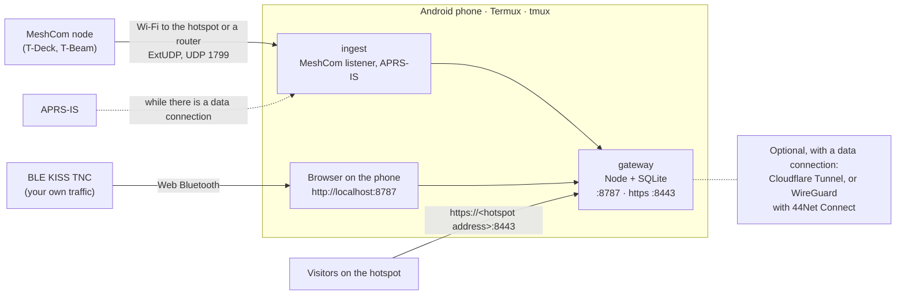

# Install Pocket on an Android phone

This page installs **Pocket**, a complete aprscaching station on one Android phone, in
[Termux](https://termux.dev) and without root. It is for a sysop who wants a station for field days, demos and
hikes; at the end the station runs on the phone and you are signed in.

The gateway (Node and SQLite) serves the map and the web app, and the ingest feeds it from APRS-IS and a MeshCom
node. Pocket is not a 24/7 server: Android stops background apps, and battery and heat are real limits. For an
always-on station, use [Self-host](self-host-docker.md).



## What it is and isn't

| It is | It isn't |
|---|---|
| A whole station in a pocket: map, caches, finds, live stations, messages, off-grid | An always-on public server |
| The same gateway and ingest as every other shape; only scripts and settings are Pocket's own | A fork, a native app, or a Play Store app |
| Runnable without root and without Google services | A way to run Docker or the desktop binary on a phone |
| A MeshCom and APRS-IS station; your own BLE TNC through the browser | A trusted receiver by default: trust tiers work as on any instance |

## Before you start

- **An Android phone**, no root needed, with a data connection for the install.
- **Your callsign.**
- **A GitHub account** for the GitHub CLI, which checks the installer's signature.

The scripts are in `deploy/pocket/`; each takes `--help`, and the
[README](https://github.com/apachler/aprscaching/blob/dev/deploy/pocket/README.md) lists every option.

## Install

1. Install **Termux from [F-Droid](https://f-droid.org/packages/com.termux/)** or its
   [GitHub releases](https://github.com/termux/termux-app/releases). The Play Store build is a different,
   older line; do not mix the two. Also install **Termux:API** from the same source: the scripts use it for
   the battery, the Wi-Fi name and telling the hotspot apart from a joined Wi-Fi.
2. In Termux, download the installer from the latest release, check it, and run it:

    ```bash
    pkg install -y gh && gh auth login     # once: the GitHub CLI checks the signature
    curl -fsSLO https://github.com/apachler/aprscaching/releases/latest/download/pocket.sh
    curl -fsSLO https://github.com/apachler/aprscaching/releases/latest/download/SHA256SUMS
    sha256sum -c --ignore-missing SHA256SUMS
    gh attestation verify pocket.sh --repo apachler/aprscaching
    bash pocket.sh --call <YOURCALL>
    ```

    [Check a download](verified-downloads.md) explains what the two checks prove. The script carries the
    SHA-256 of the release's git bundle, so the code it installs is checked too: it stops, having installed
    nothing, when the bundle does not match.

    It upgrades Termux first (`apt-get update && apt-get dist-upgrade`, choosing a mirror with
    `termux-change-repo` when none is set). Then it installs the release's bundle to `~/aprscaching`, installs
    the packages, compiles `better-sqlite3` for Android and builds the web app. It writes `~/.aprscaching/.env`
    with new secrets, starts the station, and prints its addresses and a one-time sign-in link. The first run
    takes a few minutes; compiling `better-sqlite3` is the long part.

    `--branch dev` installs a branch instead, straight from GitHub with nothing to check. It says so and asks
    first; `--unverified` answers for a script.

    !!! warning "Known issue: no release yet"
        Until the first release, the release URLs above answer 404 and there is nothing signed to check.
        Download the script from `dev`, read it, then install that branch (it asks you to confirm the
        unverified install):
        `curl -fsSLO https://raw.githubusercontent.com/apachler/aprscaching/dev/deploy/pocket/pocket.sh && less pocket.sh && bash pocket.sh --call <YOURCALL> --branch dev`

3. If `curl` itself fails with `cannot locate symbol "SSL_…"`, Termux is half-upgraded: run
   `apt update && apt full-upgrade -y` first.
4. Answer the **setup questions**, which `pocket.sh` offers after a first install. They run any time with
   `bash ~/aprscaching/deploy/pocket/wizard.sh`. With Termux:API they are Android dialogs, otherwise questions in
   the terminal (`--text` forces those). Each shows the current value, and nothing is written until you
   confirm the summary:

    | Question | Writes |
    |---|---|
    | Your callsign, the base call | `ADMIN_CALLSIGNS` (the first entry) and `APRSIS_CALLSIGN` |
    | Instance name, e.g. `oe8apr-pocket` | `INSTANCE`: the name other instances know the station by when it federates. It is set once: caches and finds carry the name they were made under, so a station that holds any keeps `localhost` |
    | A MeshCom node now? | runs [`meshcom-setup.sh`](../pocket/field-station.md#a-meshcom-node) |
    | Home-screen shortcuts, a daily backup while charging | runs `extras/setup.sh` ([Extras](../pocket/extras.md)) |
    | Connect to your home instance? Its URL, and its submit secret | `FED_PEERS`, `FED_HUB_URL`, `FED_SUBMIT_SECRET`, and a signing key of the station's own (`FED_PRIVATE_KEY`) when there is none ([Your home instance as the hub](../pocket/trips.md#your-home-instance-as-the-hub)) |

    Then it restarts a running station and opens **Instance admin** (`http://localhost:8787/?view=admin`),
    whose Setup checklist covers the rest once you are signed in.

The settings in `~/.aprscaching/.env` suit a phone: the gateway on port 8787 on every interface, APRS-IS
receive-only with an example filter to tune, short retention for the diagnostic tables, federation off. Every
key is in [Configuration](../../reference/configuration.md).

To update, check and run the newer release's `pocket.sh` the same way: it keeps the `.env` and restarts the
station on the new code. A checkout on a branch updates with `deploy/pocket/update.sh`.

## Check that it worked

```bash
bash ~/aprscaching/deploy/pocket/status.sh
```

It shows the gateway and the ingest running, the gateway's `/health`, and the address other devices use on each
network. Open `http://localhost:8787` in a browser on the phone and sign in with the one-time link `pocket.sh`
printed.

## Browsers on the phone

| Browser | Map | Location | Passkeys (microG phone) | Web Bluetooth |
|---|---|---|---|---|
| **Brave** | works | works out of the box | no passkey offered; use the one-time link | off by default: `brave://flags` → *Web Bluetooth API* → Enabled |
| **Firefox** | works | needs Settings → Site permissions → Location → **Ask to allow** | "Operation is not supported"; use the one-time link | not supported |
| **Cromite** | needs WebGL allowed for the site | crashes the browser | no passkey offered | — |
| Chrome | works | works | works with Google Play services | works |

Brave is the recommended browser on a phone without Google services. Without WebGL, the app shows a notice and
works without the map.

## Tested on

| Phone | Android | Termux | Node | Result |
|---|---|---|---|---|
| SHIFTphone 8 (SHIFTOS-L, microG, no Google services) | 15 | 0.118.3 (F-Droid) | 24.18.0 | install (`better-sqlite3` compiled in 2 min 35 s); restart after a killed gateway; 45 min screen off with Termux battery unrestricted and the child-process limit on, nothing killed; backup; https for a visitor on the hotspot with location; a MeshCom node through the home router and on the hotspot in flight mode |

An x86 Android device (a Chromebook, an emulator) takes its web build from a PC, handed in with `--web-dist`:
Rolldown, the web build's bundler, has Android builds for arm only.

## Not supported

### An RTL-SDR on the phone: not supported

An RTL-SDR dongle with Direwolf would make the phone an RF receiver without a TNC. On Termux this does not work,
for three independent reasons (checked in the `termux/termux-docker` image and upstream, as of September 2026):

| Piece | State |
|---|---|
| Packages | Neither `rtl-sdr` nor `direwolf` is a Termux package. |
| rtl-sdr from source | Builds (`rtl_fm`, `rtl_tcp`, `rtl_sdr`, `rtl_power`; `rtl_adsb` fails because Android's C library has no `pthread_cancel`). It **cannot open the dongle**: librtlsdr finds devices by scanning the USB bus, which Android forbids an app without root, and it has no call that takes the file descriptor `termux-usb` hands over. A patch adding one (`rtlsdr_open_fd`) was posted to the osmocom-sdr list and not merged. |
| Direwolf from source | Does not build unmodified: it needs ALSA or OSS sound headers, which Termux does not ship. Reading audio only from stdin (`rtl_fm … \| direwolf -r 24000 -`) would need a patch. |
| CPU, battery, heat | Not measured: nothing runs far enough to measure. |

Pocket therefore installs neither. For RF on the phone use a TNC, [on USB](../pocket/field-station.md#a-usb-tnc-on-the-phone)
or [over Bluetooth in the browser](../pocket/field-station.md#your-radio-in-the-browser), or a MeshCom node. For
an SDR receiver, run `rtl_fm | direwolf` on a Raspberry Pi as the station's [ingest box](../radios/rf-ingest.md).

### Docker or Linux in a VM on the phone

[Podroid](https://github.com/ExTV/Podroid) runs Podman and Docker in an Alpine Linux VM on Android. Android's own
**Linux Terminal** (a Debian VM under *Developer options → Linux development environment*, first on Pixel phones)
runs ordinary Linux software. Either could run the Docker stack or the desktop binary, but neither is tested
here: the VM's network sits behind the phone, the hotspot and Bluetooth are not the VM's own, and the phone
still stops background work. Pocket uses Termux, which runs on the phone itself.

## Next

- [Run Pocket in the field](../pocket/field-station.md): start, keep running, visitors and radios.
- [Backups](../day-to-day/backups.md): the phone's scheduled backup and moving to another shape.
