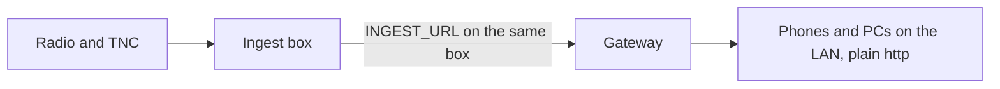

# Off-grid and LAN

This page runs an instance with no internet: the gateway, the ingest and the web app on one box, reached over
your LAN. It is for the sysop; at the end the map and your own radio work with no connection out.



The ingest box always runs on the operator's own equipment, and `INGEST_URL` can point at a gateway on the
same machine, on the LAN or in the cloud. That is what makes off-grid work: with the ingest and the gateway
on one machine, the whole stack runs with no internet. A cloud VM may add an APRS-IS-only feed when a
connection exists ([Run a cloud APRS-IS feed](../radios/ingest-box.md#run-a-cloud-aprs-is-feed)). It is
never the only way to get RF in.

## Before you start

- A Linux box (a Pi, a mini-PC or a laptop) with Docker, and a checkout of the repository
  ([Self-host with Docker](../install/self-host-docker.md)).
- The box's LAN address, for example `192.168.1.10`. Give it a fixed address on your router.
- Your radio link, set up as in [Connect a radio: quick starts](../radios/quick-starts.md).

## Off-grid with Docker

1. In `deploy/`, run the setup and choose **the local network only**:

    ```bash
    ./setup.sh
    ```

    For scripts: `./setup.sh --non-interactive --call OE8APR --lan-host 192.168.1.10`. It writes
    `DOMAIN=:80` and `APP_URL=http://192.168.1.10`, and starts the instance with federation off. The ingest
    keeps the stack's default `INGEST_URL=http://gateway:8080/ingest`, the gateway inside the same stack.

2. Start it. In `deploy/`:

    ```bash
    SOURCE_COMMIT=$(git rev-parse HEAD) docker compose up -d --build
    ```

3. Sign in. Without https there are no passkeys, so members sign in with the sysop's
   [one-time link](../day-to-day/sign-in-links.md#off-grid-sign-in).

**Without Docker**, run the ingest and a Node gateway on the same machine with
`INGEST_URL=http://localhost:8787/ingest` ([Self-host without Docker](../install/self-host-bare-metal.md)).

## What works without the internet

The app, your own radio, the map's caches and verification over RF work. Services on the internet stop: the
online base map, the APRS-IS feed, email sign-in links and web push, among others.
[HAMNET only](hamnet.md) lists each one with its workaround; the same table holds for a LAN. For the map, give
hunters an [offline map](../install/offline-map.md) to make offline packs from.

## Check that it worked

- `curl -fsS http://192.168.1.10/health` answers `{"ok":true,…}` from another machine on the LAN.
- `deploy/aprscaching doctor` reports APRS-IS as not reachable, which is expected off-grid, and passes the
  ingest's credential.
- Stations your radio hears appear on the map under **Search & filter → Live layers → Live stations**.

## Next

- [One-time sign-in links](../day-to-day/sign-in-links.md): how members sign in without https.
- [HAMNET only](hamnet.md): what stops without an internet path, and the workarounds.
