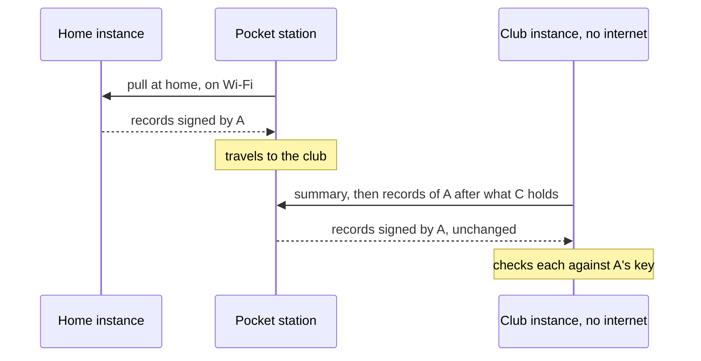

# Carry records between instances

This page shows the sysop how a Pocket station carries federation records from one instance to another that
has no path to it, such as from your home instance to a HAMNET-only club or a field event without internet. At
the end the other instance holds your home instance's caches, finds and deletions, each signed by your home
instance, and the phone brings that instance's records back home the same way.

## Before you start

- Pocket follows your home instance ([Before a trip](trips.md#your-home-instance-as-the-hub)), with a signing key
  of its own (`FED_PRIVATE_KEY`; the setup questions make one).
- The other instance runs APRScaching with a signing key, and its sysop is there to add the phone as a peer.
- The phone and the other instance reach each other on one network: the phone's hotspot, the club's Wi-Fi or
  HAMNET. `status.sh` lists the phone's address on each network.

## How it works

The phone is an ordinary instance on both visits. At home it pulls your home instance and keeps every record it
mirrors exactly as its home signed it. At the other instance, that instance pulls the phone, reads its summary of
what it holds of each home, and asks only for what it does not hold yet. Each record is checked against the key
of the instance that signed it; the phone signs nothing of it and lends it no trust
([How records travel through the mesh](../federation/how-it-works.md#how-records-travel-through-the-mesh)).



## Set up the phone

1. **Trust your home instance.** Compare its key fingerprint with the one its row shows under the phone's
   **Instance admin → Federation**, and set it to trusted, or pin it in `FED_PEERS` as
   `https://aprs.example.net#<fingerprint>`. What a trusted home passes on from other instances counts as held on
   the phone, so the phone passes it on in turn.
2. **Pass on every instance's records.** In `~/.aprscaching/.env`:

    ```bash
    FED_RESERVE=all       # pass on the records of every instance not blocked here, each as its home signed it
    ```

    With the default, `trusted`, the phone passes on only the records of instances it trusts itself: your home
    instance, but not the other instances your home instance mirrors.

3. **Restart the gateway:** `bash ~/aprscaching/deploy/pocket/restart.sh gateway`.
4. **Sync at home** before you leave: `bash ~/aprscaching/deploy/pocket/extras/sync-now.sh --finds`
   ([Sync before a trip](trips.md#sync-before-a-trip)).

## At the other instance

1. **Add the phone as a peer.** In the other instance's `.env`, add the phone's address with its key fingerprint
   to `FED_PEERS`, then restart its gateway:

    ```bash
    FED_PEERS=http://192.168.43.1:8787#<the phone's fingerprint>
    ```

    The phone shows its fingerprint under **Instance admin → Federation → Your key fingerprint**. A peer in
    `FED_PEERS` may sit on a private address such as a hotspot; one added under **Add peer** may not.

2. **Sync now** under **Instance admin → Federation** on the other instance. It pulls the phone's own records and
   the ones it carries.
3. **Bring the club's records home.** Add the other instance to the phone's `FED_PEERS` the same way, with its
   fingerprint, and run `sync-now.sh` on the phone. At home, your home instance pulls the phone at its next sync,
   provided the phone is in its `FED_PEERS` or added as a peer there.

## What to expect

- **The other instance treats your home instance as unvetted** until its sysop compares your home instance's
  fingerprint and trusts it. Its caches show there once a player includes unvetted peers.
- **Deletions travel the same way.** A cache or find removed at home is removed at the other instance once the
  phone has synced at home and met the other instance again, and a stale copy from another path never brings it
  back.
- **Only what is new crosses.** At each meeting the other instance asks for the records past what it already
  holds, from whichever path brought them.
- **A region applies.** With `FED_SYNC_REGION` set, the phone holds only the caches inside its box, and passes on
  only those.
- **Bounded travel.** A record crosses at most four instances.

## Check that it worked

- On the other instance, **Instance admin → Federation** lists your home instance as a `transit:` peer with its
  fingerprint, and the phone as a peer with its last sync.
- The map there shows your home instance's caches, *mirrored from* your home instance, once unvetted peers are
  included.

## Next

- [Hubs, relays and the registry](../federation/hubs-and-relays.md#a-hub-passes-its-spokes-records-on): the same
  rules for a hub.
- [How federation stays honest](../../reference/federation-trust.md#records-passed-on-through-hubs): what a
  receiver checks.
