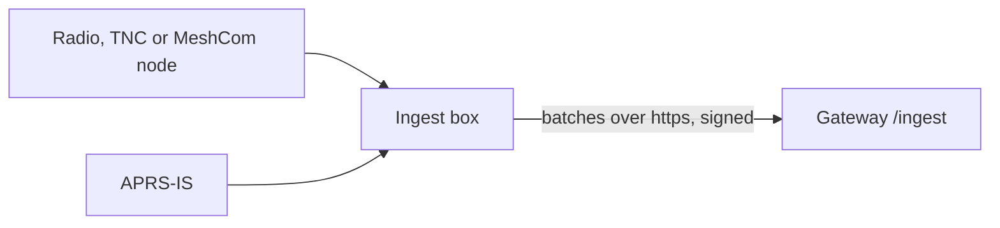

# Set up an ingest box

This page sets up an ingest box that feeds a gateway on another machine, and enrolls it on that gateway. It
is for sysops: the gateway's sysop creates the enrollment code, and the box's operator runs the setup. At the
end the box sends what its radios hear to the gateway, signed with its own key.

The **ingest box** is a small program (`apps/ingest`) on a Raspberry Pi, PC or mini-PC next to your radio.
It sends what it hears to the instance's gateway, which can be on the same machine, on your LAN or in the
cloud. RF ingest always runs on equipment the operator owns: only the box that touched the radio can vouch
for what it heard.



On the gateway's own machine you need none of this: the Self-host stack runs its own ingest, and its radio
settings go in `deploy/.env` ([Connect a radio: quick starts](quick-starts.md)).

## Before you start

- **Docker** on the box (Engine and the Compose plugin), and a checkout of the repository. With the deploy
  helper the box needs no Node.js: enrollment runs inside the ingest image.
- **The gateway's address**, for example `https://aprs.example.net`.
- **A one-time enrollment code** from the gateway's sysop ([Enrolling boxes on the gateway](#enrolling-boxes-on-the-gateway)),
  or the gateway's `INGEST_SECRET` if the sysop prefers the shared secret.
- **What the box connects to**: an APRS-IS filter, a KISS TNC, a MeshCom node. Each link is in
  [Connect a radio: quick starts](quick-starts.md).
- **The box's clock** within five minutes of the gateway's: a signed request outside that window is refused.

## How the box signs in

A box proves itself to its gateway in one of two ways:

| Credential | Settings on the box | Revoke one box | Who uses it |
|---|---|---|---|
| **Its own key** (enrolled) | `BOX_ID` and `BOX_KEY` | Yes, alone | Any box on another machine; the recommended way |
| **The shared secret** | `INGEST_SECRET`, the same as the gateway's | No: changing it cuts off every box on it | A single-operator setup |

Boxes on the shared secret keep working beside enrolled ones. Neither credential is an attestation: what a
box hears counts for Tier A only when the gateway lists its receiving site in `FIRST_PARTY_SITES`
([Receiving site and Tier A](rf-ingest.md#receiving-site-and-tier-a)). Never put the gateway's
`OPERATOR_SECRET` or `SESSION_SECRET` on a box.

## Enrolling boxes on the gateway

The gateway's sysop does this part.

1. In **Instance admin → Ingest boxes**, fill in **Box name** and, optionally, **Limit to callsign**: a box
   limited to a callsign may name only receiving sites of that base call. Select
   **Create enrollment code**. The code is shown once, holds 80 random bits, works for one box and expires
   after 15 minutes.
2. Give the code to the box's operator, who uses it in [Enrolling the box](#enrolling-the-box).
3. The box appears under **Enrolled boxes**, with when it was enrolled and last seen. When you created the
   code while signed in, you own the box for [remote control](remote-box.md) without a separate pairing
   step.
4. To cut a box off, select **Revoke** beside it. Its key stops working at once; it comes back only with a
   fresh code and a new key.

The same works over the API, as the sysop or with `OPERATOR_SECRET`: `POST /api/admin/boxes/codes` (fields
`label`, `callsign`, `ttlMin` from 10 to 15), `GET /api/admin/boxes` and `POST /api/admin/boxes/<id>/revoke`
([API reference](../../reference/api.md)). The code and box records, with who created, enrolled and revoked
each, are the enrollment's audit trail.

A signed request is fresh for five minutes and accepted once, and a box's key acts only for its own box id.

## Enrolling the box

The box's operator does this part, with the deploy helper. In the repository's top directory:

```bash
deploy/aprscaching init ingest-box --gateway https://aprs.example.net --code ABCD-EFGH-JKLM-NPQR --call OE8APR
```

1. The helper checks that the gateway answers at `<gateway>/ingest/check`.
2. It enrolls the box with the code. Enrollment runs inside the ingest image and writes `BOX_ID` and
   `BOX_KEY` into `deploy/.env` without showing the key. `--box` sets the id (default `box-<host name>`),
   `--label` the name the sysop sees.
3. It asks for the APRS-IS login and filter (`--call`, `--passcode`, `--filter`), a KISS TNC
   (`--kiss host[:port]`) and a MeshCom node (`--meshcom address=CALL`). With a TNC, it asks for the
   receiving site the TNC names (`--site-call`, written as `RF_SITE_CALL`).
4. It starts the ingest container and runs `deploy/aprscaching doctor`, which checks the credential the way
   the box sends it.

With `--shared-secret` the helper takes the gateway's `INGEST_SECRET` instead of a code, asked for without
showing it (with `--non-interactive`, from the `INGEST_SECRET` environment variable). `--no-start` writes the
settings only.

Running the helper again keeps the enrolled key unless you pass a new `--code`. A box that was revoked shows
in `doctor` as refused; enroll it again with a new code from the sysop. A box id that is still enrolled
takes a new code only after the sysop revokes it, or under another `--box` id. The helper refuses a
`deploy/.env` that belongs to a gateway, since the Self-host stack runs its own ingest.

## Set up the box by hand

Without the helper, the box runs `deploy/compose.ingest-only.yml`, the ingest container alone.

1. Create `deploy/.env`, owner-only, with the gateway's ingest address:

    ```
    INGEST_URL=https://aprs.example.net/ingest
    ```

2. Enroll the box. In `apps/ingest`, with Node.js and the workspace installed (`pnpm install`):

    ```bash
    node --import tsx src/enroll.ts --url https://aprs.example.net/ingest --code ABCD-EFGH-JKLM-NPQR \
      --box shack-1 --label "home TNC" >> ../../deploy/.env
    ```

    It generates the box's Ed25519 key, registers the public half with the code, and appends `BOX_ID` and
    `BOX_KEY`. `BOX_KEY` is the private key: keep it in the settings file and never on a screen. `--url`
    defaults to `INGEST_URL`, `--box` to `BOX_ID`, else a random id. For the shared secret instead, add
    `INGEST_SECRET=<the gateway's secret>` and skip this step.

3. Add the links the box connects to ([Connect a radio: quick starts](quick-starts.md)).
4. Start it. In `deploy/`:

    ```bash
    docker compose -f compose.ingest-only.yml up -d --build
    ```

The container receives every setting in `deploy/.env` and blanks `OPERATOR_SECRET` and `SESSION_SECRET`.
Inside it, `localhost` is the container: [From a container](rf-ingest.md#from-a-container).

**From a checkout without Docker**, the settings go in `.env` at the top of the repository (copy
`.env.example`), the enroll command appends to `../../.env`, and the ingest starts with
`pnpm --filter @aprscaching/ingest start`.

## Run a cloud APRS-IS feed

The same `compose.ingest-only.yml` runs a baseline APRS-IS feed on a cloud VM: set only `INGEST_URL`, the
box's credential and the `APRSIS_*` settings. Keep such a box APRS-IS only. RF transports always belong on
the operator's own equipment, so a cloud feed never replaces a box next to the radio.

## Check that it worked

- `deploy/aprscaching doctor` shows `ingest.credentials` as passed: the gateway accepts the box's key (or
  its `INGEST_SECRET`). It asks the gateway's `GET /ingest/check` the way the box sends its requests. A
  refused key means the box was revoked or enrolled on another gateway.
- The box's log (in `deploy/`: `docker compose -f compose.ingest-only.yml logs -f ingest`) shows
  `[ingest] started -> https://aprs.example.net/ingest` and one line per link. It stays silent while
  forwarding works, and logs `[forward] gateway unreachable …` when it cannot reach the gateway. Meanwhile
  it keeps up to `INGEST_SPOOL_MAX` (5000) undelivered packets and drops the oldest beyond that.
- On the gateway, **Instance admin → Ingest boxes** shows the box as last seen a moment ago, and
  `https://<instance>/api/ports` counts the box's packets per link.

## Next

- [Connect a radio: quick starts](quick-starts.md): one section per radio link.
- [Remote control of your box](remote-box.md): drive the box from the web app.
