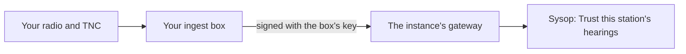

# Lend your receiver to an instance

This page is for a ham who wants their own receiver to help an instance they do not run. You set up an
ingest box next to your radio and enroll it on that instance; the sysop decides whether its hearings verify
finds. At the end your station widens the instance's radio coverage, and finds heard by it can be
Radio-verified.



## Before you start

- **A receiver you operate**: a KISS TNC (or AGWPE, WA8DED host mode) or a MeshCom node on your own radio. A
  club digipeater or someone else's node is not yours to lend.
- **A small computer next to it**, such as a Raspberry Pi, with Docker: [Set up an ingest box](ingest-box.md#before-you-start).
- **The instance's address**, for example `https://aprs.example.net`, and a way to reach its sysop.
- **The site call your box stamps on what it hears**: your callsign with an SSID, such as `OE8ABC-10`.

## Steps

1. Ask the instance's sysop for an enrollment code, and tell them your callsign and site call. The sysop
   creates the code in **Instance admin → Ingest boxes**, limited to your callsign, so your box can name only
   sites of your own call. The code works once and expires after 15 minutes.
2. Enroll the box with the code and your site call. In the repository's top directory on the box:

    ```bash
    deploy/aprscaching init ingest-box --gateway https://aprs.example.net --code <code> \
      --call OE8ABC --kiss localhost:8001 --site-call OE8ABC-10
    ```

    The helper generates the box's own key, enrolls it and starts the ingest. All the options are in
    [Enrolling the box](ingest-box.md#enrolling-the-box).

3. Tell the sysop the box is running. They see it under **Enrolled boxes**, last seen a moment ago.
4. The sysop switches on **Trust this station's hearings** for your box and confirms your site call. From then
   on, what your receiver hears directly can verify other players' finds.

## What the box sends and what the sysop sees

The box sends the instance what its radios hear: positions, messages and weather, each frame stamped with
your site call when your TNC or node heard it directly. It sends nothing else from your computer. Every
request is signed with the box's key, so the sysop can cut your box off alone.

In **Instance admin → Ingest boxes** the sysop sees your box's name, when it was enrolled and last seen, and,
once it is trusted (your site call also appears under **Trusted receiving stations**, as an enrolled box):

- **Trusted since**: when the switch went on, and which sysop switched it on;
- **Verified finds**: how many finds your station's hearings verified, with the latest ones (cache code,
  the player's callsign and the time).

## How trust works

Enrolling your box grants no trust. Tier A (Radio-verified) needs a hearing at a receiving site the instance
stands behind, and only the sysop decides that, in Instance admin. Until they switch on **Trust this
station's hearings**, what your box hears is on the map but verifies nothing.

The switch has three limits:

- **Your call only.** A box enrolled for your callsign is trusted only for sites of your base call, such as
  `OE8ABC-10`; the gateway refuses any other.
- **Heard directly only.** A frame counts only when your own receiver heard it on the air and your box
  delivered it. A copy of the same frame over APRS-IS never counts, since anyone can send one.
- **Never your own finds.** Your station never verifies a find logged by you or by any callsign on your
  account. Your finds need someone else's receiver, the phone's location, or another instance.

The details are in [How finds are verified](../../reference/trust-model.md).

## How to stop

- **The sysop** switches trust off, or selects **Revoke** beside your box. Revoking stops the box's key at
  once and ends its trust; to come back, the box needs a new code, and the sysop switches trust on again.
- **You** stop the ingest and remove it. In `deploy/` on the box:

    ```bash
    docker compose -f compose.ingest-only.yml down
    ```

    Then delete `BOX_ID` and `BOX_KEY` from `deploy/.env`, and ask the sysop to revoke the box so its record
    shows it ended.

Finds your station already verified keep their tier.

## Check that it worked

- `deploy/aprscaching doctor` on the box shows `ingest.credentials` as passed.
- After the sysop trusts the box, the instance's `https://<instance>/verify/methods` lists your site call
  under `rfSites`.
- The sysop's **Verified finds** count for your box rises as players near your receiver log finds.

## Next

- [Set up an ingest box](ingest-box.md): every option of the box.
- [Receiving site and Tier A](rf-ingest.md#receiving-site-and-tier-a): which frames name your site.
