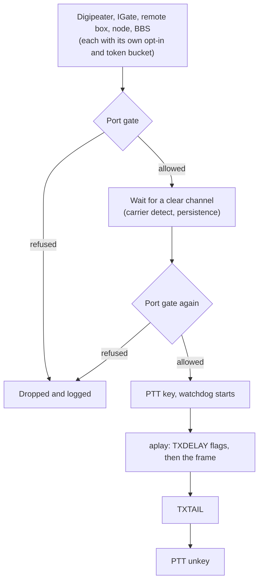

# Soundcard port

This page sets up a soundcard port: the ingest box itself is the 1200-baud APRS modem, with a USB sound card
or a Raspberry Pi sound HAT between it and the radio, and no TNC. It is for the sysop who runs the box. At the
end the box decodes what the radio hears and, once you allow it, transmits through it.

A soundcard port receives like a KISS TNC: its frames are local RF hearings (port `soundcard`), stamped with
the [receiving site](rf-ingest.md#receiving-site-and-tier-a) when heard directly, and the digipeater, the
IGate, the remote box and the packet node and BBS run over it as they do over a TNC.

## Before you start

- **An ingest box on Linux**: Raspberry Pi OS, Debian or Ubuntu ([Set up an ingest box](ingest-box.md)).
- **ALSA's tools**, `arecord` and `aplay`. Raspberry Pi OS ships them; elsewhere install them with
  `sudo apt install alsa-utils`. The Docker image has them.
- **A sound interface** with a way to key the radio:
    - a USB sound card built on a CM108 or CM119 chip, with PTT wired to one of its GPIO pins (most packet and
      AllStar interfaces use GPIO3);
    - a Raspberry Pi sound HAT, with PTT on a Pi GPIO pin;
    - any sound card, with a serial RTS or DTR line, the radio's CAT port, or Hamlib's `rigctld` for PTT;
    - any sound card, into a radio or interface that keys on audio (VOX).
- **Cables**: the radio's speaker or data output to the card's microphone input, the card's output to the
  radio's microphone or data input, and the PTT line.
- **To transmit**: your licence, and every callsign the box transmits under control-verified on the instance
  ([Callsign verification](../day-to-day/callsign-verification.md)). Read
  [Automatic stations on the air](../compliance/on-air-stations.md) first.

## How a frame goes out

The box's transmitting functions keep their own switches and pacing. The soundcard port adds a gate of its
own, because nothing between it and the radio can refuse a frame.



## Steps

### 1. Find the sound card

List the capture devices:

```bash
arecord -l
```

A line such as `card 1: Device [USB Audio Device], device 0: USB Audio [USB Audio]` is the device
`plughw:1,0`. Use the `plughw:` form: ALSA then converts the rate and format the card does not offer itself.
A name such as `plughw:CARD=Device,DEV=0` keeps pointing at the same card when the numbers change after a
reboot.

### 2. Turn the port on

In the box's settings (`deploy/.env` in Docker, `.env` in a checkout):

```
SOUNDCARD_DEVICE=plughw:1,0
```

`SOUNDCARD_PLAYBACK` names a different playback device when the card has one; by default the port plays on
the capture device. `SOUNDCARD_RATE` is `48000` (default) or `44100`.

**In Docker**, pass the sound devices into the ingest container. In `deploy/compose.ingest-only.yml` (or
`deploy/docker-compose.yml`), on the ingest service:

```yaml
    devices: ["/dev/snd:/dev/snd"]
```

The image's user is in the `audio` group (GID 29 on Debian, Ubuntu and Raspberry Pi OS). Restart the ingest.
The log shows `[soundcard:1] receive only (SOUNDCARD_TX=1 allows transmit)`, then
`[soundcard:1] capturing plughw:1,0 at 48000 Hz`.

### 3. Set the receive level

Open the card's mixer with `alsamixer -c 1` (the card number from step 1). Press **F4** for the capture
controls, and raise the microphone or line input until packets decode. Set the radio's volume to about a
third, with squelch closed. Too much level clips the tones and loses packets as surely as too little.

The `soundcard` port counts packets at `https://<instance>/api/ports`, and stations appear on the map.

### 4. Allow transmit

Receive needs nothing more. To transmit, choose the PTT
([Choose how the radio is keyed](#choose-how-the-radio-is-keyed)) and set:

```
SOUNDCARD_TX=1
SOUNDCARD_PTT=cm108:/dev/hidraw0:3
SOUNDCARD_CALL=OE8APR-10
```

`SOUNDCARD_CALL` defaults to `BOX_CALL`, then `IGATE_CALL`, then `DIGI_CALL`. The transmitting functions
still need their own settings: `DIGI_CALL` for the digipeater, `IGATE_TX=1` for the IGate, `BOX_TX=1` for
the remote box ([RF ingest & transports](rf-ingest.md)). After the restart the log shows
`[soundcard:1] transmit on, PTT CM108 /dev/hidraw0 GPIO3, watchdog 10000 ms`. A gate that still holds the port
back says why: `[soundcard:1] transmit held back: verify OE8APR-10 to transmit — control-verification
required`.

### 5. Set the transmit level

The transmit level sets your deviation: about 3 kHz for 1200-baud APRS on FM. Set the card's output in
`alsamixer -c 1` (**F3** for the playback controls) and fine-tune with `SOUNDCARD_TX_LEVEL` (0.01 to 1,
default 0.5). Listen on a second receiver, or decode your own frames there: a clean signal decodes at once,
an over-driven one sounds harsh and decodes badly. Many radios have a separate data input with a fixed level;
use it when the radio has one.

### 6. Check it

Run `deploy/aprscaching doctor`. Its `ingest.soundcard_*` checks look for the ALSA tools, open both devices,
check the PTT driver and the watchdog, and ask the gateway about the calls' verification. They never key the
radio ([Troubleshooting](../troubleshooting.md#ingestsoundcard_alsa)).

To prove the keying line, run the PTT test. It keys the transmitter for half a second, with no audio, and only
when `SOUNDCARD_TX=1` and the calls are verified. It is a transmission: run it on a dummy load or a clear
channel, under your call. From a checkout, in `apps/ingest`:

```bash
node --import tsx src/check.ts --ptt-test
```

In Docker, in `deploy/`, with the ingest stopped, since the running ingest holds the PTT:

```bash
docker compose -f compose.ingest-only.yml run --rm -w /app/apps/ingest ingest node --import tsx src/check.ts --ptt-test
```

Name a port after `--ptt-test` to test another than the first. It prints
`PTT test on port 1: CM108 /dev/hidraw0 GPIO3 keyed for 500 ms and released`, or why it refused.

## Choose how the radio is keyed

`SOUNDCARD_PTT` picks the driver. Every driver drives the line to unkeyed when the port starts.

| `SOUNDCARD_PTT` | Keys the radio with | Needs | On exit |
|---|---|---|---|
| `none` (default) or `vox` | the audio itself: the radio or interface keys on it (VOX) | nothing | no audio, no carrier |
| `cm108[:<hidraw>[:<gpio>]]` | a GPIO pin of a CM108/CM119 sound chip (default `/dev/hidraw0`, GPIO3) | write access to `/dev/hidraw*` | unkeyed: the report is written on exit |
| `gpio:<chip>:<line>` | a Linux GPIO line, through libgpiod's `gpioset`; `-<line>` keys on low | `gpiod` (`sudo apt install gpiod`), access to `/dev/gpiochip*` | unkeyed: the line is set on exit |
| `serial:<device>[:<line>]` | a serial control line, `rts` (default) or `dtr`; `-rts` or `-dtr` keys on low | the optional `serialport` package, group `dialout` | a non-inverted line drops when the port closes |
| `cat:<device>:<rig>[:<baud>[:<civ>]]` | a CAT command: `kenwood` (`TX;`), `icom` (CI-V `1C 00`, address default `0x94`) or `yaesu-bin` (FT-817/857/897) | the optional `serialport` package, group `dialout` | unkeyed: the command is written to the device |
| `rigctld[:<host>[:<port>]]` | Hamlib's `rigctld` (`T 1` / `T 0`), default `127.0.0.1:4532` | a running `rigctld` | unkeyed on a stop signal only: keep the radio's time-out on |

**CM108 access.** A `/dev/hidraw*` device belongs to root. Give the `audio` group write access with a udev
rule, in `/etc/udev/rules.d/90-cm108.rules`:

```
SUBSYSTEM=="hidraw", ATTRS{idVendor}=="0d8c", GROUP="audio", MODE="0660"
```

Then `sudo udevadm control --reload && sudo udevadm trigger`. `0d8c` is C-Media's vendor id; `lsusb` shows
yours. Several CM108 cards each have their own `/dev/hidraw*`. In Docker, pass the device in as well:
`"/dev/hidraw0:/dev/hidraw0"`.

**Raspberry Pi GPIO.** `gpioinfo` lists the chips and their lines. The header's chip has a `pinctrl-` label
(`pinctrl-bcm2711` on a Pi 4, `pinctrl-rp1` on a Pi 5); use the `gpiochip` name it shows. The line number is
the BCM GPIO number: GPIO17, header pin 11, is `gpio:gpiochip0:17` when the header is `gpiochip0`. The `gpio` group has access on Raspberry Pi OS: add the ingest's user to
it. In Docker, pass `/dev/gpiochip0` in and add the group's GID with `group_add` (`stat -c %g /dev/gpiochip0`).
The box holds the line with a running `gpioset` at all times, at the unkeyed level while idle.

**Serial and CAT.** Install the optional package once, in a checkout: `pnpm --filter @aprscaching/ingest add
serialport`. The Docker image does not carry it. A radio does not unkey when its CAT port closes, so keep the radio's own transmit time-out on.

## Timing, channel access and the watchdog

| Setting | Default | What it does |
|---|---|---|
| `SOUNDCARD_TXDELAY_MS` | `300` | Flags sent before each frame, while the radio's transmitter comes up. Raise it for a slow radio. |
| `SOUNDCARD_TXTAIL_MS` | `50` | Time the PTT stays keyed after the audio ends. |
| `SOUNDCARD_PERSIST` | `63` | Once the channel is clear, the chance (p+1)/256 of sending in a slot, so stations that waited do not all start at once. |
| `SOUNDCARD_SLOTTIME_MS` | `100` | The slot length for that draw, and for checking a busy channel again. |
| `SOUNDCARD_PTT_MAX_MS` | `10000` | The watchdog: the longest the PTT may stay keyed (1000 to 60000). |

**Carrier detect.** The demodulator raises carrier detect while it hears a 1200-baud signal, and the port waits
until it drops. A frame that waits more than 30 seconds for a clear channel is dropped and logged.

**The watchdog.** Every key starts the watchdog. A PTT still keyed when it runs out is released by every means
the driver has, the playback is stopped, and the port goes into a fault:
`[soundcard:1] FAULT: transmitter keyed longer than 10000 ms; PTT released by the watchdog`. A faulted port
receives but never transmits again until the ingest restarts; the remote box's status shows
`rf soundcard 1 (fault: PTT watchdog)`. A frame whose airtime would exceed the watchdog is never keyed. A
1200-baud APRS frame takes well under a second, so keep the default.

**Process stop.** On a stop (SIGTERM, SIGINT), an uncaught error, or exit, the box unkeys every PTT it holds.

## The transmit gate

A frame goes out only while all of these hold. A refused frame is dropped, and the log says why, at most once
a minute for each reason.

- `SOUNDCARD_TX=1` on that port: transmit is off by default, port by port.
- The PTT driver opened at start.
- The box's transmit switch is on: a remote **TX off** stops every port.
- Every callsign the box transmits under (`SOUNDCARD_CALL`, `DIGI_CALL`, `IGATE_CALL`, `BOX_CALL`,
  `NETROM_CALL`, `BBS_NODE_CALL`, `BBS_FORWARD_CALL`, `FED_LINK_CALL`) is control-verified at the gateway. The
  box asks at start and every 15 minutes; until the gateway answers, nothing counts as verified.
- The watchdog has not faulted the port.

The gate is checked when a function hands over a frame and again at the moment of keying, so a remote **TX off**
stops a frame still waiting for the channel.

## Several ports

`SOUNDCARD_PORTS` adds ports, as a JSON array of objects with the same fields in short form: `device`
(required), `name`, `playback`, `rate`, `tx`, `ptt`, `call`, `txDelayMs`, `txTailMs`, `persist`, `slotTimeMs`,
`pttMaxMs` and `txLevel`.

```
SOUNDCARD_PORTS=[{"name":"uhf","device":"plughw:2,0","tx":true,"ptt":"cm108:/dev/hidraw1:3"}]
```

A further port takes its rate, timing, level and call from the `SOUNDCARD_*` settings unless it sets its own,
but never `tx` or `ptt`. Each port has its own PTT and watchdog. The digipeater repeats on the port that heard
the frame. The IGate's transmit, the remote box and the packet node and BBS use the first radio: the KISS TNC
when there is one, else the first soundcard port.

## Troubleshooting

- **`capture ended: … No such file or directory`**: the device name is wrong, or the container has no
  `/dev/snd`. Compare with `arecord -l`.
- **`… Device or resource busy`**: another program, such as Direwolf, holds the card. A card serves one
  modem.
- **Nothing decodes**: check the receive level and the cable, and that squelch is closed. Record a minute
  with `arecord -D plughw:1,0 -f S16_LE -r 48000 -c 1 test.wav` and listen to it.
- **`PTT … unavailable`**: the log names the missing package, tool or permission. The port then receives
  only.
- **`transmit held back: verify <call> …`**: verify the call on the instance; the box picks it up within
  15 minutes, or at a restart.
- **Other stations do not decode you**: check the transmit level, and raise `SOUNDCARD_TXDELAY_MS` when the
  start of your frames is cut off.

## Compliance

A soundcard port that transmits makes your station an automatically controlled one, as any TNC does.
[Automatic stations on the air](../compliance/on-air-stations.md) covers identification and pacing: each frame
carries its source callsign, and the functions keep their token buckets. Transmit is off until you set
`SOUNDCARD_TX=1`, and the port transmits only under control-verified calls. The PTT test is a transmission too.

## Validate at deploy

The modem, the gate, the channel access, the watchdog and every PTT driver are tested against fakes: no sound
card and no radio. These need your hardware:

- **Unverified:** decoding at real receive levels, with a real radio's de-emphasis and noise.
- **Unverified:** the transmit level and deviation each card and radio need.
- **Unverified:** each PTT driver against real hardware: a CM108 interface's GPIO wiring, a Raspberry Pi GPIO
  line under libgpiod 1 and 2, a serial cable's RTS or DTR, each CAT family's PTT command on the radio, and
  rigctld with your rig.
- **Unverified:** `SOUNDCARD_TXDELAY_MS` for your radio's transmitter rise time.

## Next

- [RF ingest & transports](rf-ingest.md): the functions that transmit over the port.
- [Automatic stations on the air](../compliance/on-air-stations.md): the rules an unattended transmitter follows.
