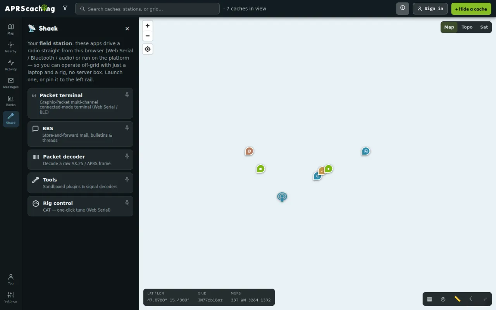

# The Shack at a glance

The Shack is the radio side of aprscaching: packet-radio apps that run in your browser and drive a radio
connected to your own computer. This page is for operators who know APRS, TNCs and packet; it shows what each
app does and where to read more.

A laptop and a radio are a complete station, even with no internet: the apps talk to a USB or Bluetooth
[TNC](../glossary.md#tnc), or to the soundcard, straight from the browser. Open the Shack from **Shack** in
the left rail (on a phone: **You → Advanced — the Shack → Shack**). Each app opens its own screen, and the pin
button next to an app puts it on the left rail.

## Your journey

1. [Your radio in the browser](my-radio.md): connect a TNC, a Mobilinkd or a soundcard.
2. [The live map](live-map.md): stations, spots and MeshCom nodes as they are heard.
3. [Packet terminal & BBS](packet-and-bbs.md): decode frames, connect to nodes, read and send mail.
4. [Messages over APRS and MeshCom](messages.md): read, send and acknowledge messages.
5. [Rig control & weather](rig-weather.md): tune your radio, report your weather station.
6. [On-air etiquette and rules](on-air.md): before you transmit.

## The apps

{ width="720" loading=lazy }

| App | What it does | Who | Read more |
|---|---|---|---|
| **Packet terminal** | A multi-channel connected-mode terminal: connect to BBSes, nodes and other stations over a USB [KISS](../glossary.md#kiss) TNC. | everyone | [Connect to a BBS or node](packet-and-bbs.md#connect-to-a-bbs-or-node) |
| **BBS** | Store-and-forward mail, bulletins and threads on the instance's [BBS](../glossary.md#bbs). Bulletins are open to everyone; your mail needs you signed in as your callsign. | everyone | [Use the instance's BBS](packet-and-bbs.md#use-the-instances-bbs) |
| **Packet decoder** | Paste a raw [APRS](../glossary.md#aprs) or [AX.25](../glossary.md#ax25) line and see every field decoded. | everyone | [Decode a packet](packet-and-bbs.md#decode-a-packet) |
| **Tools** | Plugins and signal decoders, including CW and PSK31 decoding from your microphone. | everyone | [Tools and plugins](#tools-and-plugins) |
| **Rig control** | Tune your radio over USB ([CAT](../glossary.md#cat)). | everyone | [CAT rig control](rig-weather.md#cat-rig-control) |
| **[NET/ROM](../glossary.md#netrom) node** | The instance's node: routing table, [digipeater](../glossary.md#digipeater), [sysop](../glossary.md#sysop) console. | sysop | [Packet: BBS & NET/ROM node](../run/radios/packet-node.md) |
| **Remote box** | Send commands to the instance's [ingest box](../glossary.md#ingest-box) without opening a port on it. | sysop | [Remote control of your box](../run/radios/remote-box.md) |

The last two apps manage the instance's always-on station, so only its sysop sees them.

Three things live outside the launcher:

- **Settings → My radio (browser)**: receiving, forwarding and transmitting APRS with your own radio
  ([Your radio in the browser](my-radio.md)).
- **Messages** in the left rail: the APRS and MeshCom messages the instance hears
  ([Messages over APRS and MeshCom](messages.md)).
- **Search & filter → Live layers** on the map: live stations, MeshCom nodes and activity spots
  ([The live map](live-map.md)).

## CW and PSK31 by ear

1. Open **Shack → Tools**.
2. Select **Listen (mic)** and allow the microphone.
3. Hold your phone or laptop to the radio's speaker, or connect the radio's audio output to the line-in.

CW (Morse) and PSK31 appear as text while you listen. The decoders follow slightly off-tune and noisy
signals, and everything runs in the browser. **Stop** ends it.

## Tools and plugins

**Tools** also runs plugins: extra commands, decoders, colour schemes, panels and map layers. Import one from
the **Registry** list or by its `tool.json` URL under **Import a tool**, then approve the permissions it asks
for with **Approve + run**. Before you approve, the app shows who signed it:

| Shown as | Meaning | Import |
|---|---|---|
| **Verified · registry-listed author key** | Signed by a key the project's registry lists. | allowed |
| **Signed · matches the key you trusted before** | You accepted this author key before. | allowed |
| **Signed · unknown author key (trust-on-first-use)** | Signed by a key nobody vouched for yet. | allowed, with a warning |
| **Unsigned · you're trusting the URL only** | No signature. | allowed, with a warning |
| **Author key CHANGED since you last trusted it — refused** | The author key differs from the one you accepted. | blocked |
| **Signature INVALID — refused** | The signature does not match the manifest. | blocked |

A plugin runs in a sealed-off sandbox. It reaches the network, your location, or a scheduled beacon only when
you grant that permission. A plugin that transmits passes the same callsign check as you, and no plugin
changes how finds are verified.

## Next

- [Your radio in the browser](my-radio.md): connect your radio first.
- [Writing a Shack plugin](../contribute/plugins.md): for plugin authors.
