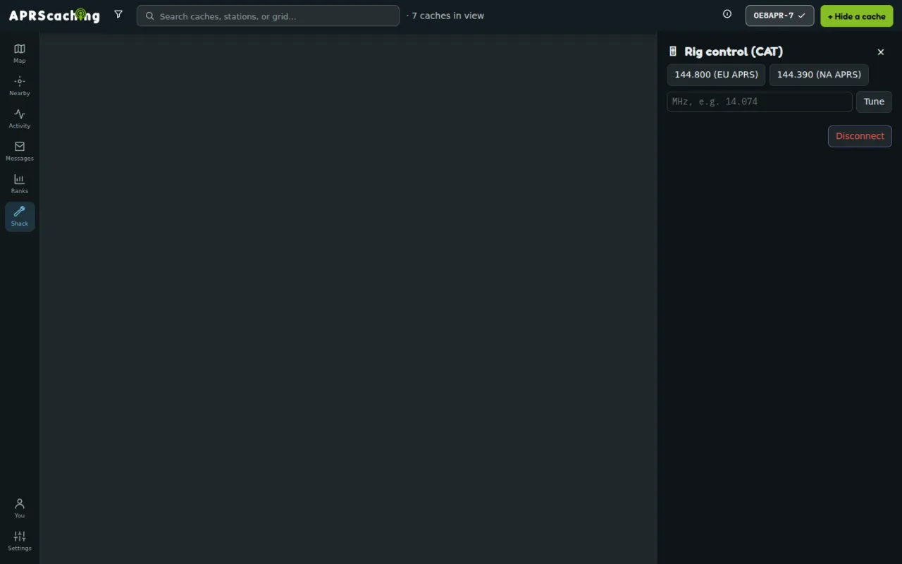

# Rig control & weather

This page shows you how to tune your transceiver from the browser and how to send your weather station's
readings to the instance. You need Chrome or Edge on a computer for the rig, and a signed-in account for the
weather station.

## CAT rig control

**Shack → Rig control** tunes a radio over USB ([CAT](../glossary.md#cat)) with no companion software. It
speaks three radio families:

- **Kenwood / modern Yaesu (ASCII)**: the Kenwood TS series, and modern Yaesu radios such as the FT-991 and
  FTDX that speak Kenwood CAT.
- **Icom (CI-V)**: with the radio's [CI-V](../glossary.md#ci-v) address.
- **Yaesu classic (FT-817/857/897)**: the older binary protocol.

Radios outside these families cannot be tuned from the Shack.

Rig control only sets the frequency and mode: it never keys the transmitter. Tuning is receive-side and needs
no verified callsign. Keying a transmitter is transmitting, which is gated on callsign control-verification.

### Tune your radio

1. Open **Shack → Rig control**.
2. Choose the **Radio** family.
3. Set the **Baud** to the rate in your radio's menu. The default follows the family: 38400 for Kenwood,
   19200 for Icom, 4800 for Yaesu classic.
4. For an Icom, enter the **CI-V addr** in hex (`94` by default).
5. Select **Connect rig** and pick the radio's port. The app shows **Rig connected**.
6. Select **144.800 (EU APRS)** or **144.390 (NA APRS)**, or type a frequency in MHz and select **Tune**.

{ width="720" loading=lazy }

The app confirms each change with **Tuned to … MHz**. While the rig is connected, a spot on the
[live map](live-map.md#live-stations-and-spots) offers **Tune rig to … MHz**. **Disconnect** releases the port.

## Weather stations

You can send your own personal weather station (PWS) to the instance. Its readings show on the map and on the
station's page, with graphs. Pushing data in needs no amateur licence.

### Add your weather station

Each weather station is one of your stations, with its own callsign and its own push key.

1. Open **Settings → My stations** and select **Add a weather station**. It fills in your callsign with the
   `-13` weather SSID and the **Weather** role.
2. Enter the station's coordinates, or leave them blank to place it at the centre of your home locator's
   6-character square, about 5 by 2.5 km, however precise the locator ([Settings → Profile](../play/account.md)).
3. Select **Add station**. The station's URLs show at once.
4. Copy the **Ecowitt — custom server path** or the **Weather Underground — Rapidfire URL**, and enter it in
   your station's configuration: as a custom server with the Ecowitt protocol, or as the Weather Underground
   upload URL.

The readings appear under the station's callsign at its coordinates. A weather-only station needs a callsign on
your account, not a verified one. Open the station under **My stations** to see **Last reading**; **Re-issue key**
makes new URLs and stops the old ones, and **Remove** revokes the key.

### More weather stations

A second station, such as one on a summit, is another station under **My stations** with the **Weather**
role, its own SSID (such as `OE8APR-14`) and its coordinates. Any station gains a push key when you give it the
**Weather** role and select **Enable weather push**. Roles beyond weather need a
[verified callsign](../play/join.md#verify-your-callsign).

### A station on USB

A Peet Bros or Ultimeter station on USB can report straight from the browser. Open the station under
**Settings → My stations**, and under **Browser-direct (Web Serial)** choose the **Baud** and select **Connect
station**. The browser posts a reading once a minute while the page is open.

### Beacon or relay your weather

Under **Transmit (optional)** on each weather station, two switches send its readings further, under the
station's callsign. Both need the station's callsign [verified](../play/join.md#verify-your-callsign) and are off
by default:

- **Beacon to APRS-IS** sends your weather as a standard APRS report, at most once every five minutes.
- **Relay to CWOP** feeds your readings to NOAA's Citizen Weather Observer Program
  ([CWOP](../glossary.md#cwop)), where the instance's sysop has set up a CWOP server
  ([Configuration](../reference/configuration.md)).

Weather is observational: it enriches the map and station pages, and never changes how a find is verified.

## Next

- [On-air etiquette and rules](on-air.md): before you transmit.
- [The live map](live-map.md): stations and spots to tune to.
